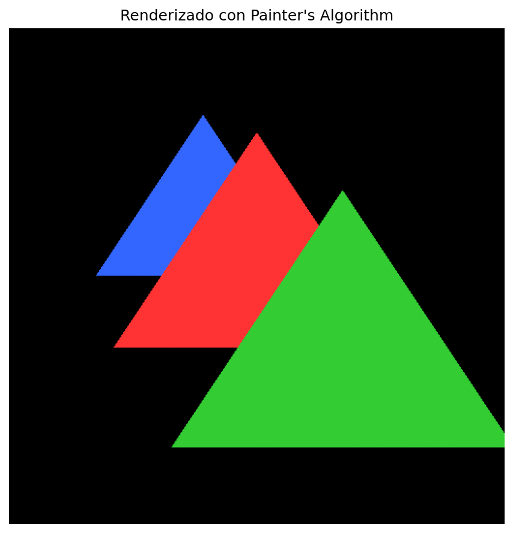
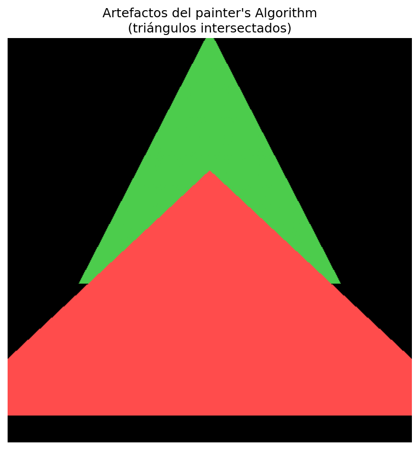
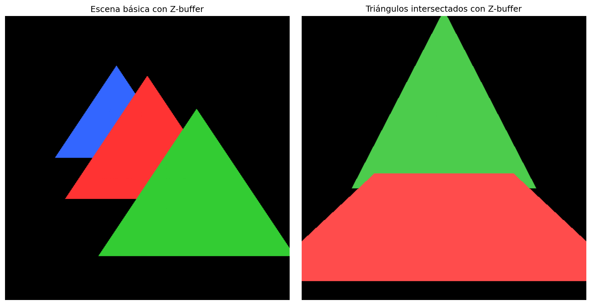
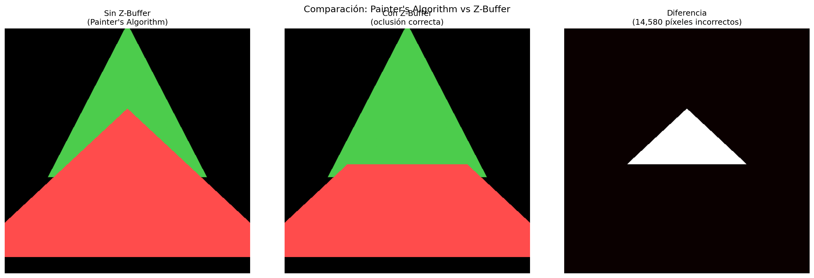
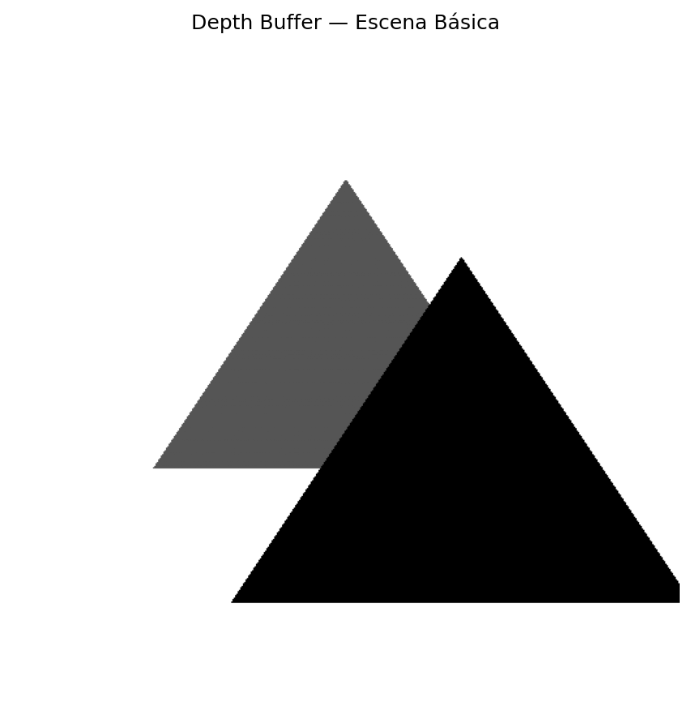
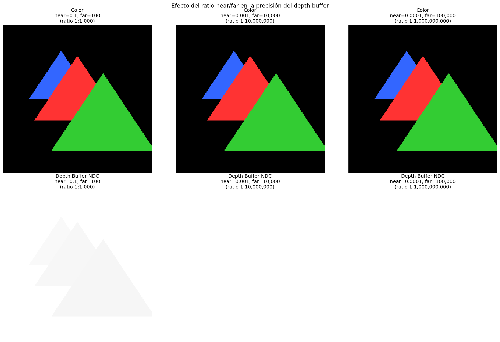
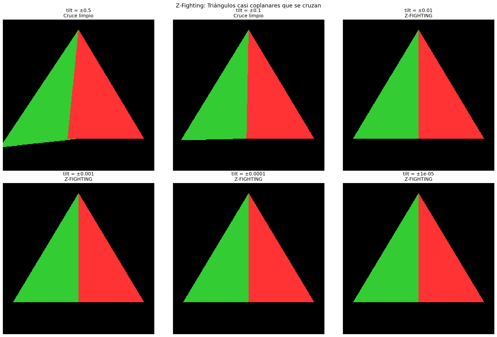
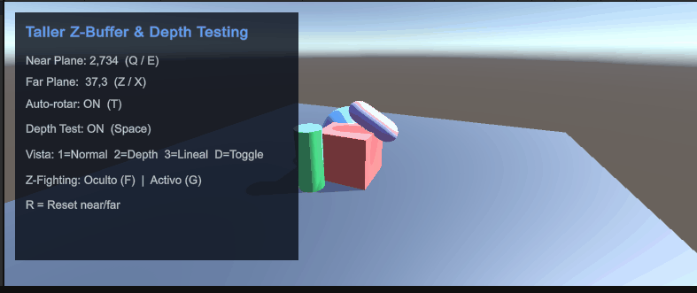

# Implementación de Z-Buffer y Depth Testing

## Nombre del estudiante

<!-- TODO: Completar -->

## Fecha de entrega

<!-- TODO: Completar -->

---

## Descripción breve

Este taller implementa el algoritmo de Z-buffer (depth buffer) desde cero para comprender su funcionamiento dentro del pipeline de renderizado 3D. Se compara el renderizado con y sin Z-buffer, se visualiza el depth buffer, se analizan problemas de precisión y se simula Z-fighting. Se desarrolla en tres entornos: Python (implementación desde cero), Three.js y Unity (configuración y análisis).

---

## Implementaciones

### Python

Notebook que implementa el Z-buffer desde cero usando NumPy y Matplotlib. Incluye: proyección perspectiva 3D→2D, rasterización de triángulos con coordenadas baricéntricas, renderizado con Painter's Algorithm (sin Z-buffer) y con Z-buffer, visualización del depth buffer como imagen en escala de grises, comparación lado a lado de ambos métodos, experimentación con ratios near/far y simulación de Z-fighting con triángulos casi coplanares que se cruzan.

### Three.js

Aplicación web con Three.js que permite explorar el Z-buffer de forma interactiva. Incluye: toggle de depth test ON/OFF con comparación visual en tiempo real, visualización del depth buffer mediante shaders GLSL (no-lineal con `gl_FragCoord.z` y linealizado con near/far), comparación lado a lado usando scissor test (mitad izquierda sin depth test, mitad derecha con depth test), demostración de Z-fighting con dos planos casi coplanares y resolución mediante `polygonOffset`, ajuste dinámico de near/far para experimentar con la precisión del depth buffer, y panel GUI interactivo con lil-gui.

### Unity

Proyecto en Unity que replica los experimentos de Z-buffer de forma interactiva. Incluye: generación procedural de la escena con objetos superpuestos (cubo, esfera, cilindro, cápsula), toggle de depth test ON/OFF modificando `_ZTest` y `_ZWrite` en los materiales (tecla Space), visualización del depth buffer con shader custom (`DepthVisualization.shader`) que alterna entre profundidad no-lineal y linealizada (teclas 1/2/3), ajuste dinámico de near/far planes (teclas Q/E y Z/X), demostración de Z-fighting con planos coplanares (tecla F) y resolución con separación (tecla G), HUD con información en tiempo real de parámetros de cámara y estado del depth test.

---

## Resultados visuales

### Python - Implementación



Renderizado con Painter's Algorithm: los triángulos se pintan de atrás hacia adelante sin prueba de profundidad.



Artefactos del Painter's Algorithm con triángulos intersectados donde no existe un orden válido de atrás hacia adelante.



Renderizado con Z-buffer: la oclusión se resuelve correctamente a nivel de píxel, sin importar el orden de renderizado.



Comparación lado a lado: Painter's Algorithm vs Z-buffer, con mapa de diferencias que resalta los píxeles incorrectos.



Visualización del depth buffer como imagen en escala de grises (oscuro = cerca, claro = lejos).



Efecto del ratio near/far en la precisión del depth buffer: ratios extremos degradan la resolución de profundidad.



Simulación de Z-fighting con triángulos casi coplanares que se cruzan, variando el ángulo de inclinación.

### Three.js - Implementación


Toggle de depth test en Three.js: a la izquierda sin depth test (objetos pintados por orden de draw call con artefactos de oclusión), a la derecha con depth test activado (oclusión correcta basada en Z-buffer).


Demostración de Z-fighting en Three.js con dos planos casi coplanares y su resolución mediante polygonOffset.

### Unity - Implementación



Visualización del depth buffer en Unity alternando entre modo no-lineal y linealizado, mostrando la distribución de profundidad según los parámetros de la cámara.


Experimentación con los planos near/far de la cámara en Unity, mostrando cómo ratios extremos degradan la precisión del depth buffer.


Demostración de Z-fighting en Unity con planos coplanares y su resolución mediante separación entre superficies.

---

## Código relevante

### Ejemplo de código Three.js - Shaders de visualización de profundidad:

```glsl
// Profundidad no-lineal (nativa de WebGL)
void main() {
  gl_FragColor = vec4(vec3(gl_FragCoord.z), 1.0);
}

// Profundidad linealizada con near/far
uniform float uNear;
uniform float uFar;
varying float vViewZ;
void main() {
  float linearDepth = (vViewZ - uNear) / (uFar - uNear);
  linearDepth = clamp(linearDepth, 0.0, 1.0);
  gl_FragColor = vec4(vec3(linearDepth), 1.0);
}
```

### Ejemplo de código Three.js - Toggle de depth test:

```javascript
function setDepthTest(enabled) {
  sceneData.group.traverse((obj) => {
    if (!obj.isMesh) return;
    obj.material.depthTest = enabled;
    obj.material.depthWrite = enabled;
    obj.material.needsUpdate = true;
  });
}
```

### Ejemplo de código Three.js - Resolución de Z-fighting con polygonOffset:

```javascript
function solveZFighting(solve) {
  const mat = sceneData.planeB.material;
  if (solve) {
    mat.polygonOffset = true;
    mat.polygonOffsetFactor = -1;
    mat.polygonOffsetUnits = -1;
    sceneData.planeB.position.z = -1.995;
  } else {
    mat.polygonOffset = false;
    sceneData.planeB.position.z = -1.999;
  }
  mat.needsUpdate = true;
}
```

### Ejemplo de código Unity (C#) - Toggle de depth test:

```csharp
void ApplyDepthTest()
{
    allRenderers = FindObjectsByType<Renderer>(FindObjectsSortMode.None);
    foreach (Renderer rend in allRenderers)
    {
        foreach (Material mat in rend.materials)
        {
            if (depthTestEnabled)
            {
                mat.SetInt("_ZTest", (int)UnityEngine.Rendering.CompareFunction.LessEqual);
                mat.SetInt("_ZWrite", 1);
            }
            else
            {
                mat.SetInt("_ZTest", (int)UnityEngine.Rendering.CompareFunction.Always);
                mat.SetInt("_ZWrite", 0);
            }
        }
    }
}
```

### Ejemplo de código Unity - Shader de visualización de profundidad:

```hlsl
v2f vert(appdata v)
{
    v2f o;
    o.pos = UnityObjectToClipPos(v.vertex);
    o.depth = o.pos.z / o.pos.w;
    float4 viewPos = mul(UNITY_MATRIX_MV, v.vertex);
    o.linearZ = -viewPos.z;
    return o;
}

fixed4 frag(v2f i) : SV_Target
{
    float d;
    #ifdef _LINEARMODE_ON
        d = (i.linearZ - _ProjectionParams.y) /
            (_ProjectionParams.z - _ProjectionParams.y);
        d = saturate(d);
    #else
        d = i.depth;
        #if defined(UNITY_REVERSED_Z)
            d = 1.0 - d;
        #endif
    #endif
    return fixed4(d, d, d, 1.0);
}
```

### Ejemplo de código Python - Rasterización con Z-buffer:

```python
def rasterize_triangle(screen_coords, depths, color, color_buffer, z_buffer=None, use_zbuffer=True):
    h, w = color_buffer.shape[:2]
    v0, v1, v2 = screen_coords
    d0, d1, d2 = depths

    # Bounding box (clamped to image)
    min_x = max(0, int(np.floor(min(v0[0], v1[0], v2[0]))))
    max_x = min(w - 1, int(np.ceil(max(v0[0], v1[0], v2[0]))))
    min_y = max(0, int(np.floor(min(v0[1], v1[1], v2[1]))))
    max_y = min(h - 1, int(np.ceil(max(v0[1], v1[1], v2[1]))))

    for y in range(min_y, max_y + 1):
        for x in range(min_x, max_x + 1):
            u, v, w_bary = barycentric(x + 0.5, y + 0.5, v0, v1, v2)

            if u >= 0 and v >= 0 and w_bary >= 0:
                # Interpolate depth using barycentric coordinates
                z = u * d0 + v * d1 + w_bary * d2

                if use_zbuffer:
                    if z < z_buffer[y, x]:  # Closer to camera?
                        z_buffer[y, x] = z
                        color_buffer[y, x] = color
                else:
                    color_buffer[y, x] = color  # Simply overwrite
```

### Ejemplo de código Python - Proyección perspectiva:

```python
def project_vertices(vertices, width=512, height=512, fov=60.0, near=0.1, far=100.0):
    aspect = width / height
    fov_rad = np.radians(fov)
    f = 1.0 / np.tan(fov_rad / 2.0)

    for i, v in enumerate(vertices):
        x, y, z = v
        depth = -z  # Camera looks down -Z

        # Perspective divide
        xp = (f / aspect) * x / depth
        yp = f * y / depth

        # NDC [-1, 1] to screen [0, width/height]
        sx = (xp + 1.0) * 0.5 * width
        sy = (1.0 - yp) * 0.5 * height  # Flip Y for screen space
```

### Ejemplo de código Python - Simulación de Z-fighting:

```python
def create_zfighting_scene(base_depth, tilt):
    return [
        {   # Flat triangle at constant depth
            "vertices": np.array([
                [-1.5, -1.0, base_depth],
                [ 1.5, -1.0, base_depth],
                [ 0.0,  1.5, base_depth],
            ]),
            "color": np.array([1.0, 0.2, 0.2]),
        },
        {   # Tilted triangle: crosses through the first one
            "vertices": np.array([
                [-1.5, -1.0, base_depth + tilt],   # Behind
                [ 1.5, -1.0, base_depth - tilt],   # In front
                [ 0.0,  1.5, base_depth],           # Same depth at top
            ]),
            "color": np.array([0.2, 0.8, 0.2]),
        },
    ]
```

---

## Prompts utilizados

Se utilizó GitHub Copilot para:
1. Estructurar el pipeline de renderizado (proyección, rasterización, Z-buffer)
2. Implementar las coordenadas baricéntricas para la interpolación de profundidad
3. Diseñar las visualizaciones comparativas y los experimentos de precisión
4. Generar la estructura modular de la aplicación Three.js (main, shaders, scene-objects, gui-controls)
5. Implementar los shaders GLSL para visualización de profundidad no-lineal y linealizada
6. Crear los scripts de Unity para generación procedural de escena y control de depth test
7. Desarrollar el shader de Unity para visualización de profundidad con soporte Standard y URP

---

## Aprendizajes y dificultades

### Aprendizajes

Se comprendió que el Z-buffer resuelve la oclusión a nivel de píxel, superando las limitaciones del Painter's Algorithm que falla con triángulos intersectados o solapamiento cíclico. La distribución no lineal de los valores de profundidad en NDC concentra la mayor precisión cerca del near plane, lo que explica por qué ratios near/far extremos causan problemas. El Z-fighting ocurre cuando la diferencia de profundidad entre dos superficies es menor que la resolución del depth buffer a esa distancia.

### Dificultades

La implementación de la rasterización por coordenadas baricéntricas requirió cuidado con los casos degenerados (triángulos con área cero). Visualizar correctamente el depth buffer necesitó manejar los valores infinitos del fondo y normalizar solo los píxeles válidos. La detección automática de Z-fighting fue desafiante porque con triángulos que se cruzan, ambos colores están presentes legítimamente.

### Mejoras futuras

Optimizar la rasterización usando vectorización con NumPy en lugar de bucles píxel por píxel. Implementar perspective-correct interpolation para la profundidad. Agregar soporte para mallas 3D completas (OBJ) en lugar de triángulos individuales.

---

## Contribuciones grupales (si aplica)

<!-- TODO: Documentar contribuciones del equipo -->

---

## Estructura del proyecto

```
semana_03_2_zbuffer_depth_testing/
├── python/
│   └── notebook.ipynb              # Implementación Z-buffer desde cero
├── media/                           # Imágenes PNG de resultados Python
└── README.md                        # Este archivo

Jero/
├── threejs/
│   ├── index.html                   # Página principal
│   ├── css/styles.css               # Estilos de la interfaz
│   └── js/
│       ├── main.js                  # Punto de entrada y lógica principal
│       ├── scene-objects.js         # Objetos 3D y materiales
│       ├── shaders.js               # Shaders GLSL de profundidad
│       └── gui-controls.js          # Panel GUI interactivo
├── unity/
│   └── Assets/
│       ├── Scripts/
│       │   ├── SceneSetup.cs            # Generación procedural de escena
│       │   ├── DepthTestToggle.cs       # Toggle depth test ON/OFF
│       │   ├── DepthMaterialSwitcher.cs # Cambio de materiales de profundidad
│       │   ├── CameraDepthController.cs # Control de near/far planes
│       │   ├── ZFightingController.cs   # Demo y resolución de Z-fighting
│       │   └── HUDOverlay.cs            # HUD con info en tiempo real
│       ├── Shaders/
│       │   ├── DepthVisualization.shader     # Shader Standard
│       │   └── DepthVisualizationURP.shader  # Shader URP
│       └── Scenes/
│           └── scene1.unity             # Escena principal
└── media/                               # GIFs de resultados Three.js y Unity
```

---

## Referencias

- **NumPy**: https://numpy.org/ - Operaciones matriciales
- **Matplotlib**: https://matplotlib.org/ - Visualización y generación de frames
- **GeeksForGeeks**: https://www.geeksforgeeks.org/computer-graphics/z-buffer-depth-buffer-method/ - Z-Buffer or Depth-Buffer method
- **Three.js**: https://threejs.org/ - Librería WebGL para renderizado 3D
- **Three.js WebGLRenderer**: https://threejs.org/docs/#api/en/renderers/WebGLRenderer - Documentación del renderer
- **Unity Shader Reference**: https://docs.unity3d.com/Manual/SL-Reference.html - Referencia de shaders de Unity
- **Unity Camera**: https://docs.unity3d.com/ScriptReference/Camera.html - Documentación de cámara y clip planes


---
