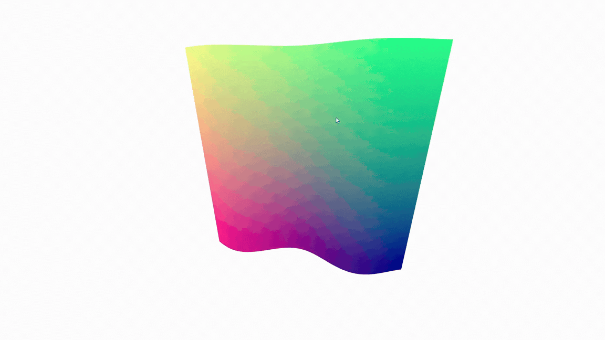
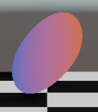
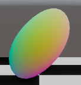
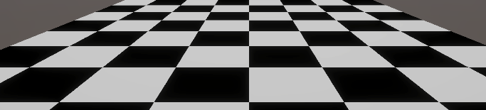
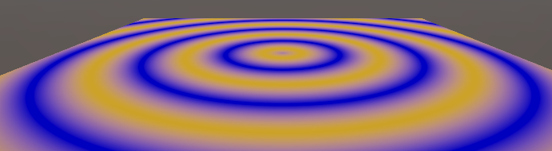
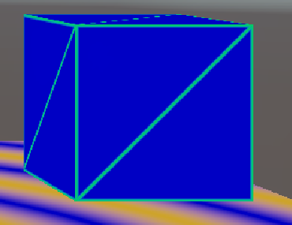
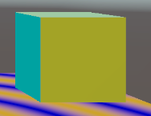
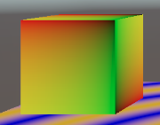
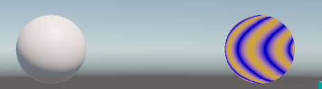

# Taller - Etapas del Pipeline Programable

## Nombre de los estudiante 
- Juan Esteban Santacruz Corredor
- Nicolas Quezada Mora
- Cristian Stiven Motta
- Sebastian Andrade Cedano
- Esteban Barrera Sanabria

## Fecha de entrega

09 de marzo de 2026

## Descripcion breve

En este ejercicio se implementó un ShaderMaterial personalizado usando React Three Fiber (Three.js + React).

Se desarrollaron vertex y fragment shaders en GLSL que deforman una geometría mediante una animación basada en tiempo (uniform time) y generan colores a partir de coordenadas UV y normales.

Adicionalmente, se construyo una implementación de las etapas programables del pipeline gráfico en Unity 6 usando HLSL para URP. Se crearon 4 shaders que cubren el vertex shader, fragment shader, una alternativa al geometry shader (limitación de URP documentada), y herramientas de debugging. 

De forma final, un script de comparación visual entre el pipeline de función fija y el pipeline programable.

## Implementaciones 

### ThreeJS
ShaderMaterial: Se utilizó ShaderMaterial dentro de React Three Fiber para definir vertex y fragment shaders personalizados.

Uniforms: Se pasaron uniforms desde React al shader:

- time → controla la animación del shader

- resolution → resolución de la pantalla

Vertex Shader: El vertex shader aplica una deformación tipo onda a los vértices de la geometría usando una función seno.

Fragment Shader: El fragment shader calcula el color usando:

- coordenadas UV

- orientación de la normal

Además se añadieron efectos de rim lighting y fresnel para resaltar los bordes de la geometría.

### Unity

### Vertex Shader

Primera etapa programable del pipeline. Se ejecuta por cada vértice y transforma su posición por tres espacios matemáticos: Model Space → World Space → View Space → Clip Space, usando las matrices M, V y P por separado. Al intervenir entre etapas se aplica la deformación sinusoidal. Las normales, UVs y el valor de la onda se pasan al fragment shader, donde la GPU los interpola por píxel.

---

### Fragment Shader

Se ejecuta por cada píxel y recibe los datos ya interpolados del vertex shader. Implementa iluminación Lambert manualmente (ángulo entre normal y luz), muestreo de texturas sobre UVs interpoladas, y efectos procedurales calculados con matemática pura sobre las UVs sin texturas externas.

---

### Geometry Shader

Unity 6 URP no soporta geometry shaders en el forward pass. Como alternativa se usan coordenadas baricéntricas: el script asigna desde CPU los valores (1,0,0), (0,1,0), (0,0,1) a los vértices de cada triángulo. La GPU los interpola y el fragment detecta los bordes donde alguna coordenada se acerca a cero.

---

### Debugging

Como los shaders no tienen debugger de paso a paso, la técnica estándar es mapear datos internos del pipeline a colores RGB. Este shader visualiza normales, UVs, posición en el mundo, profundidad y vertex ID. El Frame Debugger de Unity (`Window → Analysis → Frame Debugger`) complementa esto mostrando cada draw call por separado.

---

### Comparación

El pipeline fijo delega todo a Unity (PBR, sombras, reflexiones automáticas). El programable requiere implementar cada efecto manualmente pero permite deformar vértices y crear efectos imposibles con el fijo. El script genera dos esferas en runtime con el mismo efecto de iluminación implementado de ambas formas.


---

## Resultados visuales

### ThreeJS



La escena muestra un plano subdividido animado que se deforma continuamente mediante una onda.

El color del material cambia según las coordenadas UV y la orientación de las normales, generando un gradiente dinámico.

Los efectos de rim lighting y fresnel resaltan los bordes del objeto, dando una apariencia más estilizada.

### Unity

### Vertex Shader


*Esfera deformada en tiempo real*



*Normales en World Space visualizadas como RGB*

### Fragment Shader


*Tablero calculado con floor() y fmod() sobre las UVs, sin ninguna textura.*



*Anillos concéntricos generados con sin() sobre la distancia al centro UV.*

### Wireframe


*Bordes del cubo detectados mediante coordenadas baricéntricas interpoladas por la GPU.*



*Cada cara muestra su dirección de normal con un color diferente*

### Debugging


*Coordenadas UV mapeadas a rojo (U) y verde (V) — verifica que el mapeo sea correcto.*

### Comparación


*Izquierda: URP/Lit automático. Derecha: Lambert manual — mismo efecto, distinto nivel de control.*

### Escena general
*El video muestra todos los objetos de la escena activos simultáneamente y la comparación del pipeline fijo vs programable usando el botón en pantalla, se puede visualizar en `media/scene_comparison.mov`*

---

## Codigo utilizado

### ThreeJS

Deformación en el vertex shader
```javascript
pos.z += sin(pos.x * 5.0 + time) * 0.1;
```
Cálculo de rim lighting

```javascript
float rim = 1.0 - max(dot(normal,vec3(0,0,1)),0.0);
```
Actualización del uniform time

```javascript
uniforms.time.value = clock.getElapsedTime()
```

### Unity

### Transformaciones explícitas 

```javascript
float4 positionWS4 = mul(UNITY_MATRIX_M, input.positionOS);  // Model → World
float4 positionVS4 = mul(UNITY_MATRIX_V, float4(posWS, 1.0)); // World → View
output.positionHCS = mul(UNITY_MATRIX_P, positionVS4);        // View  → Clip
```

### Deformación sinusoidal

```javascript
float wave = sin(posWS.x * _WaveFrequency + _Time.y * _WaveSpeed)
           * cos(posWS.z * _WaveFrequency + _Time.y * _WaveSpeed);
posWS.y += wave * _WaveAmplitude;
```

### Iluminación Lambert

```javascript
float NdotL = saturate(dot(normalize(normalWS), normalize(lightDir)));
half3 color = _LightColor.rgb * NdotL + _Ambient.rgb;
```

### Detección de bordes (wireframe)
```javascript
float edge = min(min(b.x, b.y), b.z);
float wire = 1.0 - smoothstep(0.0, _WireThickness, edge);
half3 col  = lerp(_FaceColor.rgb, _WireColor.rgb, wire);
```

---

## Prompts utilizados

"React Three Fiber shader material example"

"GLSL wave vertex deformation"

"GLSL rim lighting and fresnel effect"

""Coordenadas baricentricas como alternativa al geometry sahder para Unity 6.3 URP""

---

## Aprendizajes y Dificultades

**Aprendizajes:**

- Los datos del vertex shader llegan al fragment ya nterpolados: si en el vértice A la normal es (1,0,0) y en B es (0,1,0), el píxel a mitad de camino entre A y B recibe (0.5, 0.5, 0).
- Las normales no se pueden transformar con `UNITY_MATRIX_M` directamente, pues se usa `TransformObjectToWorldNormal()` que internamente aplica la transpuesta inversa.

**Dificultades:**

- En Unity 6 con URP no los soporta el gemoetry shader tal y como se espera, es una limitación real del pipeline moderno orientado a móviles y consolas. La solución con coordenadas baricéntricas es la alternativa estándar usada en producción.
- La interpolación de normales entre vértices produce vectores de longitud menor a 1. Es obligatorio llamar `normalize()` en el fragment shader para que la iluminación sea correcta.
