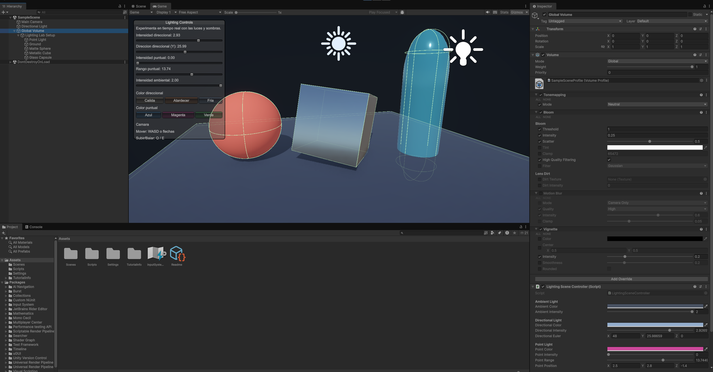
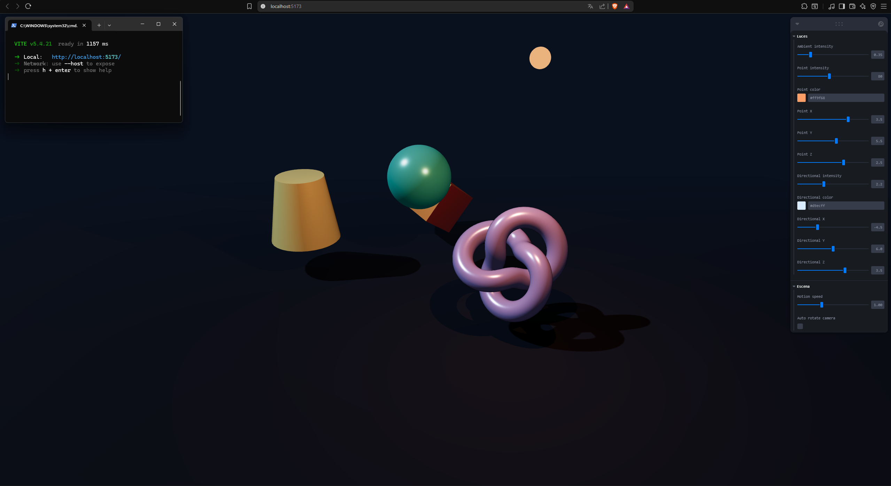

# Taller Semana 4.1 - Luces, Sombras y Radiometria

## Estudiante

Nicolas Quezada Mora

## Fecha

2026-03-24

---

## Descripcion breve

Este taller explora el comportamiento de la iluminacion, los materiales y las sombras en dos entornos distintos: Unity y Three.js con React Three Fiber. El objetivo fue comparar como cambian la apariencia, los reflejos y la proyeccion de sombras al combinar diferentes tipos de luz y superficies con propiedades fisicas distintas.

En Unity se construyo una escena con luz direccional, luz puntual y luz ambiental, junto con tres objetos principales con materiales mate, metalico y semitransparente. En Three.js se replico el ejercicio con una escena interactiva basada en `ambientLight`, `pointLight` y `directionalLight`, usando materiales `MeshStandardMaterial` y `MeshPhysicalMaterial`, sombras activas y controles para modificar la iluminacion en tiempo real.


## Implementaciones

### Unity

- Version utilizada: Unity 6 LTS `6000.3.8f1`.
- Pipeline: Universal Render Pipeline (`com.unity.render-pipelines.universal`).
- Escena base: `SampleScene`.
- Script principal: `unity/Luces y Sombras/Assets/Scripts/LightingSceneController.cs`.

Se implemento una escena 3D con:

- Una luz direccional con intensidad, color y direccion configurables.
- Una luz puntual con intensidad, color, rango y posicion ajustables.
- Luz ambiental mediante `RenderSettings.ambientLight` y `RenderSettings.ambientIntensity`.
- Un plano base que recibe sombras.
- Una esfera mate.
- Un cubo metalico.
- Una capsula semitransparente.
- Sombras suaves activadas tanto para la luz direccional como para la puntual.

El script `LightingSceneController` genera y configura automaticamente los objetos, materiales, luces y camara. Tambien incluye un panel `OnGUI()` para modificar en tiempo real la intensidad, colores y direccion de la iluminacion, cumpliendo el bonus de control dinamico desde interfaz.

Extras implementados en Unity:

- Navegacion libre de camara con `WASD`, flechas, `Q`, `E`, clic derecho y `Shift`.
- Materiales URP Lit configurados por codigo con parametros de metallic, smoothness y transparencia.
- Ajustes de sombras y sesgo (`shadowBias`, `shadowNormalBias`) para mejorar la lectura visual.

### Three.js con React Three Fiber

- Stack: React 18, Vite, `@react-three/fiber`, `@react-three/drei`, `three`, `leva`.
- Archivo principal: `threejs/src/App.jsx`.

La escena web incluye:

- Un plano que recibe sombras.
- Cuatro objetos geometricos animados: esfera, cubo, torus knot y cilindro.
- `ambientLight` para iluminacion base.
- `pointLight` con sombras activadas.
- `directionalLight` con sombras activadas y camara de sombra configurada manualmente.
- Materiales `meshStandardMaterial` y `meshPhysicalMaterial`.

La escena fue pensada para observar como cambian los reflejos y las sombras cuando:

- Se mueven los objetos en la escena.
- Se altera la intensidad de las luces.
- Se cambia el color de las luces.
- Se modifica la posicion de la luz puntual y de la luz direccional.

El bonus tambien fue resuelto en esta implementacion mediante `leva`, que permite ajustar en tiempo real intensidad, color y posicion de las luces, asi como la velocidad del movimiento de los objetos y la rotacion automatica de la camara.

### Componentes no aplicados

Este taller no incluye implementaciones en Python ni Processing.

---

## Ejecucion

### Unity

1. Abrir la carpeta `unity/Luces y Sombras/` desde Unity Hub.
2. Usar Unity `6000.3.8f1`.
3. Abrir la escena `Assets/Scenes/SampleScene.unity`.
4. Ejecutar la escena para probar el panel de control de luces en tiempo real.

### Three.js

1. Entrar a la carpeta `threejs/`.
2. Instalar dependencias con `npm install`.
3. Ejecutar el servidor con `npm run dev`.
4. Abrir la URL local mostrada por Vite en el navegador.

---

## Resultados visuales

### Unity



Vista general de la escena en Unity con el panel de control activo, mostrando la esfera mate, el cubo metalico, la capsula semitransparente, la plataforma base y los controles para variar la iluminacion.


Registro en GIF del experimento con cambios dinamicos en luces, sombras y materiales dentro de la escena.

### Three.js / React Three Fiber



Captura de la escena web con varios objetos geometricos, sombras proyectadas sobre el plano y controles laterales de `leva` para manipular la iluminacion.


GIF del comportamiento dinamico de la escena en el navegador, evidenciando movimiento de objetos, variacion de reflejos y cambios en sombras al modificar las luces.

---

## Codigo relevante

### Unity - configuracion de luces y sombras

```csharp
private void ApplyLighting()
{
    RenderSettings.ambientMode = AmbientMode.Flat;
    RenderSettings.ambientIntensity = ambientIntensity;
    RenderSettings.ambientLight = ambientColor * ambientIntensity;

    directionalLight.type = LightType.Directional;
    directionalLight.color = directionalColor;
    directionalLight.intensity = directionalIntensity;
    directionalLight.shadows = LightShadows.Soft;
    directionalLight.transform.SetPositionAndRotation(
        new Vector3(0f, 3f, 0f),
        Quaternion.Euler(directionalEuler));

    pointLight.type = LightType.Point;
    pointLight.color = pointColor;
    pointLight.intensity = pointIntensity;
    pointLight.range = pointRange;
    pointLight.shadows = LightShadows.Soft;
    pointLight.transform.localPosition = pointPosition;
}
```

### Unity - creacion de objetos con materiales distintos

```csharp
private void BuildEnvironment()
{
    var matteSphere = GetOrCreatePrimitive("Matte Sphere", PrimitiveType.Sphere);
    ApplyMaterial(matteSphere, "MatteSphere_Mat",
        new Color(0.87f, 0.33f, 0.25f, 1f), 0f, 0.08f, false);

    var metallicCube = GetOrCreatePrimitive("Metallic Cube", PrimitiveType.Cube);
    ApplyMaterial(metallicCube, "MetallicCube_Mat",
        new Color(0.72f, 0.78f, 0.84f, 1f), 1f, 0.92f, false);

    var glassCapsule = GetOrCreatePrimitive("Glass Capsule", PrimitiveType.Capsule);
    ApplyMaterial(glassCapsule, "GlassCapsule_Mat",
        new Color(0.38f, 0.9f, 1f, 0.46f), 0.12f, 0.95f, true);
}
```

### Three.js - luces principales

```jsx
<ambientLight intensity={controls.ambientIntensity} />

<pointLight
  castShadow
  color={controls.pointColor}
  intensity={controls.pointIntensity}
  position={[controls.pointX, controls.pointY, controls.pointZ]}
/>

<directionalLight
  castShadow
  color={controls.directionalColor}
  intensity={controls.directionalIntensity}
  position={[
    controls.directionalX,
    controls.directionalY,
    controls.directionalZ,
  ]}
/>
```

### Three.js - materiales fisicos

```jsx
<meshStandardMaterial color="#4fd1c5" roughness={0.25} metalness={0.35} />

<meshPhysicalMaterial
  color="#c4b5fd"
  roughness={0.18}
  metalness={0.55}
  clearcoat={1}
  clearcoatRoughness={0.12}
  reflectivity={1}
/>
```

---

## Prompts utilizados

Se utilizo IA para la generacion de scripts y la correccion de errores durante el desarrollo del taller. No se conservaron los prompts literales, pero las solicitudes realizadas estuvieron orientadas a tareas como las siguientes:

```text
Genera un script en Unity C# para crear una escena con luz direccional, luz puntual y luz ambiental, con objetos que usen materiales mate, metalico y transparente en URP.

Ayudame a corregir errores en React Three Fiber relacionados con sombras, pointLight y directionalLight.

Agrega controles interactivos con leva para modificar intensidad, color y posicion de las luces en tiempo real.

Explica como ajustar metallic, roughness, smoothness y transparencia para que los materiales reaccionen mejor a la luz.
```

---

## Aprendizajes y dificultades

### Aprendizajes

Este taller permitio reforzar la diferencia entre tipos de luz y su impacto en la lectura visual de una escena. Tambien ayudo a entender mejor como los parametros del material, modifican la respuesta a la iluminacion y la calidad de los reflejos.

Otro aprendizaje importante fue comparar dos flujos de trabajo distintos: uno desde Unity con URP y otro desde Three.js con React Three Fiber. Aunque ambos entornos comparten conceptos fisicos similares, la forma de configurar luces, sombras, materiales y controles interactivos cambia bastante entre motor y framework.

### Dificultades

La parte mas delicada fue ajustar sombras y materiales para que el resultado no se viera plano ni presentara artefactos visuales. En Unity fue necesario configurar correctamente sombras suaves, sesgos y materiales transparentes. En Three.js tambien fue importante calibrar intensidades, mapa de sombras y posicion de las luces para lograr un resultado legible.

Otra dificultad fue corregir errores de configuracion en la escena web y mantener un equilibrio visual entre ambient light, point light y directional light sin quemar los materiales o perder contraste en las sombras.

### Mejoras futuras

Como mejora futura se puede extender el laboratorio con animaciones mas complejas, mas tipos de materiales, luces adicionales y comparaciones entre distintos modelos de sombreado.
---

## Contribuciones

Apartado hecho por Nicolas Quezada Mora

---

## Referencias

- Documentacion oficial de Unity sobre luces: https://docs.unity3d.com/Manual/Lighting.html
- Documentacion de Universal Render Pipeline: https://docs.unity3d.com/Packages/com.unity.render-pipelines.universal@latest
- Documentacion de React Three Fiber: https://docs.pmnd.rs/react-three-fiber/
- Documentacion de Three.js: https://threejs.org/docs/
- Documentacion de Leva: https://leva.pmnd.rs/
