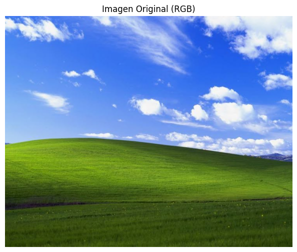
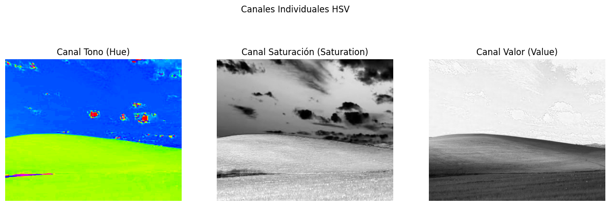
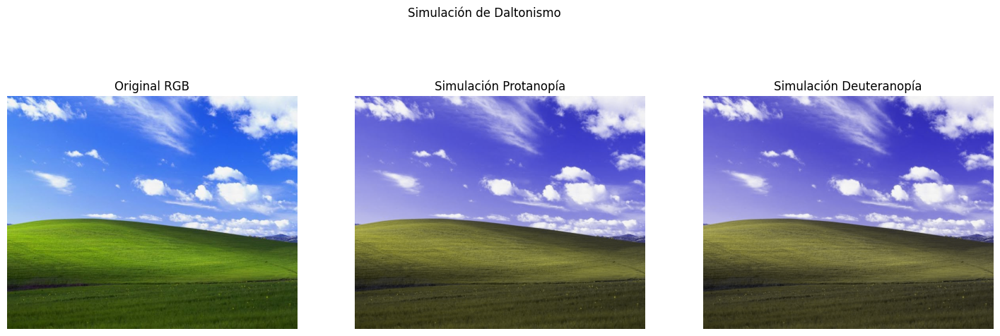
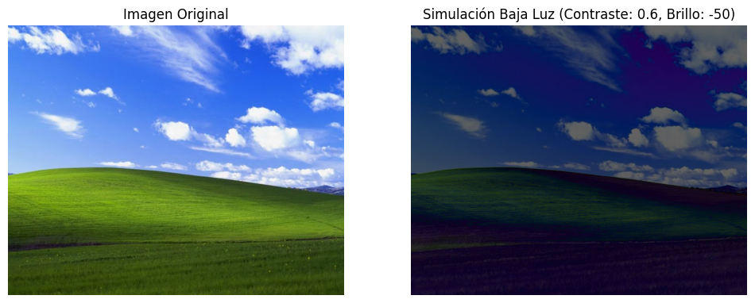

# Transformaciones de Espacios de Color y Simulacion de Vision (Python)

## Nombre del estudiante

- Juan Esteban Santacruz Corredor
- Nicolas Quezada Mora
- Cristian Stiven Motta
- Cristian Steven Motta Ojeda
- Sebastian Andrade Cedano
- Esteban Barrera Sanabria
- Jerónimo Bermúdez Hernández

## Fecha de entrega

2026-03-27

---

## Descripcion breve

En este taller se desarrolló un notebook en Python para analizar y transformar imágenes entre distintos espacios de color, así como para simular condiciones de percepción visual alterada. El objetivo principal fue comprender cómo los espacios RGB, HSV y CIE Lab representan la información de color de manera diferente y cómo estas representaciones afectan la percepción humana.

Se implementaron funciones para convertir imágenes entre espacios de color, visualizar sus canales individuales y aplicar transformaciones que simulan daltonismo, reducción de iluminación y filtros de temperatura de color. Estas herramientas permiten estudiar cómo cambian los colores bajo distintas condiciones fisiológicas y ambientales.

---

## Implementaciones

### Python (Jupyter / Colab)

Se desarrolló el notebook:


utilizando las librerías:

- opencv-python
- numpy
- matplotlib
- skimage.color
- colorsys

El notebook realiza:

- carga de imágenes desde archivo,
- conversión de RGB a HSV,
- conversión de RGB a CIE Lab,
- visualización de canales individuales (R, G, B, H, S, V, L, a, b),
- simulación de daltonismo (protanopía y deuteranopía) mediante matrices de transformación,
- simulación de baja iluminación mediante reducción de brillo y contraste,
- aplicación de filtros de color personalizados como inversión y monocromo,
- y una función para alternar dinámicamente entre distintas transformaciones.

---

## Resultados visuales


### Conversion de espacios de color



Imagen original en espacio RGB utilizada como referencia para las transformaciones.



Visualizacion de la imagen convertida a HSV y sus canales separados.

### Simulacion de vision alterada



Simulacion de protanopia y deuteranopia aplicadas sobre la imagen original.



Simulacion de condiciones de iluminacion reducida y contraste bajo.

---

## Codigo relevante

### Conversion de RGB a HSV y Lab

```python
import cv2
from skimage import color

img_bgr = cv2.imread("imagen.jpg")
img_rgb = cv2.cvtColor(img_bgr, cv2.COLOR_BGR2RGB)

img_hsv = cv2.cvtColor(img_rgb, cv2.COLOR_RGB2HSV)
img_lab = color.rgb2lab(img_rgb)
```

### Visualizacion de canales individuales
import matplotlib.pyplot as plt

```python
fig, axs = plt.subplots(1, 3, figsize=(12, 4))
axs[0].imshow(img_rgb[:,:,0], cmap="gray")
axs[0].set_title("Canal R")

axs[1].imshow(img_rgb[:,:,1], cmap="gray")
axs[1].set_title("Canal G")

axs[2].imshow(img_rgb[:,:,2], cmap="gray")
axs[2].set_title("Canal B")
```


### Visualizacion de canales individuales

```python
import numpy as np

protanopia_matrix = np.array([
    [0.56667, 0.43333, 0.0],
    [0.55833, 0.44167, 0.0],
    [0.0,     0.24167, 0.75833]
])

def apply_color_matrix(img, matrix):
    h, w, _ = img.shape
    flat = img.reshape(-1, 3)
    transformed = flat @ matrix.T
    return transformed.reshape(h, w, 3)
```

## Visualizacion de canales individuales
Durante el desarrollo del notebook se utilizó IA generativa para generar funciones base de conversión de color, matrices de simulación de daltonismo y ejemplos de visualización con matplotlib.

## Prompts usados:

- "Cómo simular protanopia y deuteranopia en imágenes usando matrices de transformación en numpy."

- "Cómo reducir brillo y contraste de una imagen en OpenCV para simular baja iluminación."

- "Cómo crear una función en Python que permita alternar entre diferentes filtros de color sobre una imagen."
  

## Aprendizajes y dificultades

### Aprendizajes
Se comprendió cómo distintos espacios de color separan la información cromática y luminosa, y por qué modelos como HSV y Lab son más adecuados para tareas de análisis perceptual que el espacio RGB. También se reforzó el uso de transformaciones matriciales para modificar la percepción del color de forma controlada.

Además, se observó cómo pequeñas modificaciones en brillo, saturación o contraste pueden cambiar significativamente la legibilidad y la percepción de una imagen, lo cual es relevante para accesibilidad visual y diseño gráfico.

### Dificultades
Una de las principales dificultades fue manejar las diferencias de rango y normalización entre los distintos espacios de color, ya que OpenCV y scikit-image utilizan escalas diferentes para HSV y Lab. Esto generó inconsistencias iniciales en la visualización que se resolvieron normalizando los datos antes de graficarlos.

También se requirió cuidado al aplicar matrices de transformación para evitar valores fuera del rango [0, 255], lo cual provocaba artefactos visuales si no se realizaba un recorte adecuado.

## Referencias
- OpenCV color conversions: https://docs.opencv.org/
- scikit-image color spaces: https://scikit-image.org/docs/stable/api/skimage.color.html
- Matplotlib image display: https://matplotlib.org/stable/tutorials/introductory/images.html
- Simulacion de daltonismo: https://ixora.io/projects/colorblindness/color-blindness-simulation-research/