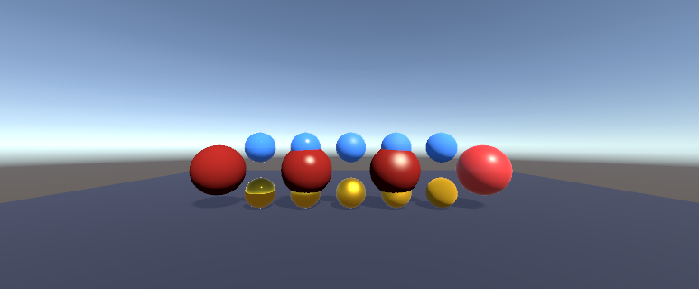
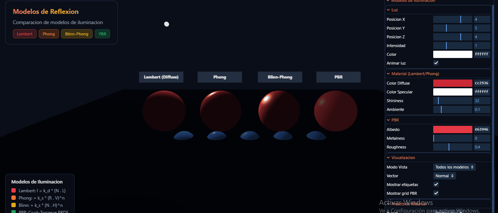
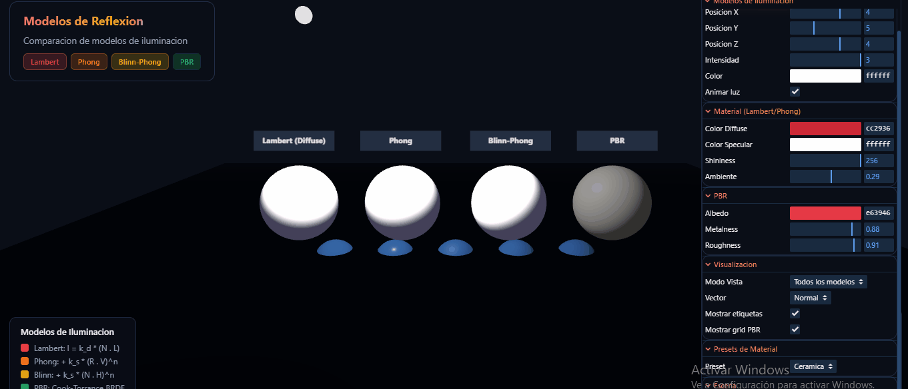

# Taller Modelos Reflexion PBR

## Nombre de los estudiante 
- Juan Esteban Santacruz Corredor
- Nicolas Quezada Mora
- Cristian Stiven Motta
- Sebastian Andrade Cedano
- Esteban Barrera Sanabria
- Jerónimo Bermúdez Hernández

## Fecha de entrega

09 de marzo de 2026


## Descripcion breve

Este taller implementa y compara diferentes modelos de reflexion de luz utilizados en computacion grafica: el modelo Lambertiano (difuso), el modelo de Phong (especular), el modelo de Blinn-Phong (optimizacion de Phong), y los fundamentos del renderizado basado en fisica (PBR - Physically Based Rendering).

El objetivo principal fue comprender las diferencias matematicas y visuales entre cada modelo de iluminacion, observando como cada uno calcula la interaccion de la luz con las superficies. Se implementaron shaders personalizados tanto en Unity (HLSL/Cg) como en Three.js (GLSL), permitiendo visualizar lado a lado las diferencias entre los modelos y experimentar con parametros como shininess, metalness y roughness.

---

## Implementaciones

### Unity

- Version utilizada: Unity 6 LTS.
- Pipeline: Built-in Render Pipeline con shaders personalizados.
- Scripts principales: `Assets/Scripts/ReflectionModelsSetup.cs`, `Assets/Scripts/IlluminationUI.cs`.

Se implementaron los siguientes shaders HLSL:

| Shader | Descripcion | Ecuacion Principal |
|--------|-------------|---------------------|
| `LambertDiffuse.shader` | Modelo difuso puro | `I = k_d * max(N . L, 0)` |
| `PhongSpecular.shader` | Difuso + especular con vector de reflexion | `I_s = k_s * max(R . V, 0)^n` |
| `BlinnPhongSpecular.shader` | Difuso + especular con half vector | `I_s = k_s * max(N . H, 0)^n` |
| `VectorVisualization.shader` | Debug de vectores N, L, V, R, H | Mapeo RGB |
| `IlluminationComponents.shader` | Visualiza componentes individuales | Ambient / Diffuse / Specular |

La escena incluye:

- Cuatro esferas principales con cada modelo de iluminacion.
- Grid de esferas PBR con variaciones de metalness (0 a 1) y roughness (0 a 1).
- Panel de control IMGUI para ajustar shininess, colores y parametros PBR.
- Luz animada orbitando la escena.
- Camara orbital para inspeccion.
- Presets de materiales: plastico, metal dorado, metal cromado, goma, ceramica.

### Three.js

- Stack: HTML5, Three.js r164, lil-gui.
- Archivos principales: `threejs/standalone.html` (version standalone), `threejs/js/shaders.js` (shaders GLSL).

Se implementaron shaders GLSL personalizados:

| Shader | Descripcion |
|--------|-------------|
| Lambert Vertex/Fragment | Iluminacion difusa basica |
| Phong Vertex/Fragment | Especular con `R = reflect(-L, N)` |
| Blinn-Phong Vertex/Fragment | Especular con `H = normalize(L + V)` |
| PBR (Cook-Torrance) | BRDF completo con GGX, Fresnel-Schlick y Smith Geometry |

La escena web incluye:

- Cuatro esferas con Lambert, Phong, Blinn-Phong y PBR.
- Grid de esferas PBR: fila superior con dielectricos (azul), fila inferior con metales (dorado).
- Panel GUI interactivo con lil-gui para controlar todos los parametros.
- Luz puntual animada orbitando la escena.
- Controles de camara orbital.
- Visualizacion de ecuaciones matematicas.

### Diferencias clave entre modelos

| Caracteristica | Lambert | Phong | Blinn-Phong | PBR |
|----------------|---------|-------|-------------|-----|
| Componente difusa | Si | Si | Si | Si (kD) |
| Componente especular | No | Si (R.V) | Si (N.H) | Si (BRDF) |
| Conservacion energia | No | No | No | Si |
| Fisicamente correcto | No | No | No | Si |
| Parametros | kd | kd, ks, n | kd, ks, n | albedo, metalness, roughness |

---

## Ejecucion

### Unity

1. Abrir la carpeta `unity/` desde Unity Hub.
2. Abrir o crear una escena vacia.
3. Crear un GameObject vacio y agregar el script `ReflectionModelsSetup`.
4. Agregar los scripts `IlluminationUI` y `OrbitCamera` a la camara.
5. Ejecutar la escena.

### Three.js

**Opcion 1 - Standalone (sin servidor):**
1. Abrir directamente `threejs/standalone.html` en el navegador.

**Opcion 2 - Con servidor local:**
1. Navegar a la carpeta `threejs/`.
2. Ejecutar `npx serve .` o `python -m http.server 8000`.
3. Abrir `http://localhost:8000` o `http://localhost:5000`.

---

## Resultados visuales

### Unity



Vista general de la escena en Unity mostrando las cuatro esferas con diferentes modelos de iluminacion: Lambert (izquierda), Phong, Blinn-Phong y PBR (derecha), junto con el grid de esferas PBR mostrando variaciones de roughness (horizontal) para materiales dielectricos (arriba) y metalicos (abajo).

### Three.js



Escena web con materiales PBR dielectricos mostrando la interactividad del panel GUI y los cambios en tiempo real de los parametros de material (metalness y roughness).



Materiales PBR metalicos implementados con Cook-Torrance BRDF, visualizando el comportamiento de superficies metalicas con diferentes valores de roughness.

---

## Codigo relevante

### Shader Lambert (GLSL)

```glsl
// Fragment shader - Modelo Lambertiano
void main() {
    vec3 L = normalize(uLightPosition - vWorldPosition);
    vec3 N = normalize(vNormal);

    // Componente ambiente
    vec3 ambient = uAmbientColor * uDiffuseColor;

    // Componente difusa: I_d = k_d * max(N . L, 0)
    float NdotL = max(dot(N, L), 0.0);
    vec3 diffuse = uLightColor * uDiffuseColor * NdotL * uLightIntensity;

    gl_FragColor = vec4(ambient + diffuse, 1.0);
}
```

### Shader Phong vs Blinn-Phong (GLSL)

```glsl
// PHONG: usa vector de reflexion R
vec3 R = reflect(-L, N);
float RdotV = max(dot(R, V), 0.0);
float specFactor = pow(RdotV, uShininess);

// BLINN-PHONG: usa half vector H (mas eficiente)
vec3 H = normalize(L + V);
float NdotH = max(dot(N, H), 0.0);
float specFactor = pow(NdotH, uShininess);
```

### Shader PBR - Cook-Torrance BRDF (GLSL)

```glsl
// Fresnel-Schlick
vec3 fresnelSchlick(float cosTheta, vec3 F0) {
    return F0 + (1.0 - F0) * pow(clamp(1.0 - cosTheta, 0.0, 1.0), 5.0);
}

// GGX Normal Distribution Function
float distributionGGX(vec3 N, vec3 H, float roughness) {
    float a = roughness * roughness;
    float a2 = a * a;
    float NdotH = max(dot(N, H), 0.0);
    float denom = (NdotH * NdotH * (a2 - 1.0) + 1.0);
    return a2 / (PI * denom * denom);
}

// BRDF final
vec3 numerator = NDF * G * F;
float denominator = 4.0 * max(dot(N, V), 0.0) * max(dot(N, L), 0.0) + 0.0001;
vec3 specular = numerator / denominator;
```

### Unity - Shader Blinn-Phong (HLSL)

```hlsl
fixed4 frag(v2f i) : SV_Target
{
    float3 N = normalize(i.worldNormal);
    float3 L = normalize(_WorldSpaceLightPos0.xyz);
    float3 V = normalize(_WorldSpaceCameraPos - i.worldPos);

    // Half vector H = normalize(L + V)
    float3 H = normalize(L + V);
    float NdotH = max(dot(N, H), 0.0);
    float specularFactor = pow(NdotH, _Shininess);

    fixed3 specular = _LightColor0.rgb * _SpecularColor.rgb * specularFactor;
    return fixed4(ambient + diffuse + specular, 1.0);
}
```

---

## Prompts utilizados

Se utilizo IA generativa (Claude) para asistir en el desarrollo del taller. Los prompts principales fueron:

```text
Implementar y comparar diferentes modelos de reflexion de luz: Lambert, Phong,
Blinn-Phong y PBR. Crear shaders personalizados en Unity (HLSL) y Three.js (GLSL).

Crear una escena con multiples esferas, cada una con un modelo de iluminacion
diferente, para comparar visualmente las diferencias.

Implementar shader PBR con Cook-Torrance BRDF, incluyendo GGX distribution,
Fresnel-Schlick y Smith geometry function.

Agregar controles interactivos para ajustar shininess, metalness, roughness
y colores en tiempo real.

Crear grid de esferas PBR con variaciones sistematicas de metalness y roughness
para visualizar el espacio de parametros.
```

---

## Aprendizajes y dificultades

### Aprendizajes

1. **Diferencias matematicas**: Comprender que Phong usa el vector de reflexion `R = reflect(-L, N)` mientras que Blinn-Phong usa el half vector `H = normalize(L + V)` fue clave para entender por que Blinn-Phong es mas eficiente y produce highlights mas realistas.

2. **PBR y conservacion de energia**: El modelo PBR garantiza que la energia reflejada nunca exceda la energia incidente mediante `kD = (1 - kS) * (1 - metalness)`. Los metales no tienen componente difusa porque absorben la luz que no reflejan.

3. **Fresnel effect**: Todas las superficies se vuelven mas reflectivas en angulos rasantes. El modelo PBR captura esto con la aproximacion de Schlick.

4. **Roughness vs Shininess**: Roughness en PBR controla la dispersion de los microfacets, mientras que shininess en Phong/Blinn es un exponente empirico. Roughness = 0 es un espejo perfecto, roughness = 1 es completamente mate.

### Dificultades

1. **Debugging de shaders**: Los errores en shaders GLSL/HLSL no siempre producen mensajes claros. Fue util usar la visualizacion de vectores (mapeando N, L, V, R, H a colores RGB) para verificar que los calculos eran correctos.

2. **Atenuacion de luz en PBR**: La atenuacion por distancia (`1 / distance^2`) hacia que la escena fuera muy oscura. Fue necesario ajustar un factor de escala para obtener resultados visibles.

3. **Comparacion justa**: Para comparar modelos, todos debian usar la misma posicion de luz, misma geometria y colores similares. Parametrizar esto correctamente tomo varias iteraciones.

4. **Modules ES6 y CORS**: La version modular de Three.js no funciona abriendo el HTML directamente (`file://`). Se creo una version standalone con todo inline para facilitar la ejecucion.

### Mejoras futuras

- Agregar mas tipos de luces (spot, area lights).
- Implementar Image-Based Lighting (IBL) para PBR.
- Agregar texturas de normal maps y roughness maps.
- Comparar con modelos mas avanzados como Oren-Nayar para difuso.

---

## Contribuciones

Taller desarrollado por Nicolas Quezada Mora.

---

## Referencias

- LearnOpenGL - Basic Lighting: https://learnopengl.com/Lighting/Basic-Lighting
- LearnOpenGL - PBR Theory: https://learnopengl.com/PBR/Theory
- Documentacion Three.js - Materials: https://threejs.org/docs/#api/en/materials/MeshStandardMaterial
- Unity Manual - Writing Shaders: https://docs.unity3d.com/Manual/ShadersOverview.html
- Real-Time Rendering, 4th Edition - Capítulos 5 y 9
- Physically Based Rendering: From Theory to Implementation: https://www.pbr-book.org/
