# Taller — Conversión y Manipulación de Espacios de Color

**Nombre del estudiante:** Esteban Barrera Sanabria

**Fecha de entrega:** 28 de marzo de 2026

---

## Descripción

El objetivo del taller es explorar los distintos espacios de color (RGB, HSV, HLS, LAB, YCrCb), realizar conversiones entre ellos y aplicarlos en tareas prácticas de visión computacional: manipulación de imagen, color grading, segmentación por color, extracción de paletas armónicas y análisis de histogramas.

**Entorno utilizado:**

- Python (Jupyter Notebook)

---

## Implementaciones

### 1) Python (Jupyter Notebook)

**Herramientas utilizadas:**

- `opencv-python` — conversiones entre espacios de color, segmentación, LUTs y morfología
- `scikit-image` — ecualización adaptativa, matching de histogramas
- `scikit-learn` — clustering K-means para extracción de paletas
- `numpy` — operaciones matriciales y transformaciones
- `matplotlib` — visualización de imágenes, histogramas y gráficas 3D

**Funcionalidades implementadas:**

1. Carga de imagen `peppers.png` y conversión a RGB, HSV, HLS, LAB, YCrCb y Grayscale con visualización de cada canal por separado y tabla de rangos de valores por espacio.
2. Visualización 3D del cubo RGB y el cilindro HSV: estructura teórica del espacio y distribución real de los píxeles de la imagen.
3. Segmentación por color en espacio HSV con rangos definidos para rojo, verde, azul, amarillo y cian — máscaras binarias limpiadas con morfología (cierre + apertura).
4. Manipulación de color: ajuste de saturación, rotación de matiz, modificación de luminosidad en LAB, ecualización de histograma y balance de blancos automático.
5. Color grading con LUTs: tonos warm/cool, curva S de contraste, efecto fade/mate, cross-process, vintage (sepia) y filtro Clarendon estilo Instagram.
6. Extracción de paleta dominante con K-means (k=8), visualización proporcional y generación de armonías cromáticas: complementarios, análogos, triádicos y split-complementarios.
7. Análisis de histogramas RGB y HSV, ecualización global vs CLAHE adaptativa, y matching de histogramas entre imágenes con `skimage`.
8. **BONUS:** Corrección de color automática (Gray World), detección del color dominante (resuelta en sección 6), transferencia de color entre imágenes (método Reinhard en LAB) y simulación de daltonismo con matrices de transformación para Protanopia, Deuteranopia, Tritanopia y Acromatopsia.

---

## Resultados Visuales

Se presentan según la segmentación del taller:

### 1) Conversión de espacios de color

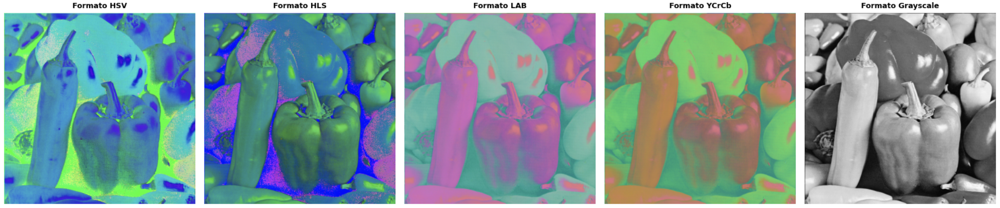

---

### 2) Visualización 3D

Se presenta un cubo RGB (teorico) y un cilindro HSV (teorico) con proyeccion de pixeles de la imagen original:

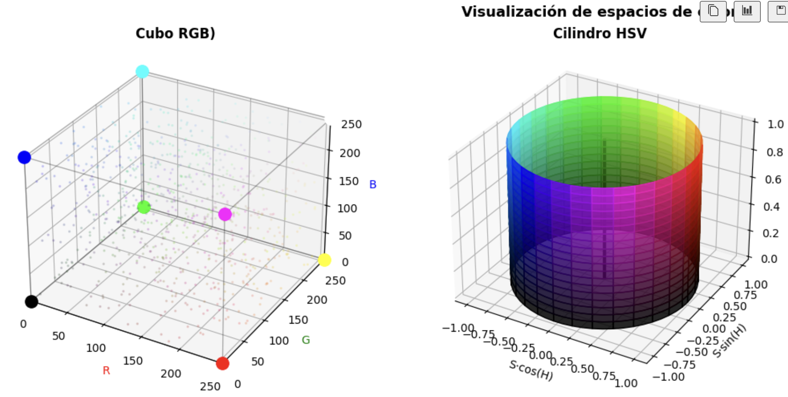

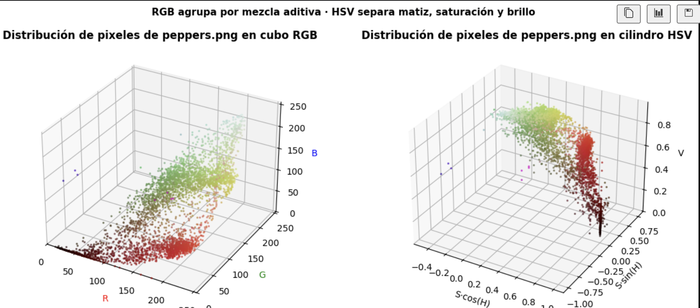

---

### 3) Segmentación por color

Estas son máscaras de segmentación para rojo, verde, azul, amarillo y cian con morfología aplicada

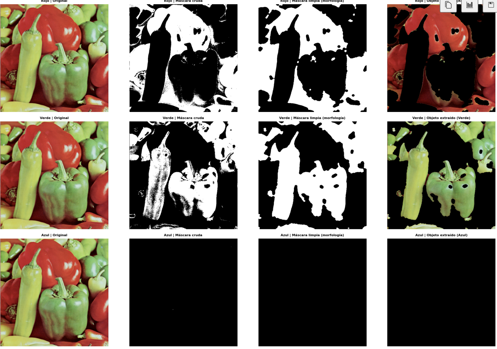
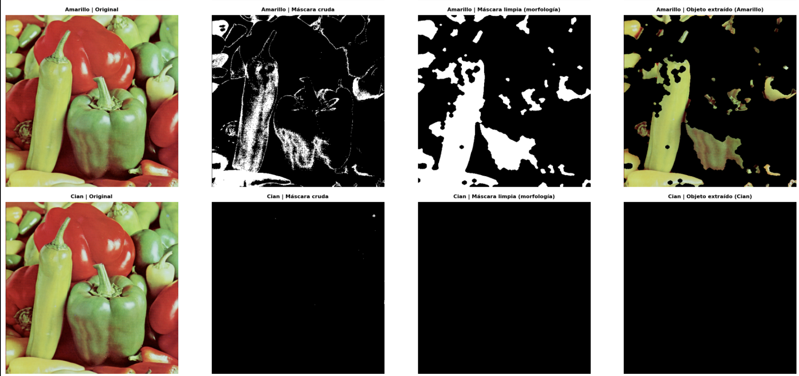

Regiones segmentadas y mapa de colores deteectados:

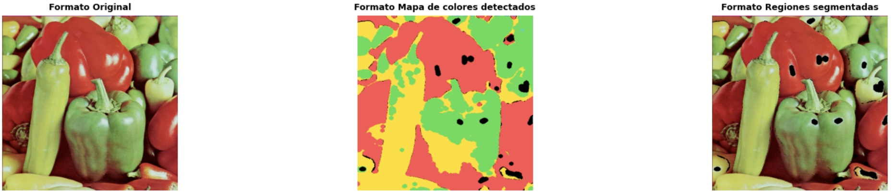

---

### 4) Manipulación de color

Compara saturación ×2, desaturado, rotación de matiz +60° y +120°, luminosidad LAB ±50, ecualización y balance de blancos


---

### 5) Color Grading

Ahora la imagen distorsionada con efectos: warm, cool, curva S, fade, cross-process, vintage y Clarendon

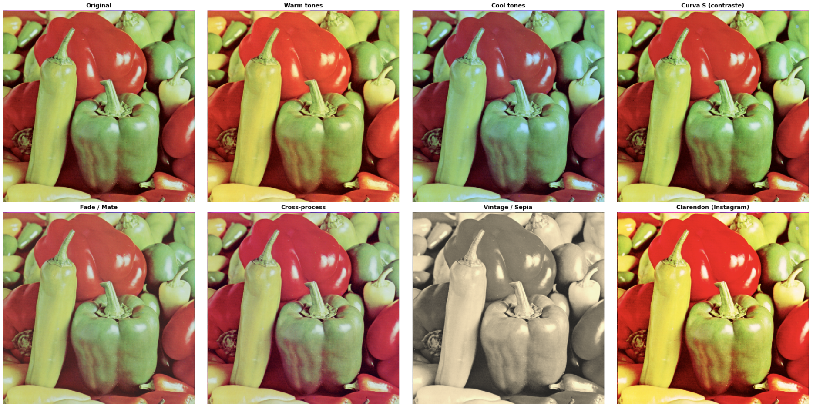

Visualización de las curvas de color aplicadas:

1.png)

---

### 6) Paletas de colores

Se utilizó el metodo de clustering k-means para la paleta de los 8 colores dominantes:

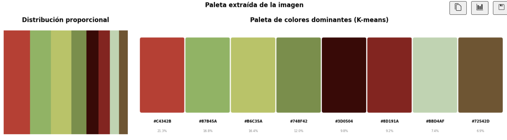

Ademas,las armonías cromáticas generadas: complementarios, análogos, triádicos y split-complementarios

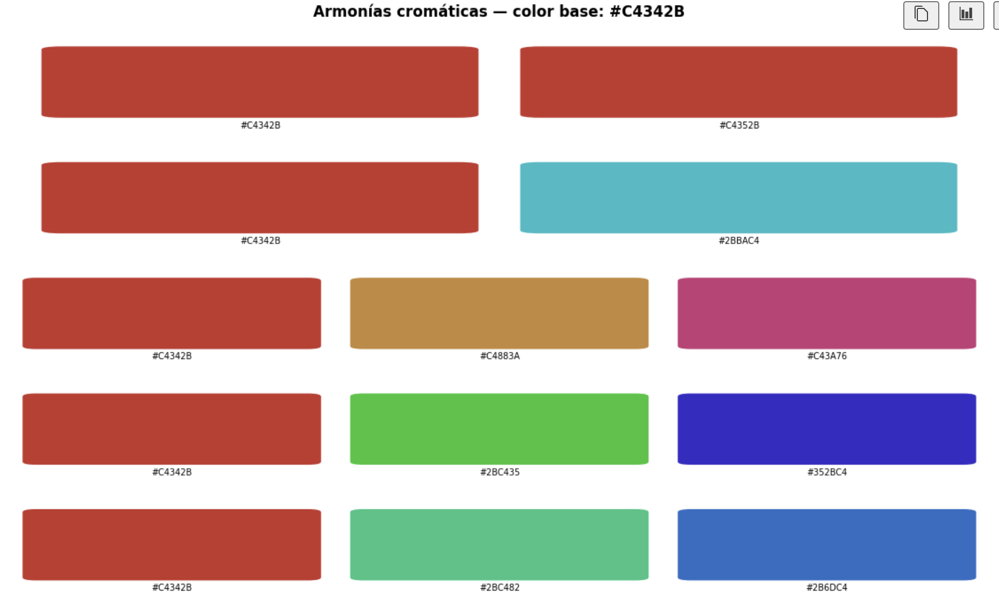


---

### 7) Histogramas

En esta parte, se presenta un histograma con los tres canales del RGB:

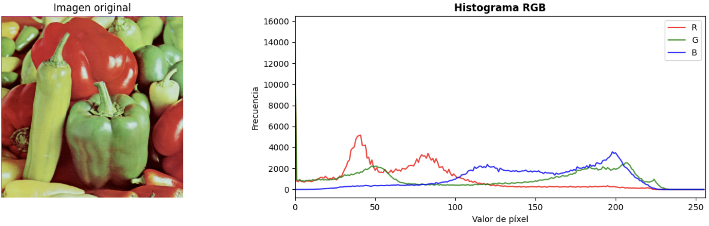

Ahora de Matiz, Saturación y Valor del HSV:

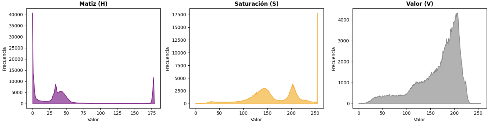

Finalmente se compara ecualización global vs CLAHE adaptativa:

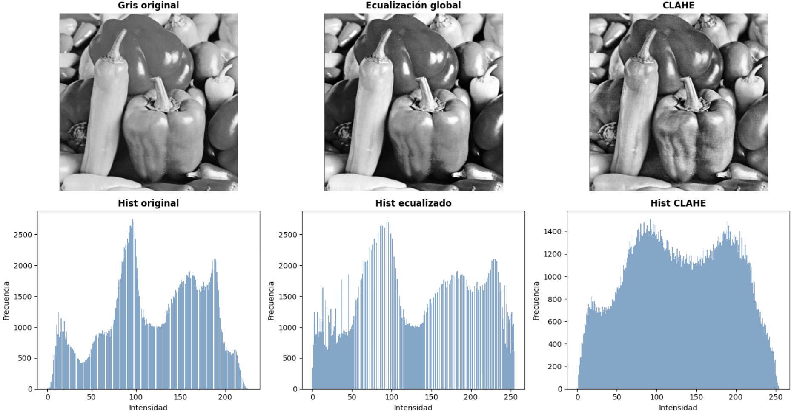

---

### 8) BONUS

En cuanto al bonus vienen distintos resultados. Primero, se presenta la comparacion de la correción automatica de dominante de color con el metodo Gray World:

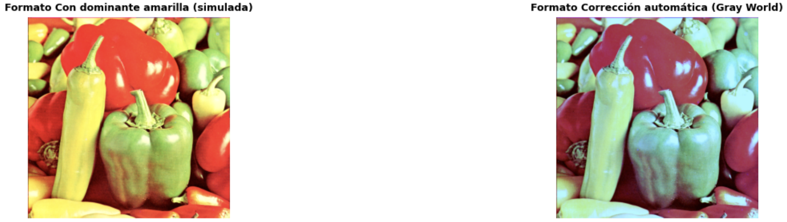

Ahora se cambia a la transferencia de color con el metodo Reinhard:

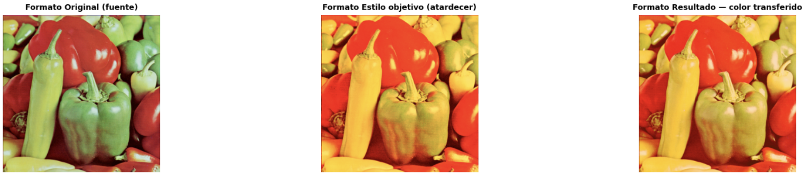

De mantera interesante, se hace un endasis en la simluación de los espectros del dalotnismo: Protanopia, Deuteranopia, Tritanopia y Acromatopsia:

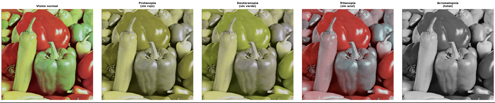

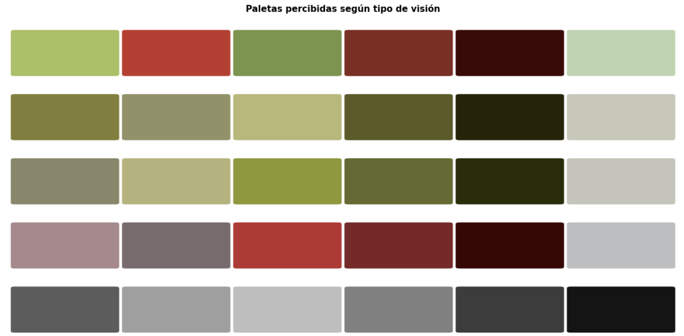

---

## Código Relevante

**Conversión entre espacios de color:**

```python
image_rgb   = cv2.cvtColor(image, cv2.COLOR_BGR2RGB)
image_hsv   = cv2.cvtColor(image_rgb, cv2.COLOR_RGB2HSV)
image_lab   = cv2.cvtColor(image_rgb, cv2.COLOR_RGB2LAB)
image_ycrcb = cv2.cvtColor(image_rgb, cv2.COLOR_RGB2YCrCb)
```

**Segmentación por color en HSV:**

```python
hsv = cv2.cvtColor(image_bgr, cv2.COLOR_BGR2HSV)
lower_blue = np.array([100, 50, 50])
upper_blue = np.array([130, 255, 255])
mask = cv2.inRange(hsv, lower_blue, upper_blue)
mask = cv2.morphologyEx(mask, cv2.MORPH_CLOSE, kernel, iterations=2)
```

**Extracción de paleta con K-means:**

```python
def extraer_paleta(img_rgb, k=8):
    pixels = img_rgb.reshape(-1, 3).astype(float)
    km = KMeans(n_clusters=k, random_state=42, n_init=10)
    km.fit(pixels)
    centros = km.cluster_centers_.astype(int)
    orden   = np.argsort(-np.bincount(km.labels_))
    return centros[orden], np.bincount(km.labels_)[orden]
```

**Transferencia de color (método Reinhard):**

```python
def transferir_color(fuente_rgb, objetivo_rgb):
    fuente_lab   = cv2.cvtColor(fuente_rgb,   cv2.COLOR_RGB2LAB).astype(float)
    objetivo_lab = cv2.cvtColor(objetivo_rgb, cv2.COLOR_RGB2LAB).astype(float)
    resultado = fuente_lab.copy()
    for canal in range(3):
        mean_f, std_f = fuente_lab[:,:,canal].mean(), fuente_lab[:,:,canal].std()
        mean_o, std_o = objetivo_lab[:,:,canal].mean(), objetivo_lab[:,:,canal].std()
        if std_f > 0:
            resultado[:,:,canal] = (fuente_lab[:,:,canal] - mean_f) * (std_o / std_f) + mean_o
    return cv2.cvtColor(np.clip(resultado, 0, 255).astype(np.uint8), cv2.COLOR_LAB2RGB)
```

**Simulación de daltonismo:**

```python
def simular_daltonismo(img_rgb, matriz):
    img_f = img_rgb.astype(float) / 255.0
    sim   = np.einsum('ij,hwj->hwi', matriz, img_f)
    return np.clip(sim * 255, 0, 255).astype(np.uint8)
```

---

## Prompts Utilizados

Durante el desarrollo se utilizaron herramientas de IA generativa para:

1. Estructurar las conversiones entre espacios de color y los rangos HSV correctos para segmentación.
2. Orientación sobre el método Reinhard para transferencia de color en espacio LAB.
3. Construcción de las matrices de simulación de daltonismo (modelo Brettel/Viénot).

---

## Aprendizajes y Dificultades

### Aprendizajes

- OpenCV trabaja internamente en BGR, no RGB — todas las conversiones requieren tener claro el orden de canales de entrada para evitar resultados incorrectos.
- El espacio HSV es significativamente más útil que RGB para segmentación por color porque separa el matiz (H) de la iluminación (V), haciendo los rangos mucho más robustos ante cambios de luz.
- El rojo en HSV ocupa dos rangos discontinuos (cerca de H=0 y H=180) porque el matiz es circular, lo que obliga a combinar dos máscaras con `bitwise_or`.
- CLAHE (ecualización adaptativa por tiles) preserva mejor el detalle local que la ecualización global, especialmente en imágenes con zonas de iluminación muy diferente.

### Dificultades

- Determinar los rangos HSV correctos para cada color requirió ajuste manual — los valores teóricos puros no siempre funcionan bien con imágenes reales con variaciones de iluminación.
- La visualización cilíndrica del espacio HSV es costosa de renderizar cuando se usa la superficie completa con colores reales; fue necesario reducir la resolución de la malla para mantener tiempos de ejecución razonables.