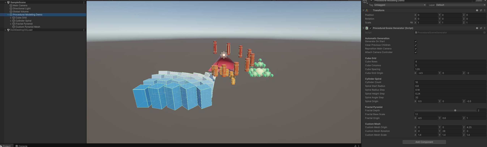
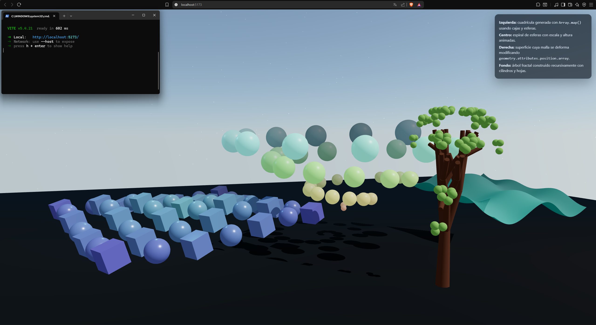

# Taller Semana 5 - Modelado procedural basico

## Nombre del estudiante

Nicolas Quezada Mora

## Fecha de entrega

`2026-03-24`

---

## Descripcion breve

Este taller desarrolla ejemplos basicos de modelado procedural en dos entornos: Unity y Three.js con React Three Fiber. El objetivo fue construir escenas replicables a partir de primitivas, estructuras generadas con ciclos, transformaciones programaticas y geometria creada o modificada desde codigo.

En Unity se implemento una escena que genera automaticamente una rejilla de cubos, una espiral de cilindros, una estructura fractal simple y una malla personalizada creada desde cero con `Mesh`, `Vector3[]` e `int[]`. En React Three Fiber se construyo una escena interactiva con una cuadricula de objetos repetidos, una espiral animada, una superficie cuyos vertices se deforman en tiempo real y un arbol fractal recursivo.

## Implementaciones

### Unity

Proyecto ubicado en `unity/Modelado`, desarrollado con Unity `6000.3.8f1`. La logica principal esta en `Assets/Scripts/ProceduralModeling/`.

Se resolvieron las siguientes tareas:

- Generacion automatica de primitivas con `GameObject.CreatePrimitive()`.
- Rejilla de cubos con posicion, rotacion y escala controladas por ciclos `for`.
- Espiral de cilindros con radio y altura crecientes.
- Estructura fractal simple basada en esferas recursivas.
- Malla personalizada tipo piramide creada desde cero con vertices, triangulos y UVs.
- Reubicacion automatica de la camara principal y controlador de movimiento libre.

Archivos principales:

- `ProceduralSceneGenerator.cs`: construye la escena procedural completa.
- `ProceduralMeshFactory.cs`: crea la malla personalizada.
- `ProceduralDemoBootstrap.cs`: instancia el generador si no existe en la escena.
- `ProceduralCameraController.cs`: permite recorrer la escena en tiempo real.

### Three.js / React Three Fiber

Proyecto ubicado en `threejs/`, construido con React 18, Vite, `@react-three/fiber`, `@react-three/drei` y `three`.

Se resolvieron las siguientes tareas:

- Uso de geometria basica (`boxGeometry`, `sphereGeometry`, `cylinderGeometry`, `planeGeometry`).
- Generacion de estructuras repetitivas usando `Array.map()`.
- Cuadricula procedural que mezcla cajas y esferas.
- Espiral de objetos con posicion y escala calculadas desde arreglos.
- Modificacion dinamica de vertices mediante `geometry.attributes.position.array`.
- Animacion por cuadro usando `useFrame()`.
- Patron fractal basico implementado como arbol recursivo de objetos.

El archivo principal es `threejs/src/App.jsx`, donde se define toda la escena, la interfaz superpuesta y las animaciones.

### Componentes no aplicados

Este taller no incluye implementaciones en Python ni Processing.

---

## Como ejecutar

### Unity

1. Abrir `unity/Modelado` desde Unity Hub.
2. Cargar la escena `Assets/Scenes/SampleScene.unity`.
3. Ejecutar la escena. Si no existe un generador en la jerarquia, `ProceduralDemoBootstrap` lo crea automaticamente.

Controles de camara:

- `W`, `A`, `S`, `D`: desplazamiento horizontal.
- `Q` y `E`: movimiento vertical.
- `Shift`: acelerar.
- Click derecho + mouse: rotacion de camara.

### Three.js / React Three Fiber

1. Abrir una terminal en `threejs/`.
2. Instalar dependencias con `npm install`.
3. Ejecutar `npm run dev`.
4. Abrir la URL local que entregue Vite.

Tambien se puede generar una version de produccion con `npm run build`.

---

## Resultados visuales

### Unity - Implementacion


El GIF muestra la escena generada por codigo: rejilla de cubos, espiral de cilindros, estructura fractal y la malla personalizada dentro del mismo espacio 3D.



La captura muestra una vista general del resultado final dentro del editor, con las primitivas distribuidas proceduralmente y los materiales aplicados desde script.

### Three.js - Implementacion


El GIF muestra la escena interactiva con animacion continua: cuadricula de objetos, espiral central, superficie deformable y arbol fractal al fondo.



La imagen permite identificar la composicion completa del entorno, la iluminacion, el fondo y la distribucion espacial de cada estructura generada.

---

## Codigo relevante

### Unity - Generacion de primitivas y transformaciones

```csharp
for (int row = 0; row < cubeRows; row++)
{
    for (int column = 0; column < cubeColumns; column++)
    {
        GameObject cube = GameObject.CreatePrimitive(PrimitiveType.Cube);
        cube.transform.SetParent(section, false);
        cube.transform.localPosition = cubeGridOrigin + startOffset +
            new Vector3(column * cubeSpacing, 0f, row * cubeSpacing);
        cube.transform.localRotation = Quaternion.Euler(row * 7f, column * 14f, 0f);
        cube.transform.localScale = new Vector3(1f, 1f + heightScale, 1f);
    }
}
```

### Unity - Malla personalizada

```csharp
Vector3[] vertices =
{
    new Vector3(-halfBase, 0f, -halfBase),
    new Vector3(halfBase, 0f, -halfBase),
    new Vector3(halfBase, 0f, halfBase),
    new Vector3(-halfBase, 0f, halfBase),
    new Vector3(0f, height, 0f)
};

int[] triangles =
{
    0, 2, 1,
    0, 3, 2,
    0, 1, 4,
    1, 2, 4,
    2, 3, 4,
    3, 0, 4
};
```

### React Three Fiber - Modificacion de vertices

```javascript
for (let index = 0; index < positions.length; index += 3) {
  const x = basePositions[index]
  const y = basePositions[index + 1]
  positions[index + 2] =
    Math.sin(x * 1.25 + time * 1.8) * 0.45 +
    Math.cos(y * 1.8 - time * 1.35) * 0.2 +
    Math.sin((x + y) * 0.9 + time * 0.85) * 0.15
}

geometry.attributes.position.needsUpdate = true
geometry.computeVertexNormals()
```

### React Three Fiber - Estructura repetitiva y fractal

```javascript
{items.map((item) => (
  <mesh key={item.id} position={item.position}>
    {item.type === 'box'
      ? <boxGeometry args={[0.9, 0.9, 0.9]} />
      : <sphereGeometry args={[0.52, 28, 28]} />}
  </mesh>
))}
```

```javascript
function Branch({ depth, length, radius, tilt = 0.4 }) {
  if (depth <= 0) {
    return <mesh position={[0, length, 0]} />
  }

  return (
    <group>
      <mesh position={[0, length / 2, 0]}>
        <cylinderGeometry args={[radius * 0.75, radius, length, 10]} />
      </mesh>
      <group position={[0, length, 0]}>
        <Branch depth={depth - 1} length={length * 0.76} radius={radius * 0.72} />
      </group>
    </group>
  )
}
```

---

## Prompts utilizados

Se utilizo IA generativa para apoyar la generacion de scripts, refinar estructuras procedurales y corregir errores durante el desarrollo. Responsable del uso: Nicolas Quezada Mora.

Ejemplos de prompts utilizados:

```text
"Genera un script en C# para Unity que cree una rejilla de cubos usando GameObject.CreatePrimitive() y aplique posicion, rotacion y escala con ciclos for."

"Ayudame a crear una espiral de cilindros en Unity con parametros editables desde el inspector."

"Explica como construir una malla piramidal en Unity usando Mesh, Vector3[] e int[]."

"Crea una escena en React Three Fiber con una cuadricula de cajas y esferas generadas con map(), una espiral animada y un arbol fractal recursivo."

"Corrige errores en la actualizacion de vertices de bufferGeometry.attributes.position.array para animar una superficie en Three.js."
```

---

## Aprendizajes y dificultades

### Aprendizajes

Este taller permitio reforzar el modelado procedural. En Unity quedo mas claro como combinar primitivas, jerarquias, materiales y mallas personalizadas dentro de una sola escena generada desde codigo.

En React Three Fiber el aprendizaje principal fue entender como mezclar React con operaciones mas cercanas al nivel de geometria, como la modificacion directa del arreglo de posiciones de un `bufferGeometry`. Tambien se reforzo el uso de recursion para construir patrones fractales.

### Dificultades

La parte mas delicada fue mantener ordenadas las transformaciones para que cada estructura procedural quedara bien ubicada y no se superpusiera con las demas.


### Mejoras futuras

Seria util parametrizar mas elementos desde interfaces o paneles de control, agregar mas tipos de mallas personalizadas y exportar configuraciones para comparar distintas variaciones de la escena.

---

## Contribuciones grupales

Apartado realizado por Nicolas Quezada Mora

---

## Referencias

- Unity Manual - Procedural Mesh Geometry: https://docs.unity3d.com/Manual/GeneratingMeshGeometryProcedurally.html
- Unity Scripting API - `GameObject.CreatePrimitive`: https://docs.unity3d.com/ScriptReference/GameObject.CreatePrimitive.html
- Unity Scripting API - `Mesh`: https://docs.unity3d.com/ScriptReference/Mesh.html
- React Three Fiber Documentation: https://docs.pmnd.rs/react-three-fiber/
- Drei Documentation: https://github.com/pmndrs/drei
- Three.js Documentation - BufferGeometry: https://threejs.org/docs/#api/en/core/BufferGeometry
