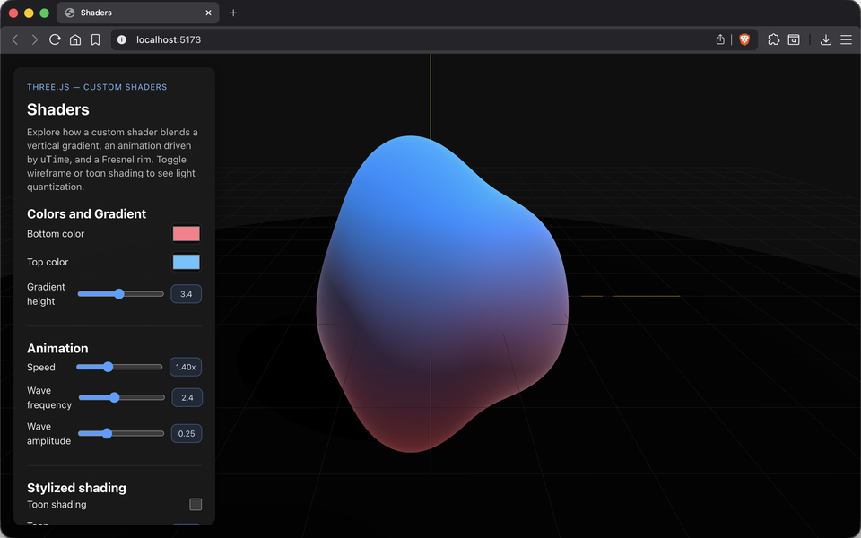
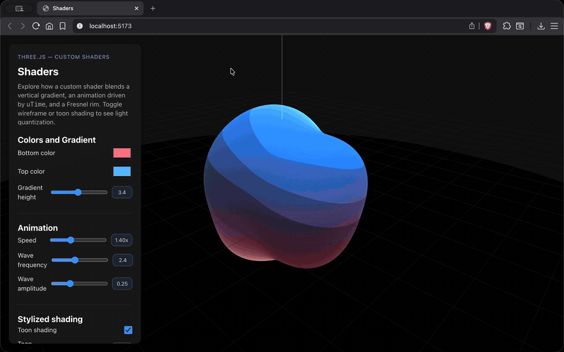
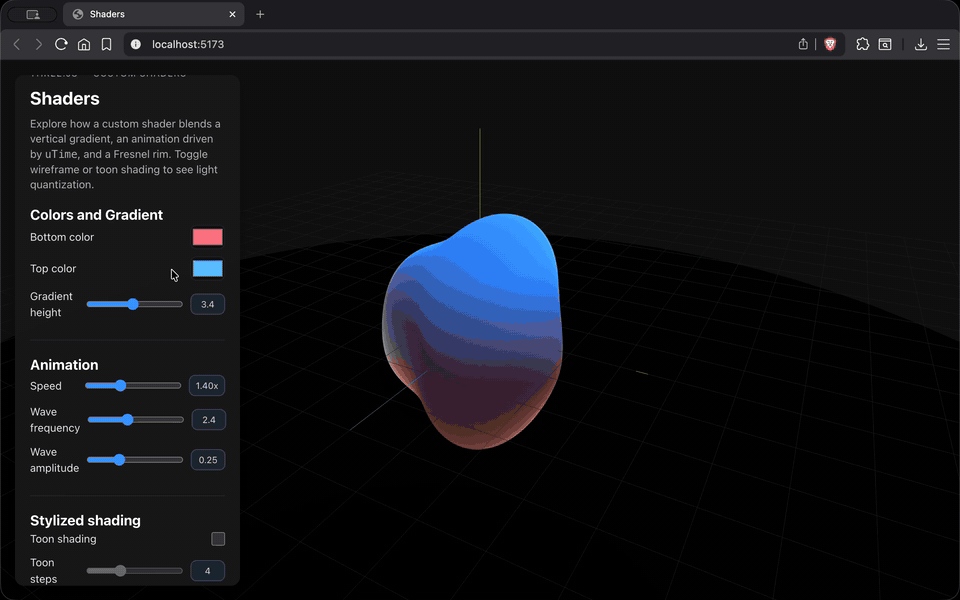

# Taller Shaders Basicos Unity Threejs

## Nombre de los estudiantes
- Juan Esteban Santacruz Corredor
- Nicolas Quezada Mora
- Cristian Steven Motta Ojeda
- Sebastian Andrade Cedano
- Esteban Barrera Sanabria
- Jerónimo Bermúdez Hernández

## Fecha de entrega

`2026-03-24`

---

## Descripción breve

Taller sobre shaders personalizados en Three.js (React Three Fiber). Se implementó un shader que mezcla gradiente vertical animado con `uTime`, desplazamiento de vértices con ondas senoidales y rim Fresnel, además de modos opcionales de toon shading y wireframe para analizar la topología y la cuantización de luz.

---

## Implementaciones

### Three.js / React Three Fiber

- Shader material custom con gradiente vertical (colores superior/inferior configurables) y pulso temporal.
- Desplazamiento de vértices con tres ondas senoidales controlables: frecuencia, amplitud y velocidad de tiempo.
- Toon shading con pasos configurables y rim Fresnel ajustable; wireframe opcional sobre la misma geometría.
- Panel de control en React que expone sliders y toggles para todos los parámetros del shader.

---

## Resultados visuales

### Three.js - Implementación



Gradiente vertical animado más desplazamiento de vértices por tres ondas senoidales; se aprecia la deformación suave y el rim Fresnel resaltando la silueta.



Alterna entre toon shading y wireframe: se observa la cuantización de la luz en bandas y la estructura de la malla al activar el modo alámbrico.



Pulso temporal de color usando `uTime`, con el rim Fresnel marcando los bordes iluminados; se nota el contraste en la parte superior de la geometría.

---

## Código relevante

### Shader GLSL (fragmento)

```glsl
uniform vec3 uTopColor;
uniform vec3 uBottomColor;
uniform float uGradientHeight;
uniform float uTime;
uniform float uUseToon;
uniform float uToonSteps;

void main() {
	float gradient = clamp((vPosition.y + uGradientHeight * 0.5) / uGradientHeight, 0.0, 1.0);
	float pulse = 0.55 + 0.45 * sin(uTime * 1.3 + vPosition.y * 0.5);
	vec3 base = mix(uBottomColor, uTopColor, gradient);
	base = mix(base, base * 1.2, pulse);

	float diffuse = clamp(dot(normalize(vNormal), normalize(vec3(0.35, 0.8, 0.45))), 0.0, 1.0);
	if (uUseToon > 0.5) {
		float steps = max(uToonSteps, 1.0);
		diffuse = floor(diffuse * steps) / steps;
	}
	gl_FragColor = vec4(base * (0.35 + 0.75 * diffuse), 1.0);
}
```

### React Three Fiber — panel de controles

```jsx
function Controls({ settings, onChange }) {
	const handleNumber = (key) => (e) => onChange(key, Number(e.target.value));
	const handleToggle = (key) => (e) => onChange(key, e.target.checked);
	const handleColor = (key) => (e) => onChange(key, e.target.value);

	return (
		<div className="controls-panel">
			<h3>Colors and Gradient</h3>
			<input type="color" value={settings.bottomColor} onChange={handleColor('bottomColor')} />
			<input type="color" value={settings.topColor} onChange={handleColor('topColor')} />
			<input type="range" min="1" max="6" step="0.1" value={settings.gradientHeight} onChange={handleNumber('gradientHeight')} />

			<h3>Animation</h3>
			<input type="range" min="0" max="4" step="0.05" value={settings.animationSpeed} onChange={handleNumber('animationSpeed')} />
			<input type="range" min="0" max="6" step="0.1" value={settings.waveFrequency} onChange={handleNumber('waveFrequency')} />
			<input type="range" min="0" max="0.8" step="0.01" value={settings.waveAmplitude} onChange={handleNumber('waveAmplitude')} />

			<h3>Stylized shading</h3>
			<label><input type="checkbox" checked={settings.useToon} onChange={handleToggle('useToon')} /> Toon</label>
			<input type="range" min="2" max="8" step="1" value={settings.toonSteps} onChange={handleNumber('toonSteps')} disabled={!settings.useToon} />
			<label><input type="checkbox" checked={settings.wireframe} onChange={handleToggle('wireframe')} /> Wireframe</label>
		</div>
	);
}
```

### Archivos de la escena

- Escena con shader personalizado: [threejs /src/components/SceneViewer.jsx](threejs%20/src/components/SceneViewer.jsx)
- Panel y controles: [threejs /src/components/Controls.jsx](threejs%20/src/components/Controls.jsx)
- Estilos del panel: [threejs /src/components/Controls.css](threejs%20/src/components/Controls.css)
- Punto de entrada React: [threejs /src/main.jsx](threejs%20/src/main.jsx)

---

## Prompts utilizados

1. "Create a GLSL gradient shader with time animation and Fresnel rim for Three.js"
2. "Add toon shading quantization steps to a fragment shader"
3. "React three fiber shaderMaterial with UI controls for uniforms"

---

## Aprendizajes y dificultades

### Aprendizajes

- `uTime` debe vivir en uniforms estables para no reiniciar la animación al cambiar estado.
- Cuantizar la luz con toon steps requiere normalizar la difusa antes de discretizar.
- Wireframe sobre la misma geometría ayuda a depurar topología sin perder el gradiente base.
- El rim Fresnel mejora la lectura de silueta; valores altos pueden lavar el color.

### Dificultades

- Ajustar la intensidad del rim para no saturar colores al combinar toon y pulso temporal.
- Mantener el tiempo continuo al cambiar sliders en React sin reinicializar el material.
- Balancear frecuencia y amplitud de ondas para evitar clipping en la malla animada.

---

## Contribuciones grupales (si aplica)

| Integrante | Rol |
|---|---|
| Juan Esteban Santacruz Corredor | Shader GLSL y rim Fresnel |
| Nicolas Quezada Mora | Toon shading y wireframe |
| Cristian Steven Motta Ojeda | Integración React Three Fiber y cámara/luces |
| Sebastian Andrade Cedano | Panel de controles y UX |
| Esteban Barrera Sanabria | Pruebas, capturas (png/gif/video) |
| Jerónimo Bermúdez Hernández | Documentación y referencias |

---

## Estructura del proyecto

```
semana_05_3_shaders_basicos_unity_threejs/
├── media/                       # Evidencias (png, gif, mov)
├── threejs /
│   ├── index.html               # Título y bootstrap de Vite
│   ├── package.json             # Dependencias R3F/drei/three
│   └── src/
│       ├── main.jsx             # Punto de entrada React
│       ├── App.jsx              # Layout y estado global
│       ├── App.css
│       ├── components/
│       │   ├── SceneViewer.jsx  # Escena con shaderMaterial
│       │   ├── Controls.jsx     # Panel y sliders de uniforms
│       │   └── Controls.css
│       └── index.css
└── README.md                    # Este documento
```

---

## Referencias

- Three.js: https://threejs.org/
- React Three Fiber: https://docs.pmnd.rs/react-three-fiber/getting-started/introduction
- @react-three/drei shaderMaterial: https://docs.pmnd.rs/drei/materials/shader-material
- Fresnel effect: https://iquilezles.org/articles/fresnel/
- Toon shading basics: https://learnopengl.com/Advanced-Lighting/Advanced-Lighting
