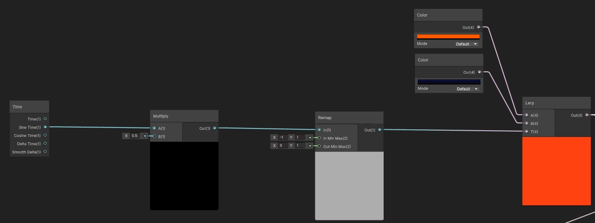
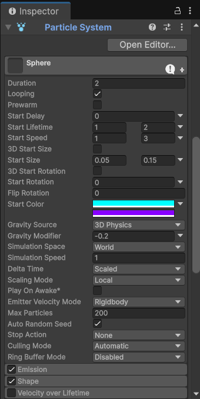

#  Rasterización desde Cero: Dibujando con Algoritmos Clásicos

## Nombre del estudiante

<!-- TODO: Completar -->

## Fecha de entrega

'2026-03-24'

---

## Descripción breve

En este taller se implementó un shader básico con shader graph, el cual mediante el uso de la variable time, aplica deformaciones UV, y cambios de color, para producir una textura de apariencia líquida cuyo color cambia con el tiempo. Adicional se configuró un sistema de particulas `Particle System` el cual se activa con el clic en el mouse.

---

## Implementacion en Unity

### Shader

Primero se creó la escena con un plano y una esfera (sobre la cual se aplicará la textura). Lo siguiente es crear un graph shader, el cual consiste en lo siguiente:

#### Mezcla entre dos colores

Hay un subsistema en el grafo el cual utiliza el módulo `time`, especificamente su valor sinusoidal, lo escala por una constante y lo re-mapea a el rango $(-1, 1)$, para después utilizar el módulo `Lerp` para mezclar los dos colores base acorde a esta función sinusoidal de tiempo y pasarle este color al `Base Color` en el fragment.



#### Deformación del UV

Otro de los subsistemas consiste en aplicar deformaciones de las coordenadas UV para simular fluidez. Para esto se utilizan módulos como `Tiling and offset` y `Simple noise` a lo que se le suma una seña sinusoidal. Con estas coordenadas UV deformadas con el tiempo, se usa el módulo `Sample Texture 2D` junto con una textura Normal, la cual da la sensación de relieve al cambiar la dirección de los normales. Todo esto se enlaza al `Normal (Tangent Space 3)` en el fragment.


#### Emisión de luz

Para esto únicamente se escala el color de la mezcla previa y se enlaza al `Emission` dentro del fragment.

### Particulas

Para la implementación del sistema de partículas se utilizó el componente Particle System de Unity, configurado como hijo directo de la esfera para que las partículas emergieran desde la superficie del objeto. El módulo principal se ajustó con un lifetime aleatorio entre 1 y 2 segundos, velocidad inicial variable entre 1 y 3 unidades, y un modificador de gravedad negativo (-0.2) para simular una dispersión ascendente de energía. La forma de emisión se estableció como esfera con radio 0.55 y grosor 0 para que las partículas nacieran exclusivamente desde la superficie. Se activaron los módulos Color over Lifetime, con una transición de cian a violeta con desvanecimiento final, y Size over Lifetime con curva descendente para que las partículas se redujeran antes de desaparecer. La activación del sistema se controló mediante un script en C# 



## Resultados visuales

### Esfera con shader y particulas


## Código Relevante

Script activación de párticulas con mouse
'''
using UnityEngine;
using UnityEngine.InputSystem;

public class EnergyOnClick : MonoBehaviour
{
    private ParticleSystem energyParticles;
    private bool isEmitting = false;

    void Start()
    {
        energyParticles = GetComponentInChildren<ParticleSystem>();
        energyParticles.Stop();
    }

    void Update()
    {
        
        if (Mouse.current.leftButton.wasPressedThisFrame)
        {
            Ray ray = Camera.main.ScreenPointToRay(
                Mouse.current.position.ReadValue()
            );
            RaycastHit hit;

            if (Physics.Raycast(ray, out hit))
            {
                if (hit.collider.gameObject == this.gameObject)
                {
                    ToggleParticles();
                }
            }
        }
    }

    void ToggleParticles()
    {
        if (isEmitting)
        {
            energyParticles.Stop();
            isEmitting = false;
        }
        else
        {
            energyParticles.Play();
            isEmitting = true;
        }
    }
}
'''
---

## Aprendizajes y dificultades

<!-- TODO: Completar implementación Three.js -->

### Aprendizajes

Se pudo aprender lo básico de los Graph shaders, y como usar algunos de sus módulos para construir shaders de una manera de más alto nivel que directamente con código. Además se pudo conocer lo básico de los particle systems de unity.

### Dificultades

Fué algo complicado saber que módulo de graph shaders utilizar, puesto que hay bastantes con nombres muy similares y eso lo hace complicado.

### Mejoras futuras

Quizá se pueda mejorar el color / textura de las particulas para que se vea algo más realista

---

## Estructura del proyecto

<!-- TODO: Completar -->

```
semana_05_4_/
├── unity/                     # Proyecto en unity
├── media/                     # Imágenes y GIFs de resultados
└── README.md                  # Este archivo
```

---

---
