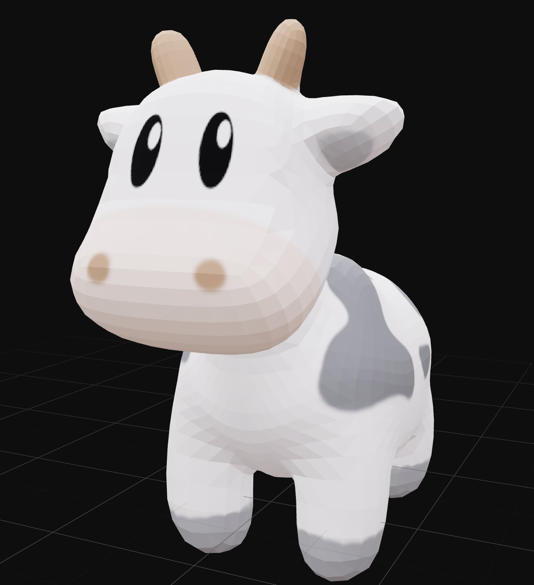
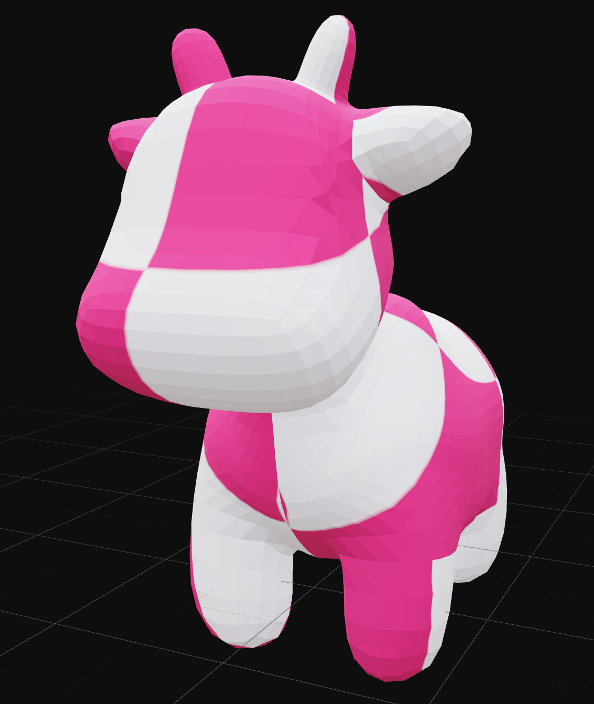
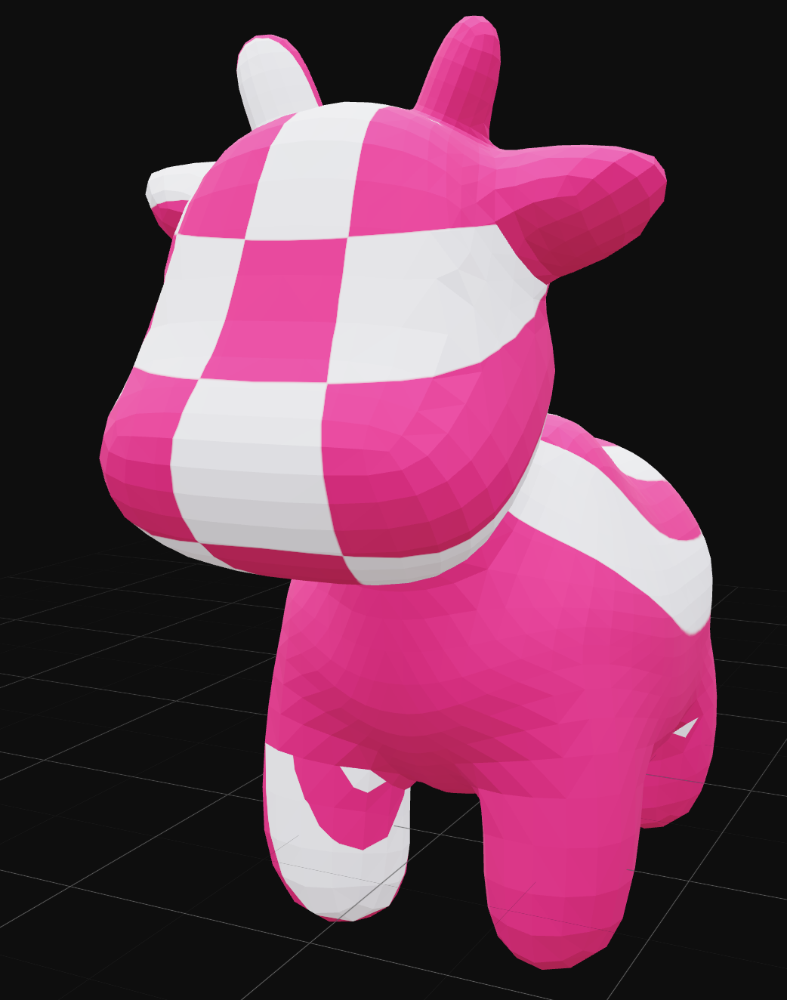
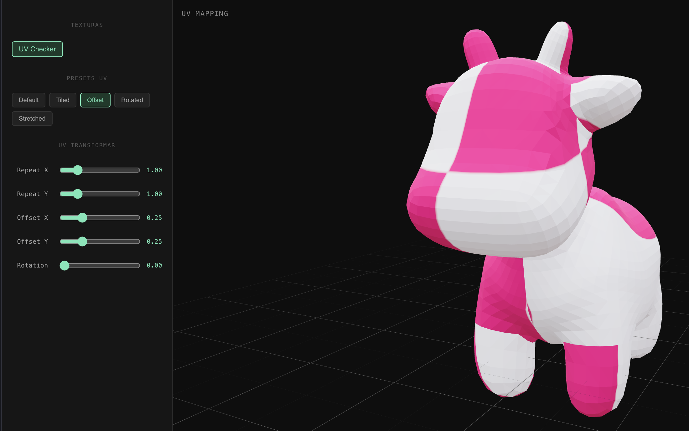
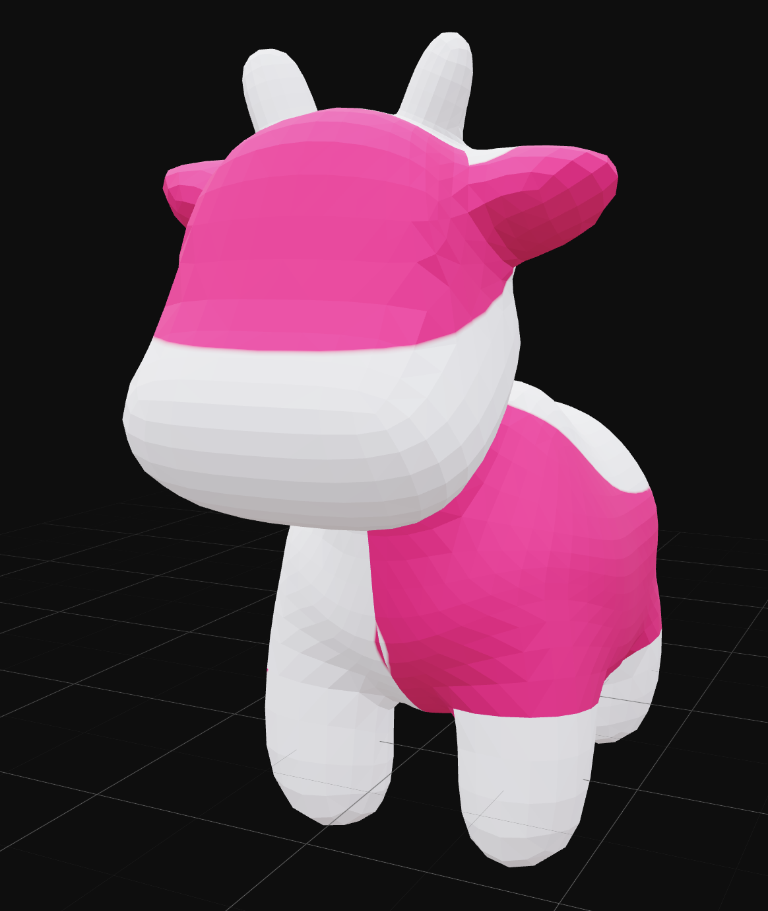
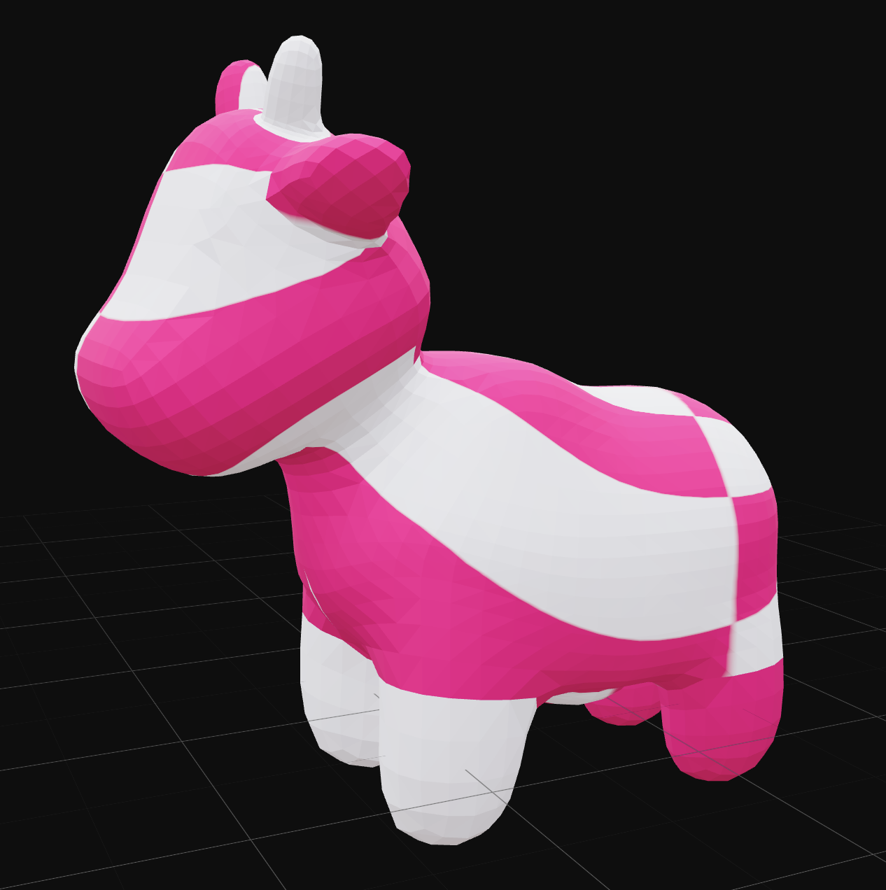

# Taller — UV Mapping: Texturas que Encajan

**Nombre del estudiante:** Esteban Barrera Sanabria

**Fecha de entrega:** 28 de marzo de 2026

---

## Descripción

El objetivo del taller es explorar el mapeo UV como técnica fundamental para aplicar correctamente texturas 2D sobre modelos 3D. Se trabaja con un modelo `.OBJ` al que se le aplican texturas externas, se manipulan las coordenadas UV en tiempo real y se usa una cuadrícula de prueba (UV checker) para evidenciar distorsiones y entender cómo se proyectan las texturas sobre la geometría.

**Entorno utilizado:**

- Three.js con React Three Fiber (Vite)

---

## Implementaciones

### Three.js con React Three Fiber

**Herramientas utilizadas:**

- `@react-three/fiber` — render loop y escena 3D en React
- `@react-three/drei` — `OrbitControls`, `Grid`, `Environment`
- `three` — `OBJLoader`, `TextureLoader`, `MeshStandardMaterial`, `CanvasTexture`
- `Vite` — entorno de desarrollo

**Funcionalidades implementadas:**

1. Carga de modelo `.OBJ` (Spot) con `OBJLoader` y aplicación de textura externa con `TextureLoader` usando `MeshStandardMaterial` creado desde cero, desacoplado del material original del archivo.
2. UV checker generado proceduralmente con `CanvasTexture` y Canvas2D — cuadrícula blanco/rosa sin archivos externos — que permite ver exactamente cómo se proyecta la textura sobre la geometría.
3. Alternancia en tiempo real entre textura original del modelo y UV checker mediante un botón.
4. Manipulación de coordenadas UV con controles interactivos: `repeat` (X e Y), `offset` (X e Y) y `rotation`, aplicados directamente sobre la textura activa.
5. Presets de UV predefinidos: Default, Tiled (repeat 3×3), Offset (desplazamiento 0.25), Rotated (rotación 90°) y Stretched (ratio asimétrico 0.5×2) — activos solo en modo checker para no distorsionar la textura original.
6. Grid de referencia y `OrbitControls` para navegar la escena libremente.

---

## Resultados Visuales

Este es el modelo con su textura original correctamente mapeada (por default).



Y el default de la textura de UV checker:



El UV Checker con el preset Tiled: 3x3 mostrando repeteición:



Se le introduce ahora el preset offset: desplazamiento 0.25 en X e Y evidenciando el corrimiento de coordenadas.



Se cambia al preset Rotated: rotación de 90° sobre las coordenadas UV



Finalmente para el ultimo preset, Stretched: repeat asimétrico 0.5×2 mostrando distorsión intencional



### Vista general de la escena

En esta parte se muestra la visual continua de como cambia el modelo cambiando los valores UV especificamente uno por uno, primero para la textura default y luego para el UV Checker:


---

## Código Relevante

**Carga del modelo OBJ y aplicación de material propio:**

```jsx
function SpotModel({ useChecker, uvParams }) {
  const obj            = useLoader(OBJLoader, "/models/spot/spot.obj");
  const rawTexture     = useLoader(TextureLoader, "/models/spot/spot_texture.png");
  const checkerTexture = useMemo(() => makeCheckerTexture(), []);

  const texture = useChecker ? checkerTexture : rawTexture;
  const effectiveRepeatX = useChecker ? uvParams.repeatX : 1;
  const effectiveRepeatY = useChecker ? uvParams.repeatY : 1;

  texture.repeat.set(effectiveRepeatX, effectiveRepeatY);
  texture.offset.set(uvParams.offsetX, uvParams.offsetY);
  texture.rotation  = uvParams.rotation * Math.PI;
  texture.needsUpdate = true;

  useEffect(() => {
    obj.traverse((node) => {
      if (node.isMesh) {
        node.material = new MeshStandardMaterial({ map: texture });
      }
    });
  }, [obj, texture]);

  return <primitive object={obj} scale={2} position={[0, 0, 0]} />;
}
```

**UV checker generado proceduralmente con Canvas2D:**

```jsx
function makeCheckerTexture(size = 512, tiles = 8) {
  const canvas = document.createElement("canvas");
  canvas.width = canvas.height = size;
  const ctx = canvas.getContext("2d");
  const cell = size / tiles;
  for (let row = 0; row < tiles; row++) {
    for (let col = 0; col < tiles; col++) {
      ctx.fillStyle = (row + col) % 2 === 0 ? "#ffffff" : "#ff0080";
      ctx.fillRect(col * cell, row * cell, cell, cell);
    }
  }
  const tex = new CanvasTexture(canvas);
  tex.colorSpace = SRGBColorSpace;
  return tex;
}
```

**Presets de UV con repeat restringido a textura checker:**

```jsx
const effectiveRepeatX = useChecker ? uvParams.repeatX : 1;
const effectiveRepeatY = useChecker ? uvParams.repeatY : 1;
texture.repeat.set(effectiveRepeatX, effectiveRepeatY);
```

---

## Prompts Utilizados

Durante el desarrollo se utilizaron herramientas de IA generativa para:

1. Resolver el problema de cache de `useGLTF` que impedía reasignar materiales — la solución fue cambiar a `OBJLoader` y crear el material desde cero con `MeshStandardMaterial`.
2. Generar el UV checker proceduralmente con `CanvasTexture` sin depender de archivos externos.
3. Orientación sobre por qué `repeat` mayor a 1 distorsiona texturas no diseñadas para repetirse, y cómo restringirlo según el modo activo.

---

## Aprendizajes y Dificultades

### Aprendizajes

- Los archivos `.GLTF` cachean materiales y escenas internamente en `useGLTF`, lo que impide reasignar propiedades del material directamente. La solución fue usar `.OBJ` con `OBJLoader` y construir el `MeshStandardMaterial` desde React, manteniendo control total sobre la textura.
- Las propiedades `repeat`, `offset` y `rotation` de una textura en Three.js modifican la matriz UV de forma implícita — no se trata de transformar la geometría sino de transformar el espacio de coordenadas de la textura.
- `wrapS` y `wrapT` deben estar en `RepeatWrapping` para que `repeat` mayor a 1 tenga efecto visible; con el wrap por defecto (`ClampToEdgeWrapping`) la textura simplemente se estira en los bordes.
- Generar texturas proceduralmente con `CanvasTexture` es más confiable que depender de archivos externos para pruebas de UV, ya que el resultado es predecible y siempre disponible.

### Dificultades

- El mayor obstáculo fue el sistema de cache de `useGLTF` de React Three Fiber: cualquier modificación al material de la escena cacheada no se reflejaba visualmente aunque los valores cambiaran en JavaScript. Se intentaron múltiples enfoques (`scene.clone`, `Clone` de drei, mutación directa) antes de resolver con `OBJLoader`.
- `repeat` en texturas no diseñadas para tile (como la textura original del Spot) genera cortes visibles en las costuras UV del modelo — por eso se restringe `repeat` a 1 cuando la textura original está activa.