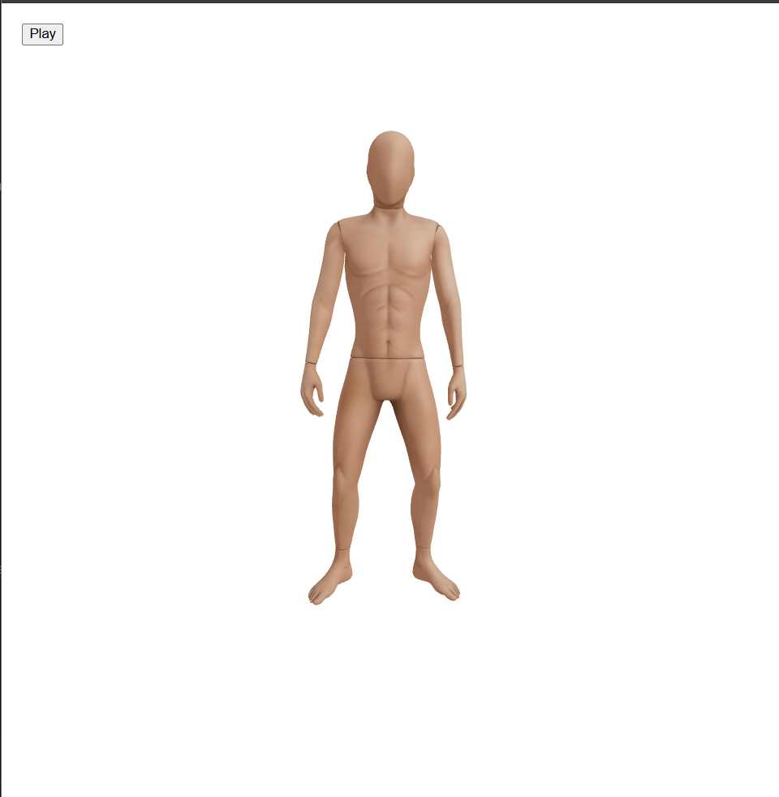
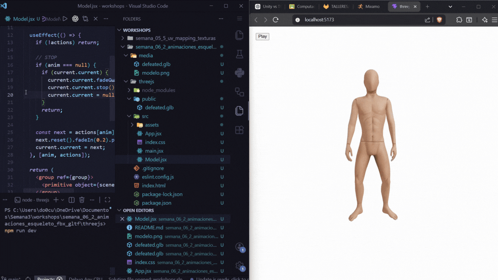

# Taller Animaciones Esqueleto Fbx Gltf

## Nombre de los estudiantes
- Juan Esteban Santacruz Corredor
- Nicolas Quezada Mora
- Cristian Steven Motta Ojeda
- Sebastian Andrade Cedano
- Esteban Barrera Sanabria
- Jerónimo Bermúdez Hernández

## Fecha de entrega

`15 de abril de 2026`

---

## Descripción 

El objetivo de este taller fue comprender el flujo completo de trabajo para manejar animaciones esqueléticas en formatos FBX y GLTF.
Se desarrolló una aplicación web utilizando React Three Fiber donde se carga un modelo animado, se controlan sus animaciones y se permite interacción mediante botones.

Se abordó el proceso desde la descarga del modelo en Mixamo, su procesamiento en Blender y su integración en un entorno web.

---

## Implementaciones

### Three.js / React Three Fiber

- Carga de modelos .glb usando useGLTF
- Control de animaciones con useAnimations
- Implementación de sistema de reproducción:
  - Play / Stop
- Manejo de estado con React (useState)
- Transiciones suaves entre animaciones (fadeIn, fadeOut)
- Control de cámara con OrbitControls
- Ajuste dinámico de escala del modelo
- Corrección de problemas de iluminación y materiales

---

## Resultados visuales

### Three.js - Implementación



El modelo usado 




El resultado del taller 

---

## Código relevante

### Control de animaciones

```javascript
  const current = useRef(null);

  useEffect(() => {
    if (!actions) return;

    // STOP
    if (anim === null) {
      if (current.current) {
        current.current.fadeOut(0.2);
        current.current.stop();
        current.current = null;
      }
      return;
    }

    const next = actions[anim];
    next.reset().fadeIn(0.2).play();
    current.current = next;
  }, [anim, actions]);
```

### UI y control desde React
```javascript
const [anim, setAnim] = useState("mixamo com");
 <button onClick={() => setAnim("mixamo.com")}>Play</button>
```


---

## Prompts utilizados

- “Cómo cargar un modelo GLTF con animaciones en React Three Fiber”
- “Cómo usar useAnimations en drei”
- “Cómo exportar animaciones correctamente desde Blender a GLB”
- “Por qué un modelo aparece en T-pose en Three.js”

---

## Aprendizajes y dificultades

### Aprendizajes

- Diferencias entre formatos FBX y GLTF
- Importancia de exportar correctamente animaciones en Blender
- Uso de hooks como useGLTF y useAnimations
- Manejo de estados para controlar animaciones
- Integración de UI con escenas 3D

### Dificultades

- Problemas al exportar animaciones (T-pose en Three.js)
- Nombres incorrectos de animaciones
- Materiales sin textura o modelos oscuros
- Comprender el flujo de animaciones entre herramientas

---

## Referencias

- Three.js: https://threejs.org/
- React Three Fiber: https://docs.pmnd.rs/react-three-fiber/getting-started/introduction
- @react-three/drei shaderMaterial: https://docs.pmnd.rs/drei/materials/shader-material