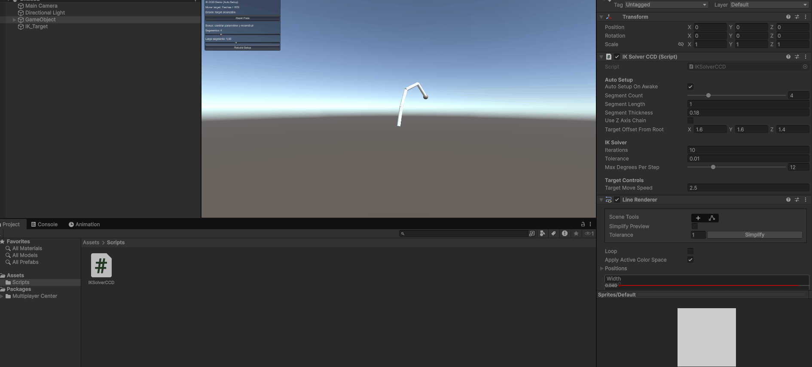

# Taller Cinematica Inversa Ik

## Nombre de los estudiantes
- Juan Esteban Santacruz Corredor
- Nicolas Quezada Mora
- Cristian Steven Motta Ojeda
- Sebastian Andrade Cedano
- Esteban Barrera Sanabria
- Jeronimo Bermudez Hernandez

## Fecha de entrega

`15 de abril de 2026`

---

## Descripcion breve

El objetivo de este taller fue implementar cinematica inversa para un brazo articulado y analizar su respuesta frente a un objetivo interactivo. Se desarrollo una escena en React Three Fiber con un objetivo arrastrable, un solver CCD por frame, una linea de referencia y un modo alternativo de cinematica directa con poses predefinidas para comparar estabilidad y control en tiempo real.

---

## Implementaciones

### Three.js / React Three Fiber

- Cadena jerarquica de eslabones con `boxGeometry`.
- Objetivo arrastrable con el mouse sobre un plano de trabajo.
- Solver CCD en cada `useFrame` para alinear la punta con el objetivo.
- Linea de referencia desde la base al objetivo.
- Modo IK / FK con poses predefinidas y alternancia automatica.
- HUD con distancia restante e iteraciones por frame.

### Unity

- Escena de cinematica inversa con brazo segmentado y objetivo interactivo.
- Ajuste del brazo para alcanzar el objetivo y visualizacion del resultado.
- Enfoque en la lectura visual de la convergencia del brazo frente al objetivo.

---

## Resultados visuales

### Three.js - Implementacion


Vista general del brazo alcanzando el objetivo con CCD.

### Unity - Implementacion



Vista general de la escena en Unity.

---

## Codigo relevante

### Solver CCD (fragmento)

```javascript
for (let iter = 0; iter < iterations; iter += 1) {
  for (let i = segmentCount - 1; i >= 0; i -= 1) {
    const joint = jointRefs[i].current;
    if (!joint) continue;

    joint.getWorldPosition(jointPos);
    endRef.current.getWorldPosition(endPos);

    toEnd.copy(endPos).sub(jointPos);
    toTarget.copy(targetVec).sub(jointPos);

    if (toEnd.lengthSq() < 1e-8 || toTarget.lengthSq() < 1e-8) continue;

    toEnd.normalize();
    toTarget.normalize();
    axis.crossVectors(toEnd, toTarget);
    if (axis.lengthSq() < 1e-10) continue;

    axis.normalize();
    const angle = Math.acos(
      THREE.MathUtils.clamp(toEnd.dot(toTarget), -1, 1),
    );
    const step = Math.min(angle, maxStep);

    joint.getWorldQuaternion(jointQuat);
    invQuat.copy(jointQuat).invert();
    axisLocal.copy(axis).applyQuaternion(invQuat);
    joint.rotateOnAxis(axisLocal, step);
    joint.updateWorldMatrix(true, true);
  }
}
```

### Arrastre del objetivo en el plano de trabajo

```javascript
const updateFromRay = (ray) => {
  if (ray.intersectPlane(dragPlane, hitPoint)) {
    onChange([hitPoint.x, planeY, hitPoint.z]);
  }
};

<mesh
  position={position}
  onPointerDown={(event) => {
    event.stopPropagation();
    event.currentTarget.setPointerCapture(event.pointerId);
    setDragging(true);
    onDragChange?.(true);
    updateFromRay(event.ray);
  }}
  onPointerMove={(event) => {
    if (!dragging) return;
    event.stopPropagation();
    updateFromRay(event.ray);
  }}
>
  <sphereGeometry args={[0.15, 32, 32]} />
</mesh>
```

### Toggle IK/FK y HUD de estado

```javascript
<button
  type="button"
  onClick={() => setMode(mode === "ik" ? "fk" : "ik")}
>
  Modo: {mode.toUpperCase()}
</button>

<div className="row">Distancia restante: {stats.distance.toFixed(3)}</div>
<div className="row">Iteraciones por frame: {stats.iterations}</div>
```

### Enlaces al codigo

- Solver y jerarquia de eslabones: [threejs/src/Arm.jsx](./threejs/src/Arm.jsx)
- Objetivo arrastrable: [threejs/src/Target.jsx](./threejs/src/Target.jsx)
- Escena y UI: [threejs/src/App.jsx](./threejs/src/App.jsx)

---

## Prompts utilizados

- "Implementa un solver CCD simple en JavaScript para un brazo articulado en React Three Fiber"
- "Como arrastrar un objetivo con el mouse sobre un plano en React Three Fiber"

---

## Aprendizajes y dificultades

### Aprendizajes

- La tecnica CCD converge de forma estable con iteraciones cortas por frame.
- La jerarquia de `group` simplifica la propagacion de rotaciones en un brazo.
- Separar IK y FK facilita comparar estrategias de control en tiempo real.

### Dificultades

- Evitar oscilaciones cuando el objetivo esta fuera del alcance total.
- Balancear el numero de iteraciones para mantener rendimiento.
- Mantener la interaccion de camara sin interferir con el drag del objetivo.
