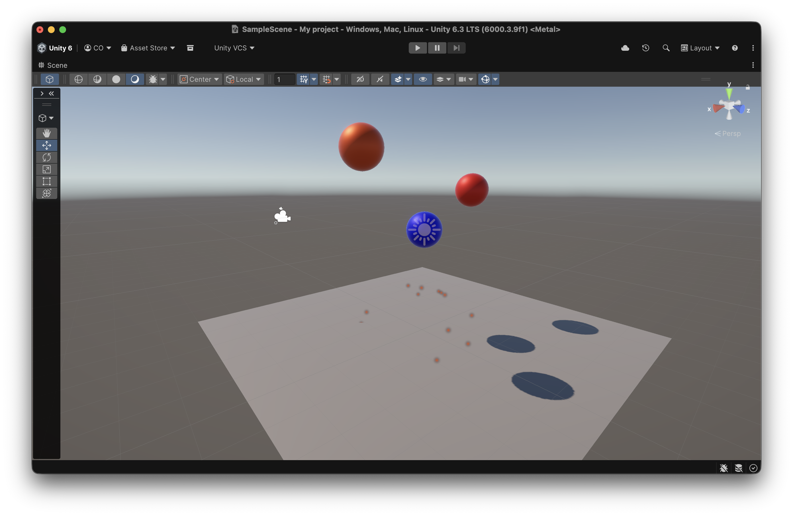

# Taller Colisiones y Particulas en Unity

## Nombre de los estudiantes
- Juan Esteban Santacruz Corredor
- Nicolas Quezada Mora
- Cristian Steven Motta Ojeda
- Sebastian Andrade Cedano
- Esteban Barrera Sanabria
- Jerónimo Bermúdez Hernández

## Fecha de entrega

`2026-04-15`

---

## Descripción breve

Taller enfocado en colisiones y sistemas de particulas en Unity. Se construyo una escena con esferas en movimiento que detectan impactos mediante fisica, y en cada colision instancian un efecto de particulas en el punto de contacto, orientado segun la normal de la superficie.

---

## Implementaciones

### Unity

- Script `ColisionParticulas` con `OnCollisionEnter` para capturar impactos en tiempo real.
- Instanciacion de un prefab de `ParticleSystem` en el primer punto de contacto reportado por `Collision`.
- Orientacion del efecto con `Quaternion.LookRotation` usando la normal de la colision para que el spray salga en direccion coherente.
- Reproduccion y destruccion automatica del efecto a los 2 segundos para evitar acumulacion de objetos en escena.

---

## Resultados visuales

### Unity - Implementación



Se observa la configuracion de la escena con varias esferas, plano de suelo, iluminacion y el sistema de particulas preparado para activarse en contacto.


En ejecucion, cada choque genera particulas naranjas en la zona exacta del impacto, validando la deteccion de colisiones y la sincronizacion con el efecto visual.

---

## Código relevante

### Script C# de colisiones y particulas

```csharp
using UnityEngine;

public class ColisionParticulas : MonoBehaviour
{
    public ParticleSystem efectoPrefab;

    private void OnCollisionEnter(Collision collision)
    {
        if (efectoPrefab != null && collision.contactCount > 0)
        {
            Vector3 punto = collision.contacts[0].point;
            Quaternion rot = Quaternion.LookRotation(collision.contacts[0].normal);

            ParticleSystem fx = Instantiate(efectoPrefab, punto, rot);
            fx.Play();

            Destroy(fx.gameObject, 2f);
        }
    }
}
```

### Configuracion de la escena en Unity

```text
1) Crear esferas con Collider y Rigidbody para habilitar interaccion fisica.
2) Asignar el script ColisionParticulas a los objetos que deben reaccionar al impacto.
3) Exponer y vincular en el Inspector el prefab del ParticleSystem (efectoPrefab).
4) Ajustar fuerza, gravedad y materiales para obtener trayectorias y rebotes visibles.
```

### Archivos de la escena

- Script principal de colision: [unity/Assets/Collision.cs](unity/Assets/Collision.cs)
- Escena del taller: [unity/Assets/Scenes/SampleScene.unity](unity/Assets/Scenes/SampleScene.unity)
- Configuracion de render URP (PC): [unity/Assets/Settings/PC_RPAsset.asset](unity/Assets/Settings/PC_RPAsset.asset)
- Configuracion de render URP (Mobile): [unity/Assets/Settings/Mobile_RPAsset.asset](unity/Assets/Settings/Mobile_RPAsset.asset)

---

## Prompts utilizados

1. "How do I instantiate a ParticleSystem on collision point in Unity C#?"
2. "Unity OnCollisionEnter get contact point and normal for impact effect"
3. "Best way to auto destroy spawned particle effects after playback in Unity"

---

## Aprendizajes y dificultades

### Aprendizajes

- `OnCollisionEnter` permite disparar logica reactiva de forma precisa al detectar impactos fisicos.
- El uso de `collision.contacts[0].point` mejora la credibilidad visual al ubicar el efecto exactamente donde ocurre el choque.
- Orientar el sistema de particulas con la normal del contacto ayuda a comunicar direccion del impacto.
- Destruir instancias temporales evita fugas de rendimiento cuando hay multiples colisiones seguidas.

### Dificultades

- Ajustar la escala y duracion del `ParticleSystem` para que el efecto fuera visible sin saturar la escena.
- Coordinar velocidades de los cuerpos rigidos para provocar colisiones frecuentes pero controladas.
- Evitar que choques simultaneos generaran demasiadas instancias en cuadros consecutivos.

---

## Contribuciones grupales (si aplica)

| Integrante | Rol |
|---|---|
| Juan Esteban Santacruz Corredor | Lider de fisicas y ajuste de Rigidbody/Colliders |
| Nicolas Quezada Mora | Programacion del sistema de colision en C# |
| Cristian Steven Motta Ojeda | Integracion del ParticleSystem y depuracion en Play Mode |
| Sebastian Andrade Cedano | Direccion visual de materiales, luces y composicion de escena |
| Esteban Barrera Sanabria | Validacion de pruebas y registro de evidencia (png/gif) |
| Jerónimo Bermúdez Hernández | Redaccion tecnica y consolidacion de documentacion |

---

## Estructura del proyecto

```
semana_06_5_colisiones_y_particulas/
├── media/                               # Evidencias del resultado (png/gif)
├── unity/
│   ├── Assets/
│   │   ├── Collision.cs                 # Script de deteccion de impacto y spawn FX
│   │   ├── Scenes/
│   │   │   └── SampleScene.unity        # Escena principal
│   │   └── Settings/                    # Configuracion URP y perfiles
│   ├── Packages/
│   └── ProjectSettings/
└── README.md                            # Este documento
```

---

## Referencias

- Unity Manual - Collisions: https://docs.unity3d.com/Manual/collider-interactions-oncollision.html
- Unity Scripting API - OnCollisionEnter: https://docs.unity3d.com/ScriptReference/MonoBehaviour.OnCollisionEnter.html
- Unity Scripting API - Collision.contacts: https://docs.unity3d.com/ScriptReference/Collision-contacts.html
- Unity Scripting API - Quaternion.LookRotation: https://docs.unity3d.com/ScriptReference/Quaternion.LookRotation.html
- Unity Manual - Particle System: https://docs.unity3d.com/Manual/ParticleSystems.html
