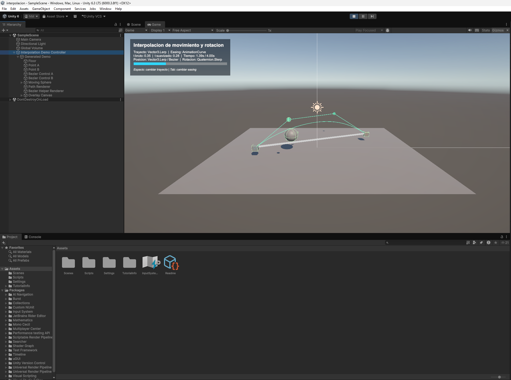
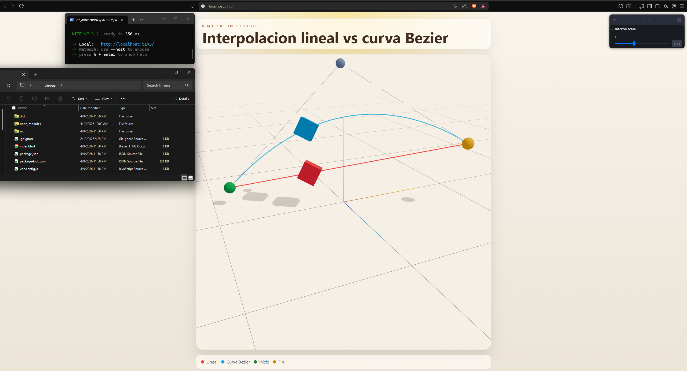

# Taller de Interpolacion de Movimiento y Animaciones

## Integrantes

- Esteban Barrera
- Nicolas Quezada Mora
- Cristian Motta
- Esteban Santacruz
- Jeronimo Bermudez
- Sebastian Andrade

## Fecha de entrega

`2026-04-10`

---

## Descripcion breve

Este proyecto explora tecnicas de interpolacion de movimiento y rotacion en dos entornos distintos: Unity y Three.js con React Three Fiber. El objetivo fue construir ejemplos basicos, claros y replicables para entender como se controla el desplazamiento de un objeto entre puntos, como se suaviza su comportamiento en el tiempo y como se visualizan trayectorias rectas y curvas.

En Unity se desarrollo una demo autocontenida que genera la escena, los puntos de control, la trayectoria y una interfaz de apoyo para mostrar el estado de la animacion. En React Three Fiber se construyo una escena interactiva que compara en tiempo real una interpolacion lineal frente a un recorrido sobre curva Bezier, con control manual del parametro `t`.

---

## Objetivos del taller

- Implementar interpolacion de posicion entre dos puntos.
- Aplicar interpolacion de rotacion con cuaterniones.
- Comparar movimiento lineal frente a movimiento sobre curva.
- Usar funciones de suavizado tipo ease in / ease out.
- Mostrar visualmente el trayecto recorrido y el progreso temporal.
- Construir ejemplos faciles de replicar en motores y frameworks diferentes.

---

## Estructura del proyecto

- `unity/interpolacion`: proyecto de Unity con la demo de interpolacion.
- `threejs`: aplicacion React + Vite + React Three Fiber.
- `media`: capturas y GIFs de los resultados.

---

## Implementaciones

### Unity

La implementacion de Unity se desarrollo en el proyecto `unity/interpolacion` y tiene como pieza central el script `InterpolationDemoController.cs`. Este controlador crea automaticamente el entorno de prueba, genera un objeto esferico en movimiento, define los puntos de inicio y fin, y anade dos puntos de control para una trayectoria Bezier cubica.

Las funciones principales implementadas fueron:

- Movimiento lineal entre dos puntos usando `Vector3.Lerp()`.
- Interpolacion de rotacion usando `Quaternion.Slerp()`.
- Modos de suavizado con `Linear`, `Mathf.SmoothStep()` y `AnimationCurve`.
- Cambio entre trayecto lineal y trayecto Bezier.
- Visualizacion del trayecto con `LineRenderer` y `Gizmos`.
- Indicador de tiempo y progreso mediante una interfaz sobrepuesta en pantalla.
- Atajos de teclado para cambiar de trayecto y easing durante la ejecucion.

Adicionalmente, la escena se configura de forma automatica con piso, camara, marcadores de orientacion y panel informativo. Esto hace que el ejemplo sea facil de ejecutar y modificar sin depender de una escena compleja previa.

Version usada en el proyecto:

- Unity `6000.3.8f1`

### Three.js con React Three Fiber

La implementacion web se desarrollo en `threejs` usando React, Vite, `@react-three/fiber`, `@react-three/drei`, `three` y `leva`. La escena compara dos objetos en simultaneo: una caja roja que recorre un trayecto lineal y una caja azul que sigue una curva Bezier cuadratica.

Las funciones principales implementadas fueron:

- Interpolacion lineal de posicion con `lerpVectors()`.
- Interpolacion de rotacion con `Quaternion.slerp()`.
- Curva Bezier simple con `QuadraticBezierCurve3`.
- Visualizacion de puntos de inicio, fin y control.
- Dibujo del trayecto lineal, la curva y las lineas guia.
- Control interactivo del parametro `t` entre `0` y `1` usando Leva.
- Comparacion simultanea entre interpolacion lineal y curva como parte del bonus.

La interfaz tambien incluye una leyenda visual y una camara orbitable para inspeccionar el comportamiento desde diferentes angulos.

### Apartados no aplicados

- Python: no se realizo implementacion en este proyecto.
- Processing: no se realizo implementacion en este proyecto.

---

## Como ejecutar

### Unity

1. Abrir la carpeta `unity/interpolacion` desde Unity Hub.
2. Cargar la escena `Assets/Scenes/SampleScene.unity`.
3. Ejecutar la escena en Play Mode.
4. Usar `Espacio` para alternar el trayecto y `Tab` para cambiar el tipo de easing.

### Three.js / React Three Fiber

1. Abrir una terminal en la carpeta `threejs`.
2. Instalar dependencias con `npm install`.
3. Iniciar el proyecto con `npm run dev`.
4. Abrir la URL local que muestra Vite en el navegador.
5. Ajustar el valor `t` desde el panel de Leva para observar la interpolacion.

---

## Resultados visuales

### Unity


Animacion de la esfera moviendose entre puntos con cambio de trayectoria e interpolacion de rotacion.



Vista de la escena con la trayectoria visible, puntos de control y panel informativo de tiempo y easing.

### Three.js / React Three Fiber


Comparacion visual entre el trayecto lineal y el trayecto curvo dentro de la escena 3D.



Vista de la interfaz con marcadores de inicio, fin, punto de control y leyenda de colores.

---

## Codigo relevante

### Unity - Interpolacion de posicion y rotacion

```csharp
float easedT = EvaluateEasing(normalizedTime);
Vector3 position = pathMode == PathMode.Bezier
    ? EvaluateBezier(easedT)
    : Vector3.Lerp(pointA.position, pointB.position, easedT);

movingSphere.position = position + Vector3.up * 0.6f;
movingSphere.rotation = Quaternion.Slerp(
    Quaternion.Euler(startRotationEuler),
    Quaternion.Euler(endRotationEuler),
    easedT);
```

### Unity - Curva Bezier cubica personalizada

```csharp
private Vector3 EvaluateBezier(float t)
{
    Vector3 p0 = pointA.position;
    Vector3 p1 = controlPointA.position;
    Vector3 p2 = controlPointB.position;
    Vector3 p3 = pointB.position;

    float oneMinusT = 1f - t;
    return
        oneMinusT * oneMinusT * oneMinusT * p0 +
        3f * oneMinusT * oneMinusT * t * p1 +
        3f * oneMinusT * t * t * p2 +
        t * t * t * p3;
}
```

### Three.js - Trayecto lineal

```javascript
useFrame(() => {
  if (!meshRef.current) return

  meshRef.current.position.lerpVectors(START_POINT, END_POINT, t)
  meshRef.current.quaternion.copy(START_QUATERNION).slerp(END_QUATERNION, t)
})
```

### Three.js - Trayecto sobre curva Bezier

```javascript
useFrame(() => {
  if (!meshRef.current) return

  BEZIER_CURVE.getPoint(t, curvePoint.current)
  meshRef.current.position.copy(curvePoint.current)
  meshRef.current.quaternion.copy(START_QUATERNION).slerp(END_QUATERNION, t)
})
```

---

## Prompts utilizados

Este apartado fue realizado completamente por Nicolas Quezada Mora.

Los prompts de IA se enfocaron en dos usos concretos: solucion de errores simples y generacion de scripts base para acelerar el desarrollo.

### Prompts orientados a solucion de errores simples

```text
En Unity, revisa este script de interpolacion y dime por que el objeto no cambia suavemente entre Vector3.Lerp y una curva Bezier. Propon una correccion minima.

Tengo un error en React Three Fiber porque la rotacion del mesh no se actualiza como espero al usar quaternions. Explica la causa probable y muestra la correccion.

Analiza este fragmento de C# y detecta posibles problemas en la actualizacion de la UI del tiempo y la barra de progreso.

Revisa este componente de Three.js y corrige un fallo sencillo de referencias nulas dentro de useFrame.
```

### Prompts orientados a generacion de scripts

```text
Genera un script de Unity en C# que mueva una esfera entre dos puntos usando Vector3.Lerp, con rotacion usando Quaternion.Slerp y un modo opcional de Mathf.SmoothStep.

Crea un ejemplo en React Three Fiber con una caja que se mueva entre dos puntos, mostrando tambien una curva Bezier y un control t entre 0 y 1 con Leva.

Escribe una funcion en C# para evaluar una curva Bezier cubica usando cuatro puntos de control y un parametro t.

Genera un controlador basico en Unity que dibuje la trayectoria del movimiento con LineRenderer y muestre el progreso del tiempo en una interfaz simple.
```

---

## Aprendizajes y dificultades

### Aprendizajes

Este taller permitio reforzar la diferencia entre interpolacion lineal de posicion y trayectorias curvas controladas por puntos intermedios. Tambien ayudo a entender que la rotacion debe manejarse de forma distinta a la posicion, siendo `Quaternion.Slerp()` una opcion adecuada para lograr transiciones mas naturales.

En Unity se afianzaron conceptos de generacion programatica de escena, uso de `LineRenderer`, `AnimationCurve` y construccion de interfaces sencillas para depuracion visual. En Three.js se reforzo el uso de `useFrame()`, vectores, cuaterniones y curvas de `three` dentro de una escena declarativa con React.

### Dificultades

Una de las partes mas delicadas fue mantener coherencia visual entre posicion, rotacion y representacion de la trayectoria. No basta con mover un objeto; tambien es necesario mostrar claramente los puntos de referencia y el estado temporal para que la interpolacion sea entendible.

Otra dificultad fue traducir el mismo concepto entre Unity y React Three Fiber, ya que ambos entornos resuelven la animacion con patrones distintos. La solucion fue mantener la logica matematica equivalente y adaptar solo la forma en que cada framework actualiza los objetos en escena.

### Mejoras futuras

- Agregar controles de velocidad en tiempo real en ambas implementaciones.
- Permitir editar los puntos de control desde interfaz.
- Incluir comparacion entre mas tipos de easing.
- Extender la demo con `TubeGeometry` o recorridos 3D mas complejos.
- Exportar una build web o ejecutable para facilitar la entrega final.

---

## Contribuciones grupales

- El apartado de esta tarea fue realizado completamente por Nicolas Quezada Mora.

---

## Referencias

- Documentacion oficial de Unity sobre `Vector3.Lerp`: https://docs.unity3d.com/ScriptReference/Vector3.Lerp.html
- Documentacion oficial de Unity sobre `Quaternion.Slerp`: https://docs.unity3d.com/ScriptReference/Quaternion.Slerp.html
- Documentacion oficial de Unity sobre `Mathf.SmoothStep`: https://docs.unity3d.com/ScriptReference/Mathf.SmoothStep.html
- Documentacion de Three.js: https://threejs.org/docs/
- Documentacion de React Three Fiber: https://r3f.docs.pmnd.rs/
- Documentacion de Drei: https://github.com/pmndrs/drei
- Documentacion de Leva: https://leva.pmnd.rs/
