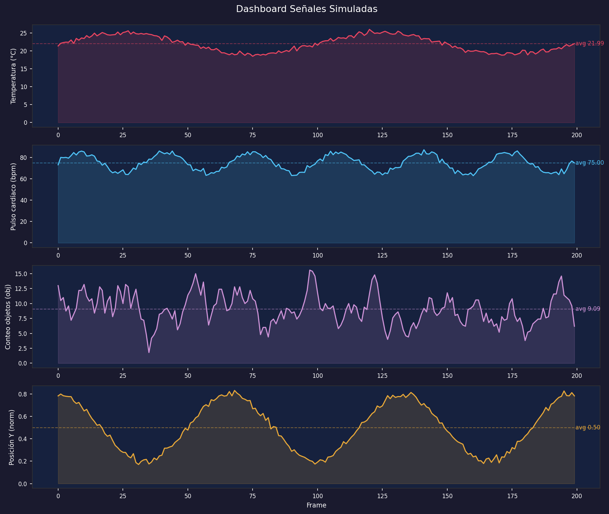

# Taller — Visualización de Datos en Tiempo Real

**Nombre del estudiante:**

- Esteban Barrera Sanabria
- Cristian Steven Motta Ojeda
- Juan Esteban Santacruz Corredor
- Sebastian Andrade Cedano
- Nicolas Quezada Mora
- Jeronimo Bermudez Hernandez

**Fecha de entrega:** 25 de abril de 2026

---

## Descripción breve

El objetivo del taller es capturar o simular datos numéricos y visualizarlos en tiempo real mediante gráficos dinámicos, explorando cómo enlazar señales con representaciones gráficas actualizadas en vivo. Se implementó un pipeline completo en Python usando `matplotlib.animation.FuncAnimation` para animación frame a frame y `plotly` para visualización interactiva post-captura. Las cuatro señales simuladas representan métricas reales de monitoreo: temperatura, pulso cardíaco, conteo de objetos (análogo a salida YOLO) y coordenada Y normalizada (análogo a landmark de MediaPipe).

**Entorno utilizado:**

- Python (Jupyter Notebook / VSCode)
- `matplotlib` — animación con `FuncAnimation` y ventana deslizante
- `numpy` — generación de señales con `np.sin`, `np.cos`, `np.random`
- `pandas` — suavizado con media móvil y exportación CSV
- `plotly` — dashboard interactivo exportado a HTML

---

## Implementaciones

### Fuente de datos — Señales simuladas

Se definieron cuatro señales independientes sobre 200 frames usando numpy. La temperatura es una onda sinusoidal base de 22°C con amplitud 3 y ruido gaussiano `np.random.normal(0, 0.4)`, simulando un sensor de temperatura ambiente. El pulso cardíaco usa una sinusoide de frecuencia triple con baseline 75 bpm y ruido `np.random.normal(0, 1.5)`, simulando variabilidad de frecuencia cardíaca. El conteo de objetos son enteros aleatorios entre 0 y 20 suavizados con media móvil de ventana 5 usando `pandas.Series.rolling()`, simulando el conteo cuadro a cuadro de un modelo YOLO. La posición Y es un coseno clippeado al rango [0, 1] con `np.clip`, simulando la coordenada Y normalizada de un landmark facial de MediaPipe.

### Visualización 1 — Temperatura en tiempo real (línea con ventana deslizante)

Se implementó una animación de línea con `FuncAnimation` que muestra los últimos 50 frames de temperatura. El eje X se remapea en cada frame para que la ventana siempre empiece en 0, dando el efecto de scroll continuo hacia la derecha. Un texto en el gráfico muestra el valor actual en tiempo real. El fondo oscuro se configuró con `fig.patch.set_facecolor` y `ax.set_facecolor` para aspecto de dashboard profesional.

### Visualización 2 — Dashboard de 4 señales simultáneas

Las cuatro señales se muestran en cuatro subplots verticales sincronizados, todos actualizando en el mismo `update` de `FuncAnimation`. Cada subplot tiene su propio color, etiqueta de unidad y texto de valor actual. Los buffers por señal se mantienen como listas independientes recortadas a la ventana de 60 frames. `blit=True` garantiza que solo se redrawn los artistas modificados, reduciendo la carga de renderizado.

### Visualización 3 — Conteo de objetos con histograma animado

El conteo de objetos se visualiza como un histograma acumulado de los últimos 80 frames usando `np.histogram` y barras de `ax.bar`. En cada frame se actualiza la altura de cada barra con `bar.set_height(h)`, mostrando cómo evoluciona la distribución de frecuencias mientras la señal avanza. Esto simula el comportamiento de un monitor de distribución de detecciones en tiempo real.

### Visualización 4 — Dashboard interactivo con Plotly

Las cuatro señales completas (200 frames) se grafican en un `go.Figure` con cuatro trazas superpuestas. La posición Y se escala ×100 para que sea visible junto a las otras señales. El gráfico se exporta como `dashboard_plotly.html` con `fig.write_html()`, generando un archivo interactivo con zoom, pan y tooltips sin necesidad de servidor.

### BONUS — Exportación CSV y estadísticas de rendimiento

Todas las señales se consolidan en un `DataFrame` de pandas y se exportan a `datos_tiempo_real.csv`. Se calculan estadísticas por señal (media, desviación estándar, mínimo, máximo) y métricas de rendimiento estimadas: FPS teóricos basados en el intervalo de 40ms (25 FPS) y duración total de la secuencia.

### BONUS — Captura estática PNG con área rellena y promedio

El dashboard completo se renderiza como imagen estática con `%matplotlib inline`, añadiendo un `fill_between` semitransparente bajo cada línea y una línea de promedio punteada con su valor anotado. La imagen se exporta a `dashboard_estatico.png` a 150 DPI.

---

## Resultados Visuales

### Temperatura en tiempo real — ventana deslizante


### Dashboard de 4 señales simultáneas


### Histograma animado de conteo de objetos


### Dashboard interactivo Plotly


### Captura estática PNG con promedio y área rellena



### CSV exportado y estadísticas en consola


---

## Código Relevante

**Generación de las cuatro señales:**

```python
t      = np.linspace(0, 4 * np.pi, N_STEPS)
temp   = 22 + 3 * np.sin(t) + np.random.normal(0, 0.4, N_STEPS)
pulso  = 75 + 10 * np.sin(3 * t) + np.random.normal(0, 1.5, N_STEPS)
conteo = np.random.randint(0, 20, N_STEPS).astype(float)
conteo = pd.Series(conteo).rolling(window=5, min_periods=1).mean().values
pos_y  = np.clip(0.5 + 0.3 * np.cos(t * 1.5) + np.random.normal(0, 0.02, N_STEPS), 0, 1)
```

**FuncAnimation con ventana deslizante:**

```python
def update(frame):
    x_data.append(frame)
    y_data.append(temp[frame])
    x_rel = list(range(len(x_data[-WINDOW:])))
    line.set_data(x_rel, y_data[-WINDOW:])
    text_val.set_text(f'{temp[frame]:.1f} °C')
    return line, text_val

ani = animation.FuncAnimation(
    fig, update, frames=N_STEPS,
    init_func=init, interval=40, blit=True, repeat=False
)
```

**Histograma animado con np.histogram:**

```python
def update_bar(frame):
    bar_buffer.append(conteo[frame])
    counts, _ = np.histogram(bar_buffer[-HIST_WIN:], bins=bins_edges)
    for bar, h in zip(bars, counts):
        bar.set_height(h)
    return list(bars) + [frame_text]
```

**Exportación Plotly a HTML interactivo:**

```python
fig_plotly.write_html('exports/dashboard_plotly.html')
```

**Exportación CSV con pandas:**

```python
df = pd.DataFrame({'frame': np.arange(N_STEPS), 'temperatura': temp,
                   'pulso': pulso, 'conteo': conteo, 'pos_y': pos_y})
df.to_csv('exports/datos_tiempo_real.csv', index=False)
```

---

## Prompts Utilizados

Durante el desarrollo se usaron herramientas de IA generativa para:

1. Diseñar las cuatro señales simuladas con parámetros que representaran métricas reales de monitoreo, eligiendo frecuencias y amplitudes que produjeran formas visualmente distintas entre sí.
2. Implementar el remapeo del eje X en la ventana deslizante — sin el remap, el eje X crece indefinidamente y la línea no scrollea sino que se encoge hacia la izquierda.
3. Resolver el uso correcto de `blit=True` en el dashboard de 4 señales — todos los artistas actualizados deben retornarse como lista aplanada en `update`, de lo contrario `blit` solo redibuja el primer subplot.
4. Orientación sobre la diferencia entre `%matplotlib tk` (ventana externa para `FuncAnimation` en vivo) y `%matplotlib inline` (para celdas estáticas en Jupyter), diferencia que no es obvia y no produce error sino un resultado silenciosamente incorrecto.

---

## Aprendizajes y Dificultades

### Aprendizajes

- `FuncAnimation` con `blit=True` es considerablemente más eficiente que redraw completo porque solo actualiza los artistas que cambiaron. Sin embargo, requiere que todos los artistas modificados sean retornados explícitamente desde `update` como lista — olvidar uno hace que no se actualice visualmente aunque el dato sí cambie internamente.
- La ventana deslizante en animaciones de series temporales requiere remapear el eje X en cada frame. Si se deja el índice absoluto, matplotlib intenta mantener el dominio completo y la línea se ve cada vez más pequeña hacia la izquierda en lugar de scrollear naturalmente.
- `pd.Series.rolling()` para suavizar señales enteras produce resultados más realistas que el ruido puro de `np.random`, porque introduce correlación temporal similar a la que tienen las detecciones reales de modelos como YOLO donde frames consecutivos comparten contexto visual.
- Plotly y matplotlib coexisten en el mismo notebook sin conflicto, pero sirven propósitos distintos: matplotlib con `FuncAnimation` es ideal para visualización en vivo frame a frame, mientras que Plotly es superior para exploración interactiva de datos ya capturados.

### Dificultades

- El backend de matplotlib debe cambiarse a `tk` con `%matplotlib tk` para que `FuncAnimation` abra una ventana externa donde la animación corre en vivo. Con `%matplotlib inline` la animación no se ejecuta en tiempo real — solo renderiza el primer frame estático. Este comportamiento no produce ningún error, simplemente parece que la animación no funciona.
- Sincronizar cuatro subplots con `blit=True` requiere retornar todos los artistas de los cuatro ejes en una sola lista aplanada desde `update`. Si se retornan como listas anidadas o se omiten artistas de algún subplot, `blit` lanza un error de tipo en el renderer de matplotlib que no indica claramente cuál artista está causando el problema.
