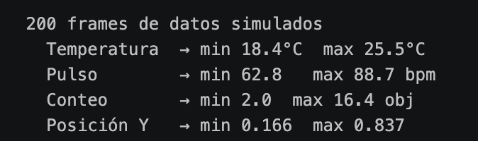
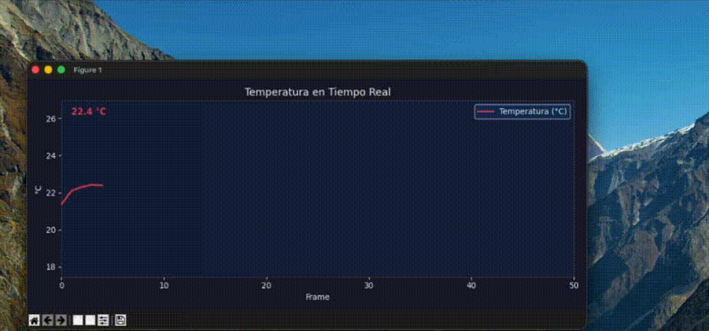
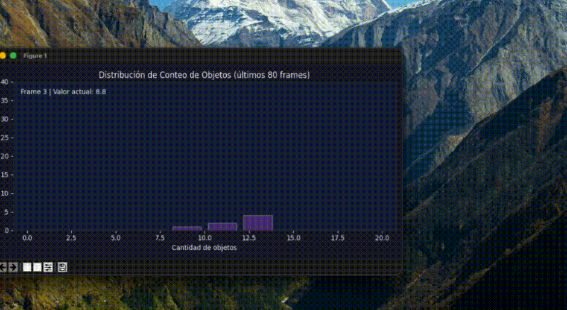
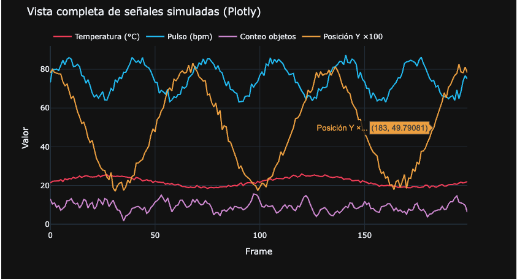
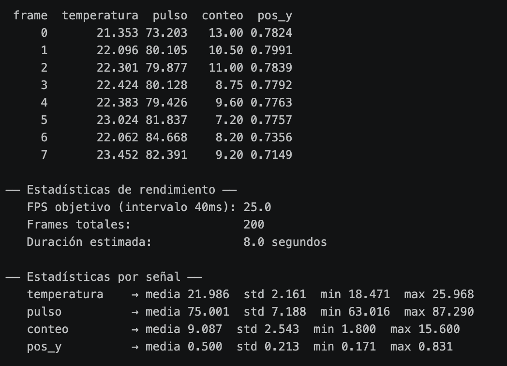

# Taller — Visualización de Datos en Tiempo Real

**Nombre del estudiante:**

- Esteban Barrera Sanabria
- Cristian Steven Motta Ojeda
- Juan Esteban Santacruz Corredor
- Sebastian Andrade Cedano
- Nicolas Quezada Mora
- Jeronimo Bermudez Hernandez

**Fecha de entrega:** 25 de abril de 2026

---

## Descripción breve

El objetivo del taller es capturar o simular datos numéricos y visualizarlos en tiempo real mediante gráficos dinámicos, explorando cómo enlazar señales con representaciones gráficas actualizadas en vivo.

En medida de lo anterior, se implementó un pipeline completo en Python usando `matplotlib.animation.FuncAnimation` para animación frame a frame y `plotly` para visualización interactiva post-captura.

Despues de la implementacion queda claro que las cuatro señales simuladas representan métricas reales de monitoreo: temperatura, pulso cardíaco, conteo de objetos (análogo a salida YOLO) y coordenada Y normalizada (análogo a landmark de MediaPipe).

**Entorno utilizado:**

- Python (Jupyter Notebook) - `matplotlib`, `numpy`, `pandas`, `plotly`

---

## Implementaciones

Se definieron cuatro señales independientes sobre 200 frames usando numpy.

1. La temperatura es una onda sinusoidal base de 22°C con amplitud 3 y ruido gaussiano `np.random.normal(0, 0.4)`.
2. El pulso cardíaco usa una sinusoide de frecuencia triple con baseline 75 bpm y ruido `np.random.normal(0, 1.5)`, simulando variabilidad de frecuencia cardíaca.
3. El conteo de objetos son enteros aleatorios entre 0 y 20 suavizados con media móvil de ventana 5 usando `pandas.Series.rolling()`, simulando el conteo cuadro a cuadro de un modelo YOLO.
4. La posición Y es un coseno clippeado al rango [0, 1] con `np.clip`, simulando la coordenada Y normalizada de un landmark facial de MediaPipe.

### Visualización 1: Temperatura en tiempo real

Se implementó una animación de línea con `FuncAnimation` que muestra los últimos 50 frames de temperatura, es decir, el eje X se remapea en cada frame para que la ventana siempre empiece en 0, dando el efecto de scroll continuo hacia la derecha.

### Visualización 2: Dashboard de 4 señales simultáneas

Las cuatro señales se muestran en cuatro subplots verticales sincronizados, todos actualizando en el mismo `update` de `FuncAnimation`.

### Visualización 3: Conteo de objetos con histograma animado

El conteo de objetos se visualiza como un histograma acumulado de los últimos 80 frames usando `np.histogram`, en cada frame se actualiza la altura de cada barra para mostrar cómo evoluciona la distribución de frecuencias mientras la señal avanza.

### Visualización 4: Dashboard interactivo con Plotly

Las cuatro señales completas (200 frames) se grafican en un `go.Figure` con cuatro trazas superpuestas. El gráfico se exporta con `fig.write_html()`, mas abajo se comparte la previsualizacion de lo que es el HTML.

### BONUS: Exportación CSV y estadísticas de rendimiento

Todas las señales se consolidan en un DataFrame de pandas y se exportan a CSV, calculando estadísticas por señal (media, desviación estándar, mínimo, máximo) y métricas de rendimiento estimadas: FPS teóricos basados en el intervalo de 40ms (25 FPS) y duración total de la secuencia.

### BONUS: Captura estática PNG con área rellena y promedio

El dashboard completo se renderiza como imagen estática con `%matplotlib inline`. se exporta a `dashboard_estatico.png` a 150 DPI.

---

## Resultados Visuales

En orden se muestran las capturas o animaciones con la información correpsondiente, como primera instancia se expone los frames simulados en consolas de las 4 señales ya simuladas, con sus respectivos mínimos y máximos.



### Temperatura en tiempo real



### Dashboard de 4 señales simultáneas


### Histograma animado de conteo de objetos



### Dashboard interactivo Plotly

Para este punto se generó un HTML ubicado en `/exports` para la visualizacion pública.



### Captura estática PNG con promedio y área rellena


### Estadísticas de CSV en consola

En este punto se hizo la exportacion del CSV al mismo `/exports`, aqui se proyecta un muestreo de consola.



---

## Código Relevante

**Generación de las cuatro señales:**

```python
t      = np.linspace(0, 4 * np.pi, N_STEPS)
temp   = 22 + 3 * np.sin(t) + np.random.normal(0, 0.4, N_STEPS)
pulso  = 75 + 10 * np.sin(3 * t) + np.random.normal(0, 1.5, N_STEPS)
conteo = np.random.randint(0, 20, N_STEPS).astype(float)
conteo = pd.Series(conteo).rolling(window=5, min_periods=1).mean().values
pos_y  = np.clip(0.5 + 0.3 * np.cos(t * 1.5) + np.random.normal(0, 0.02, N_STEPS), 0, 1)
```

**FuncAnimation con ventana deslizante:**

```python
def update(frame):
    x_data.append(frame)
    y_data.append(temp[frame])
    x_rel = list(range(len(x_data[-WINDOW:])))
    line.set_data(x_rel, y_data[-WINDOW:])
    text_val.set_text(f'{temp[frame]:.1f} °C')
    return line, text_val

ani = animation.FuncAnimation(
    fig, update, frames=N_STEPS,
    init_func=init, interval=40, blit=True, repeat=False
)
```

**Exportación Plotly a HTML interactivo:**

```python
fig_plotly.write_html('exports/dashboard_plotly.html')
```

**Exportación CSV con pandas:**

```python
df = pd.DataFrame({'frame': np.arange(N_STEPS), 'temperatura': temp,
                   'pulso': pulso, 'conteo': conteo, 'pos_y': pos_y})
df.to_csv('exports/datos_tiempo_real.csv', index=False)
```

---

## Prompts Utilizados

Durante el desarrollo se usaron herramientas de IA generativa para:

1. Implementar el remapeo del eje X en la ventana deslizante — sin el remap, el eje X crece indefinidamente y la línea no scrollea sino que se encoge hacia la izquierda.
2. Orientación sobre la diferencia entre `%matplotlib tk` (ventana externa para `FuncAnimation` en vivo) y `%matplotlib inline` (para celdas estáticas en Jupyter), diferencia que no es obvia y no produce error sino un resultado silenciosamente incorrecto.

---

## Aprendizajes y Dificultades

### Aprendizajes

- `FuncAnimation` con `blit=True` es considerablemente más eficiente que redraw completo porque solo actualiza los artistas que cambiaron. Sin embargo, requiere que todos los artistas modificados sean retornados explícitamente desde `update` como lista — olvidar uno hace que no se actualice visualmente aunque el dato sí cambie internamente.
- La ventana deslizante en animaciones de series temporales requiere remapear el eje X en cada frame. Si se deja el índice absoluto, matplotlib intenta mantener el dominio completo y la línea se ve cada vez más pequeña hacia la izquierda en lugar de scrollear naturalmente.
- `pd.Series.rolling()` para suavizar señales enteras produce resultados más realistas que el ruido puro de `np.random`, porque introduce correlación temporal similar a la que tienen las detecciones reales de modelos como YOLO donde frames consecutivos comparten contexto visual.
- Plotly y matplotlib coexisten en el mismo notebook sin conflicto, pero sirven propósitos distintos: matplotlib con `FuncAnimation` es ideal para visualización en vivo frame a frame, mientras que Plotly es superior para exploración interactiva de datos ya capturados.

### Dificultades

- El backend de matplotlib debe cambiarse a `tk` con `%matplotlib tk` para que `FuncAnimation` abra una ventana externa donde la animación corre en vivo. Con `%matplotlib inline` la animación no se ejecuta en tiempo real — solo renderiza el primer frame estático. Este comportamiento no produce ningún error, simplemente parece que la animación no funciona.
- Sincronizar cuatro subplots con `blit=True` requiere retornar todos los artistas de los cuatro ejes en una sola lista aplanada desde `update`. Si se retornan como listas anidadas o se omiten artistas de algún subplot, `blit` lanza un error de tipo en el renderer de matplotlib que no indica claramente cuál artista está causando el problema.
