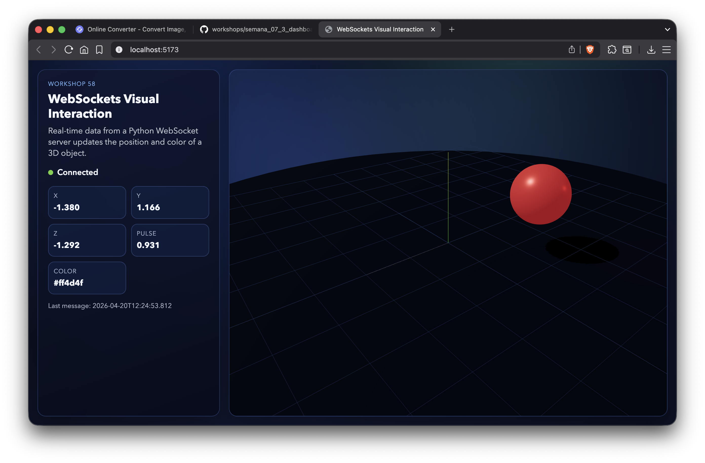
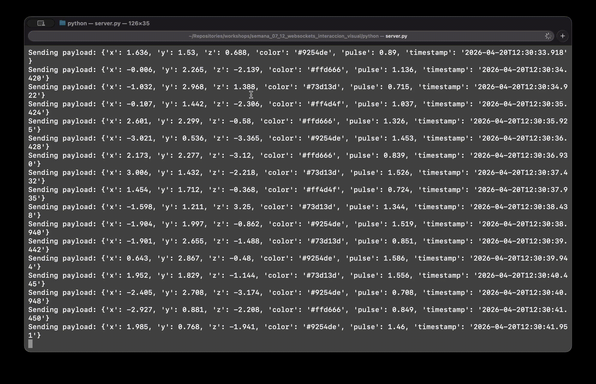

# Taller Websockets Interaccion Visual

## Nombre de los estudiantes
- Juan Esteban Santacruz Corredor
- Nicolas Quezada Mora
- Cristian Steven Motta Ojeda
- Sebastian Andrade Cedano
- Esteban Barrera Sanabria
- Jerónimo Bermúdez Hernández

## Fecha de entrega

`2026-04-20`

---

## Descripción breve

En este taller se implementó un sistema de comunicación en tiempo real usando WebSockets entre un servidor en Python y un cliente visual en Three.js con React Three Fiber. El servidor transmite datos JSON cada 0.5 segundos y el cliente actualiza posición, color y pulso de un objeto 3D en vivo.

---

## Implementaciones

### Python (Servidor WebSocket)

- Servidor implementado con `asyncio` + `websockets`.
- Emisión continua de mensajes cada 0.5 segundos.
- Formato de mensaje JSON con: `x`, `y`, `z`, `color`, `pulse`, `timestamp`.
- Soporte para conexión/desconexión de cliente y cierre seguro del proceso con señales del sistema.

### Three.js / React Three Fiber (Cliente)

- Conexión WebSocket desde navegador a `ws://localhost:8765`.
- Escena 3D con una esfera que cambia su posición y color en tiempo real.
- Panel visual con estado de conexión y métricas en vivo (x, y, z, pulse, color, timestamp).
- Interpolación suave de movimiento y control de cámara con `OrbitControls`.

---

## Resultados visuales

### Three.js - Implementación



Vista general del cliente: panel de conexión y métricas en tiempo real junto con la escena 3D reactiva.


Demostración de la esfera cambiando posición y color según los mensajes recibidos por WebSocket.



Evidencia del flujo continuo de datos (cada 0.5 s) reflejado en la animación y en el estado visual del cliente.

---

## Código relevante

### Servidor Python (emisión cada 0.5s)

```python
async def stream_data(websocket):
    while True:
        payload = {
            "x": round(random.uniform(-3.5, 3.5), 3),
            "y": round(random.uniform(0.5, 3.0), 3),
            "z": round(random.uniform(-3.5, 3.5), 3),
            "color": random.choice(COLORS),
            "pulse": round(random.uniform(0.7, 1.6), 3),
            "timestamp": datetime.now().isoformat(timespec="milliseconds"),
        }
        await websocket.send(json.dumps(payload))
        await asyncio.sleep(0.5)
```

### Cliente React (consumo WebSocket)

```jsx
useEffect(() => {
  const socket = new WebSocket('ws://localhost:8765')

  socket.onmessage = (event) => {
    const parsed = JSON.parse(event.data)
    setData((previous) => ({ ...previous, ...parsed }))
  }

  return () => socket.close()
}, [])
```

### Archivos relevantes

- Servidor WebSocket: [python/server.py](python/server.py)
- Dependencias Python: [python/requirements.txt](python/requirements.txt)
- Cliente React R3F: [threejs/src/App.jsx](threejs/src/App.jsx)
- Escena 3D: [threejs/src/components/SceneViewer.jsx](threejs/src/components/SceneViewer.jsx)
- Estilos de interfaz: [threejs/src/App.css](threejs/src/App.css)

---

## Prompts utilizados

1. "Build a Python WebSocket server that sends random JSON data every 0.5 seconds."
2. "Create a React Three Fiber scene that updates object position and color from WebSocket messages."
3. "Design a dashboard panel to display real-time connection status and incoming metrics."

---

## Aprendizajes y dificultades

### Aprendizajes

- Cómo estructurar comunicación bidireccional en tiempo real con WebSockets frente al modelo request-response de HTTP.
- Cómo integrar datos asíncronos en React sin bloquear renderizado de una escena 3D.
- Cómo suavizar la actualización visual con interpolación para evitar saltos bruscos.
- Cómo separar responsabilidades entre backend (generación de señal) y frontend (visualización interactiva).

### Dificultades

- Manejo de estados de conexión (`connecting`, `connected`, `disconnected`, `error`) sin romper la experiencia visual.
- Ajustar la frecuencia de emisión para mantener fluidez sin sobrecargar cliente o servidor.
- Coordinar ejecución local de dos procesos (servidor Python y cliente Vite) de manera consistente.

---

## Contribuciones grupales (si aplica)

| Integrante | Rol |
|---|---|
| Juan Esteban Santacruz Corredor | Arquitectura del servidor WebSocket y protocolo de mensajes |
| Nicolas Quezada Mora | Implementación de conexión WebSocket en el cliente React |
| Cristian Steven Motta Ojeda | Integración de escena 3D en React Three Fiber |
| Sebastian Andrade Cedano | Diseño del panel de métricas y estado en tiempo real |
| Esteban Barrera Sanabria | Pruebas funcionales de conectividad y captura de evidencias |
| Jerónimo Bermúdez Hernández | Documentación técnica, redacción del README y referencias |

---

## Estructura del proyecto

```
semana_07_12_websockets_interaccion_visual/
├── python/
│   ├── server.py                # Servidor WebSocket en Python
│   └── requirements.txt         # Dependencias de backend
├── unity/                       # Espacio opcional para implementación Unity
├── threejs/
│   ├── index.html
│   ├── package.json
│   ├── vite.config.js
│   └── src/
│       ├── main.jsx
│       ├── App.jsx              # Estado de conexión y dashboard de métricas
│       ├── App.css
│       ├── index.css
│       └── components/
│           └── SceneViewer.jsx  # Escena 3D reactiva a mensajes WebSocket
├── media/                       # Evidencias visuales (png, gif, video)
└── README.md                    # Este documento
```

---

## Referencias

- WebSockets (Python): https://websockets.readthedocs.io/
- asyncio: https://docs.python.org/3/library/asyncio.html
- Three.js: https://threejs.org/
- React Three Fiber: https://docs.pmnd.rs/react-three-fiber/getting-started/introduction
- MDN WebSocket API: https://developer.mozilla.org/en-US/docs/Web/API/WebSocket
