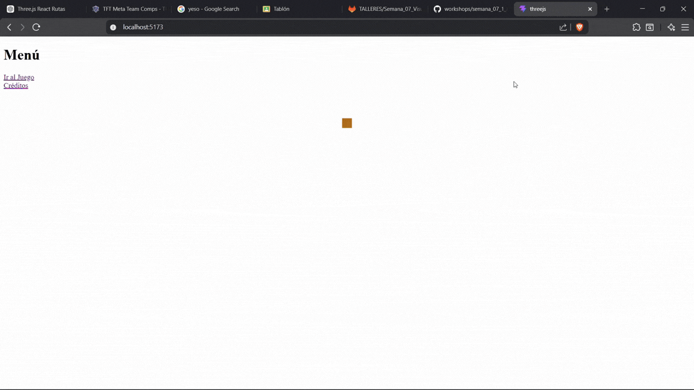

# Arquitectura de Escenas y Navegación — Unity & Three.js

## Nombre del estudiante

- Esteban Barrera
- Nicolas Quezada Mora
- Cristian Motta
- Esteban Santacruz
- Jeronimo Bermudez
- Sebastian Andrade

## Fecha de entrega

2026-04-24

---

## Descripción breve

En este taller se implementó un sistema de navegación entre múltiples escenas en dos entornos distintos: Unity (motor de videojuegos) y Three.js (librería 3D para la web). El objetivo fue comprender cómo se organiza una aplicación interactiva en escenas separadas con lógica de transición entre ellas, replicando el flujo clásico de menú principal → escena de juego → créditos.

En Unity se trabajó directamente con el `SceneManager` de C# y botones de UI nativa. En Three.js la implementación se realizó en React mediante componentes `.jsx`, usando `react-router-dom` para la navegación entre rutas y `@react-three/fiber` como capa de renderizado 3D sobre el canvas del navegador.

Ambas implementaciones comparten la misma arquitectura conceptual de tres escenas intercambiables, pero difieren significativamente en cómo gestionan el estado, el renderizado y el enrutamiento.

---

## Implementación en Unity

### Estructura general

El proyecto en Unity se organizó en tres escenas independientes registradas en el **Build Settings** (en Unity 6, renombrado como **Build Profiles**):

| Índice | Escena |
|---|---|
| 0 | `MenuPrincipal` |
| 1 | `EscenaJuego` |
| 2 | `Creditos` |

Cada escena tiene su propio `Canvas` de UI con el componente `NavegacionEscenas` adjunto a un `GameObject` vacío llamado `GameManager`, el cual centraliza toda la lógica de cambio de escena.

### Script de navegación

El script `NavegacionEscenas.cs` expone métodos públicos que se conectan directamente a los eventos `OnClick()` de los botones desde el Inspector de Unity, sin necesidad de código adicional en cada escena:

```csharp
using UnityEngine;
using UnityEngine.SceneManagement;

public class NavegacionEscenas : MonoBehaviour
{
    public void CargarEscena(string nombreEscena)
    {
        SceneManager.LoadScene(nombreEscena);
    }

    public void CargarEscenaPorIndice(int indice)
    {
        SceneManager.LoadScene(indice);
    }

    public void SalirJuego()
    {
        Application.Quit();
        Debug.Log("Juego cerrado");
    }
}
```

Este enfoque desacopla la lógica de navegación de cada escena individual: los botones simplemente invocan `CargarEscena("NombreEscena")` pasando el nombre como parámetro desde el Inspector.

### Navegación entre escenas

El cambio de escenas en Unity se realiza mediante `SceneManager.LoadScene()`, que descarga completamente la escena actual y carga la nueva. Esto implica que cualquier estado no persistente (variables, posición de objetos) se pierde en cada transición, lo cual es el comportamiento esperado para un flujo de menú estándar.


---

## Implementación en Three.js / React

### Estructura general

La implementación web se organizó en tres componentes React independientes que representan cada escena. La navegación entre ellos se delega a `react-router-dom`, que mapea rutas URL a componentes sin recargar la página:

```
/          → Menu.jsx       (Menú principal)
/juego     → Juego.jsx      (Escena de juego)
/creditos  → Creditos.jsx   (Pantalla de créditos)
```

El renderizado 3D se realizó con `@react-three/fiber`, una capa declarativa sobre Three.js que permite definir escenas 3D como árboles de componentes React.

### Escena del Menú Principal

El menú principal combina un canvas 3D con links de navegación HTML estándar. El cubo naranja giratorio cumple un rol decorativo que introduce al usuario al entorno 3D de la aplicación:

```jsx
import { Link } from "react-router-dom";
import { Canvas } from "@react-three/fiber";

export default function Menu() {
  return (
    <div>
      <h1>Menú</h1>
      <Link to="/juego">Ir al Juego</Link>
      <br />
      <Link to="/creditos">Créditos</Link>
      <Canvas>
        <mesh>
          <boxGeometry />
          <meshStandardMaterial color="orange" />
        </mesh>
        <ambientLight />
      </Canvas>
    </div>
  );
}
```

### Escena de Juego

La escena de juego implementa un minijuego interactivo: un cubo rosa en un canvas 3D que se reposiciona aleatoriamente al ser clickeado, incrementando un contador de puntuación. El estado del juego (`score` y `position`) se gestiona con el hook `useState` de React:

```jsx
import { Canvas } from "@react-three/fiber";
import { useState } from "react";
import { Link } from "react-router-dom";

function Cubo({ onClick, position }) {
  return (
    <mesh position={position} onClick={onClick}>
      <boxGeometry />
      <meshStandardMaterial color="hotpink" />
    </mesh>
  );
}

export default function Juego() {
  const [score, setScore] = useState(0);
  const [position, setPosition] = useState([0, 0, 0]);

  const moverCubo = () => {
    const nuevaPos = [
      (Math.random() - 0.5) * 5,
      (Math.random() - 0.5) * 5,
      (Math.random() - 0.5) * 5,
    ];
    setPosition(nuevaPos);
    setScore(score + 1);
  };

  return (
    <div style={{ height: "100vh" }}>
      <Link to="/">Volver</Link>
      <h1>Haz click en el cubo!</h1>
      <div style={{ fontSize: "20px" }}>Score: {score}</div>
      <Canvas>
        <ambientLight />
        <pointLight position={[10, 10, 10]} />
        <Cubo onClick={moverCubo} position={position} />
      </Canvas>
    </div>
  );
}
```

### Pantalla de Créditos

La pantalla de créditos es un componente puramente informativo que lista la información del equipo y ofrece navegación de regreso al menú:

```jsx
import { Link } from "react-router-dom";

export default function Creditos() {
  return (
    <div>
      <h1>Créditos</h1>
      <p>Desarrollado para la materia de visual!</p>
      <Link to="/">Volver al menú</Link>
    </div>
  );
}
```

### Navegación entre escenas

La navegación entre rutas en React es instantánea y no descarga el estado global de la aplicación, a diferencia de Unity. Esto permite, por ejemplo, que el `score` de la escena de juego pudiera persistirse mediante un estado elevado al componente raíz si fuera necesario.



---

## Comparativa Unity vs Three.js

| Aspecto | Unity | Three.js / React |
|---|---|---|
| Navegación | `SceneManager.LoadScene()` | `react-router-dom` (rutas URL) |
| Renderizado 3D | Motor nativo | `@react-three/fiber` sobre WebGL |
| Gestión de estado | Variables de MonoBehaviour | `useState` de React |
| Persistencia entre escenas | No (se destruye al cambiar) | Posible mediante estado global |
| UI | Canvas nativo de Unity | HTML + CSS estándar |
| Lenguaje | C# | JavaScript / JSX |

---

## Aprendizajes y dificultades

### Aprendizajes

Se comprendió la importancia de registrar las escenas en el **Build Settings** (o **Build Profiles** en Unity 6) antes de intentar cargarlas con `SceneManager`; sin este paso, la carga falla en tiempo de ejecución con un error que no indica claramente la causa raíz.

En la implementación de React, se entendió cómo `@react-three/fiber` abstrae la inicialización del renderer, la cámara y el loop de animación de Three.js: el desarrollador solo declara la geometría y los materiales como JSX, y la librería se encarga del ciclo de render. Esto reduce considerablemente el código necesario para poner en marcha una escena 3D en comparación con Three.js puro.

La separación de responsabilidades entre enrutamiento (`react-router-dom`), estado (`useState`) y renderizado (`Canvas`) resultó ser un modelo mental claro y escalable para construir aplicaciones interactivas con múltiples vistas.

### Dificultades

En Unity 6 el menú **File** ya no contiene la opción **Build Settings** con ese nombre; fue renombrado a **Build Profiles** y reorganizado. Esto generó confusión inicial al seguir tutoriales escritos para versiones anteriores del motor.

En la implementación de React, la integración del componente `Canvas` de `@react-three/fiber` dentro del flujo normal de HTML requirió ajustar estilos (en particular `height: 100vh`) para que el canvas ocupara correctamente el espacio disponible sin colapsar a altura cero.

### Mejoras futuras

Podría añadirse un sistema de transiciones animadas entre escenas en ambas implementaciones: en Unity mediante corutinas y un panel de fundido a negro, y en React mediante librerías como `framer-motion`. También sería valioso persistir el puntaje del juego entre sesiones usando `PlayerPrefs` en Unity o `localStorage` en la versión web.

---

## Estructura del proyecto

```
taller_escenas/
├── unity/
│   ├── Assets/
│   │   ├── Scenes/
│   │   │   ├── MenuPrincipal.unity
│   │   │   ├── EscenaJuego.unity
│   │   │   └── Creditos.unity
│   │   └── Scripts/
│   │       └── NavegacionEscenas.cs
├── threejs/
│   └── src/
│       ├── Menu.jsx
│       ├── Juego.jsx
│       └── Creditos.jsx
├── media/
│   ├── gif_unity.gif
│   └── gif_threejs.gif
└── README.md
```