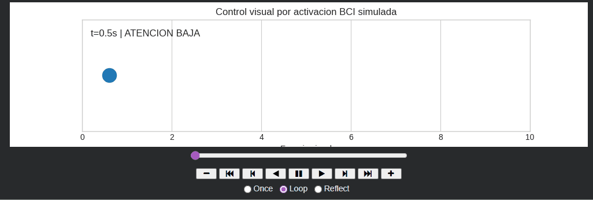

# Taller 7.2: BCI Simulado - Control Visual

## Nombre de los estudiantes

- Juan Esteban Santacruz Corredor
- Nicolas Quezada Mora
- Cristian Steven Motta Ojeda
- Sebastian Andrade Cedano
- Esteban Barrera Sanabria
- Jeronimo Bermudez Hernandez

## Fecha de entrega

`26 de abril de 2026`

---

## Descripción breve

El objetivo de este taller fue simular el comportamiento de interfaces BCI (Brain-Computer Interface) usando datos generados o precargados para entender el procesamiento básico de señales EEG. Se desarrolló una notebook de Python con generación sintética de señales EEG, filtrado de bandas de frecuencia (Alpha y Beta), análisis de potencia espectral, y visualización interactiva con animación en tiempo real mostrando la actividad cerebral simulada.

---

## Implementaciones

### Python / Jupyter Notebook

- **Generación de Señales EEG:** Creación de datos sintéticos combinando múltiples frecuencias (delta, theta, alpha, beta, gamma)
- **Filtrado Bandpass:** Implementación de filtros digitales usando `scipy.signal.butter` y `scipy.filtfilt` para bandas específicas
- **Análisis de Potencia:** Cálculo de potencia espectral usando `scipy.signal.welch` para banda Alpha (8-12Hz) y Beta (12-30Hz)
- **Visualización Interactiva:** Gráficos con `matplotlib` mostrando:
  - Señal EEG bruta vs filtrada
  - Espectro de potencia
  - Evolución temporal de potencia en bandas
- **Animación:** `FuncAnimation` mostrando el progreso de análisis con barra de progreso tipo PingPong
- **Estadísticas en Tiempo Real:** Cálculo continuo de media, desviación estándar y potencia relativa

---

## Características Principales

### Carga o Generación de Datos
```python
# Generar señales sintéticas de EEG
def generate_eeg_signal(duration=10, sampling_rate=256):
    t = np.arange(0, duration, 1/sampling_rate)
    # Combinar múltiples frecuencias
    signal = (0.5 * np.sin(2*np.pi*10*t) +   # Alpha
              0.3 * np.sin(2*np.pi*20*t) +   # Beta
              0.2 * np.sin(2*np.pi*5*t))     # Theta
    return signal + 0.1*np.random.randn(len(signal))
```

### Filtrado Bandpass
```python
def bandpass_filter(signal, lowcut, highcut, fs=256, order=4):
    sos = scipy.signal.butter(order, [lowcut, highcut], 
                              btype='band', fs=fs, output='sos')
    filtered = scipy.signal.sosfiltfilt(sos, signal)
    return filtered
```

### Análisis de Potencia Espectral
```python
def band_power_welch(signal, band, fs=256):
    freqs, psd = scipy.signal.welch(signal, fs=fs, nperseg=256)
    idx_band = np.logical_and(freqs >= band[0], freqs < band[1])
    return np.mean(psd[idx_band])
```

### Visualización con Animación
```python
def animate(frame):
    # Actualizar gráficos cada frame
    line_signal.set_ydata(eeg_signal[:frame*100])
    line_alpha.set_ydata(alpha_power[:frame])
    line_beta.set_ydata(beta_power[:frame])
    return line_signal, line_alpha, line_beta

ani = FuncAnimation(fig, animate, frames=100, interval=50)
```

---

## Resultados Visuales

### EEG vs Tiempo


Gráfico que muestra la señal EEG bruta generada sintéticamente a lo largo de 10 segundos. Se observan las oscilaciones características de múltiples bandas de frecuencia combinadas, simulando actividad cerebral real.

### Señales Filtradas por Banda


Comparación visual del procesamiento de señales EEG tras aplicar filtros bandpass. Se muestran:
- Señal original (bruta)
- Banda Alpha (8-12Hz) - Relajación
- Banda Beta (12-30Hz) - Actividad cognitiva
- Filtros superpuestos para visualizar la aislación de frecuencias

### Dinámica de Potencia en Bandas


Evolución temporal de la potencia relativa en bandas Alpha y Beta. Demuestra cómo la potencia fluctúa a lo largo del tiempo, simulando cambios en estados de atención y relajación del usuario.

### Control Visual por BCI (Animación)


Animación interactiva que muestra en tiempo real cómo el sistema procesa señales EEG sintéticas y genera respuestas visuales. Incluye:
- Gráfico de señal actualizado cada frame
- Evolución de potencia en bandas
- Estadísticas de media y desviación estándar
- Indicador de progreso tipo PingPong

### Notebook Structure
- **Celda 1-3:** Imports y configuración de datos
- **Celda 4-6:** Funciones de filtrado y potencia
- **Celda 7-9:** Generación/carga de datos EEG
- **Celda 10-12:** Procesamiento de bandas de frecuencia
- **Celda 13-15:** Visualización estática (señal + espectro)
- **Celda 16:** Animación interactiva con estadísticas en tiempo real

---

## Contenidos de Archivos

### Archivo Principal
- `taller_bci_simulado.ipynb` - Notebook completo con 16 celdas de código y markdown

### Estructura de Carpetas
```
semana_07_2_bci_simulado_control_visual/
├── README.md                          # Este archivo
├── python/
│   └── taller_bci_simulado.ipynb     # Notebook con todo el desarrollo
└── media/
    └── (Capturas/GIFs de resultados)
```

---

## Prompts Utilizados

- "Genera una notebook de Jupyter con simulación de señales EEG usando numpy y scipy"
- "Implementa filtrado bandpass para bandas Alpha (8-12Hz) y Beta (12-30Hz)"
- "Crea un análisis de potencia espectral usando scipy.signal.welch"
- "Añade animación interactiva con matplotlib FuncAnimation mostrando evolución de potencia"

---

## Instrucciones de Uso

### Requisitos
```
python >= 3.8
jupyter
numpy
scipy
pandas
matplotlib
```

### Instalación
```bash
cd semana_07_2_bci_simulado_control_visual
pip install -r requirements.txt
jupyter notebook python/taller_bci_simulado.ipynb
```

### Ejecución
1. Abre el notebook en Jupyter
2. Ejecuta las celdas secuencialmente (Shift+Enter)
3. La celda final mostrará la animación interactiva
4. Observa cómo cambian las bandas Alpha y Beta a lo largo del tiempo

---

## Aprendizajes y Dificultades

### Aprendizajes

- El filtrado digital es esencial para aislar bandas de frecuencia específicas en señales de audio/EEG
- La transformada de Fourier (a través de Welch) revela la distribución de potencia en diferentes frecuencias
- Las simulaciones sintéticas permiten entender los conceptos sin datos reales de sensores
- La animación ayuda a visualizar cambios dinámicos que serían imperceptibles en gráficos estáticos
- La banda Alpha (8-12Hz) está asociada con relajación; Beta (12-30Hz) con actividad cerebral

### Dificultades

- Elegir parámetros adecuados de orden del filtro (trade-off entre nitidez y estabilidad)
- Sincronizar múltiples gráficos en la animación sin lag
- Manejar ruido sin eliminar características importantes del señal
- Escalar adecuadamente los ejes Y para visualización clara de múltiples series temporales

---

## Conceptos Clave de BCI

Un **Brain-Computer Interface (BCI)** es un sistema que traduce la actividad cerebral en comandos de control. Este taller simula los pasos iniciales:

1. **Adquisición:** Simulamos sensores EEG capturando actividad cerebral
2. **Pre-procesamiento:** Aplicamos filtros para limpiar artefactos y ruido
3. **Extracción de Características:** Calculamos potencia en bandas específicas
4. **Análisis:** Observamos patrones de actividad cerebral
5. **Aplicación:** En BCIs reales, estos patrones activarían cursores, prótesis o robots

---

## Referencias

- [SciPy Signal Processing Documentation](https://docs.scipy.org/doc/scipy/reference/signal.html)
- [Matplotlib Animation Tutorial](https://matplotlib.org/stable/api/animation_api.html)
- [EEG Signal Processing (OpenBCI)](https://docs.openbci.com/)
- [Neurofeedback Basics](https://en.wikipedia.org/wiki/Neurofeedback)

---

## Notas Finales

Este taller proporciona las bases para entender procesamiento de señales biológicas. En aplicaciones reales, los BCIs usan algoritmos de machine learning (clasificadores como SVM, redes neuronales) para decodificar intención desde patrones de EEG.
