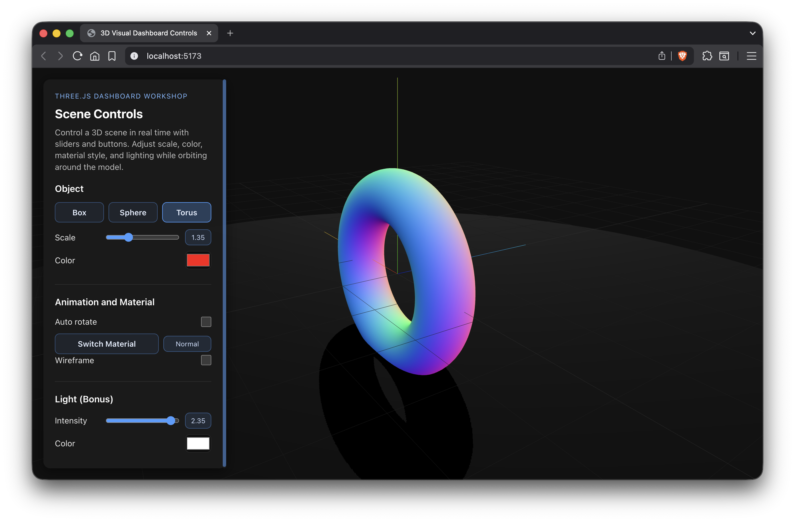

# Taller Dashboards Visuales 3D Sliders Botones

## Nombre de los estudiantes
- Juan Esteban Santacruz Corredor
- Nicolas Quezada Mora
- Cristian Steven Motta Ojeda
- Sebastian Andrade Cedano
- Esteban Barrera Sanabria
- Jerónimo Bermúdez Hernández

## Fecha de entrega

`2026-04-20`

---

## Descripción breve

Taller sobre dashboards visuales 3D en Three.js con React Three Fiber. Se implementó una escena interactiva con un panel de controles para modificar en tiempo real propiedades del objeto (tipo, escala, color, material), activar rotación automática y ajustar parámetros de iluminación.

---

## Implementaciones

### Three.js / React Three Fiber

- Escena 3D con selección de objeto mediante botones: `Box`, `Sphere` y `Torus`.
- Slider para controlar la escala del objeto en tiempo real.
- Selector de color para modificar el material del objeto.
- Botón para alternar entre materiales `standard`, `toon` y `normal`.
- Toggle para activar/desactivar rotación automática.
- Toggle de wireframe para inspección visual de geometría.
- Control bonus de luz con slider de intensidad y color picker para la luz principal.

---

## Resultados visuales

### Three.js - Implementación



Panel lateral de control conectado a la escena 3D: se observan los controles de forma, escala, color, material y luz aplicándose en tiempo real.


Demostración de interacción con sliders y botones: cambios de material, rotación automática y ajustes de iluminación durante la navegación orbital.

---

## Código relevante

### React Three Fiber — panel de controles

```jsx
const cycleMaterial = () => {
  const modes = ['standard', 'toon', 'normal']
  const currentIndex = modes.indexOf(settings.materialMode)
  const nextIndex = currentIndex === -1 ? 0 : (currentIndex + 1) % modes.length
  onChange('materialMode', modes[nextIndex])
}
```

### React Three Fiber — objeto y escena

```jsx
useFrame((_, delta) => {
  if (!meshRef.current || !settings.autoRotate) {
    return
  }

  meshRef.current.rotation.y += delta * 0.9
  meshRef.current.rotation.x += delta * 0.35
})
```

### Archivos de la escena

- Escena principal y luces: [threejs/src/components/SceneViewer.jsx](threejs/src/components/SceneViewer.jsx)
- Panel y controles: [threejs/src/components/Controls.jsx](threejs/src/components/Controls.jsx)
- Estilos del panel: [threejs/src/components/Controls.css](threejs/src/components/Controls.css)
- Estado global y composición: [threejs/src/App.jsx](threejs/src/App.jsx)

---

## Prompts utilizados

1. "Implement a 3D dashboard with sliders and buttons in React Three Fiber to control object transform, materials, and lighting."
2. "Keep the visual style consistent with the previous workshop UI panel."
3. "Add mobile-friendly layout behavior while preserving desktop dashboard usability."

---

## Aprendizajes y dificultades

### Aprendizajes

- Cómo mapear estado de React a propiedades de escena 3D para interacción en tiempo real.
- Cómo alternar materiales de forma segura sin romper la navegación ni la iluminación global.
- Cómo diseñar un panel de control compacto que mantenga legibilidad y respuesta visual inmediata.
- Cómo balancear controles de objeto y luz para crear una experiencia de exploración clara.

### Dificultades

- Mantener la consistencia visual del panel mientras cambiaba por completo la lógica del taller anterior.
- Ajustar la distribución responsive para que el panel y el canvas funcionen bien en móvil.
- Evitar sobreexposición de la escena al combinar cambios de color de objeto y de luz.

---

## Contribuciones grupales (si aplica)

| Integrante | Rol |
|---|---|
| Juan Esteban Santacruz Corredor | Diseño de interacción del dashboard (sliders y botones) |
| Nicolas Quezada Mora | Implementación de materiales y modos de visualización |
| Cristian Steven Motta Ojeda | Integración de escena, cámaras y controles orbitales en R3F |
| Sebastian Andrade Cedano | Sistema de iluminación y ajustes en tiempo real |
| Esteban Barrera Sanabria | Validación visual, pruebas de uso y captura de evidencias |
| Jerónimo Bermúdez Hernández | Documentación técnica y redacción del README |

---

## Estructura del proyecto

```
semana_07_3_dashboards_visuales_3d_sliders_botones/
├── media/                       # Evidencias (png, gif, mov)
├── threejs/
│   ├── index.html               # Título y bootstrap de Vite
│   ├── package.json             # Dependencias R3F/drei/three
│   └── src/
│       ├── main.jsx             # Punto de entrada React
│       ├── App.jsx              # Layout y estado global
│       ├── App.css
│       ├── components/
│       │   ├── SceneViewer.jsx  # Escena 3D y controles de luz/objeto
│       │   ├── Controls.jsx     # Panel y controles de dashboard
│       │   └── Controls.css
│       └── index.css
└── README.md                    # Este documento
```

---

## Referencias

- Three.js: https://threejs.org/
- React Three Fiber: https://docs.pmnd.rs/react-three-fiber/getting-started/introduction
- @react-three/drei: https://docs.pmnd.rs/drei/introduction
- Materiales en Three.js: https://threejs.org/docs/#api/en/materials/Material
- OrbitControls: https://threejs.org/docs/#examples/en/controls/OrbitControls
