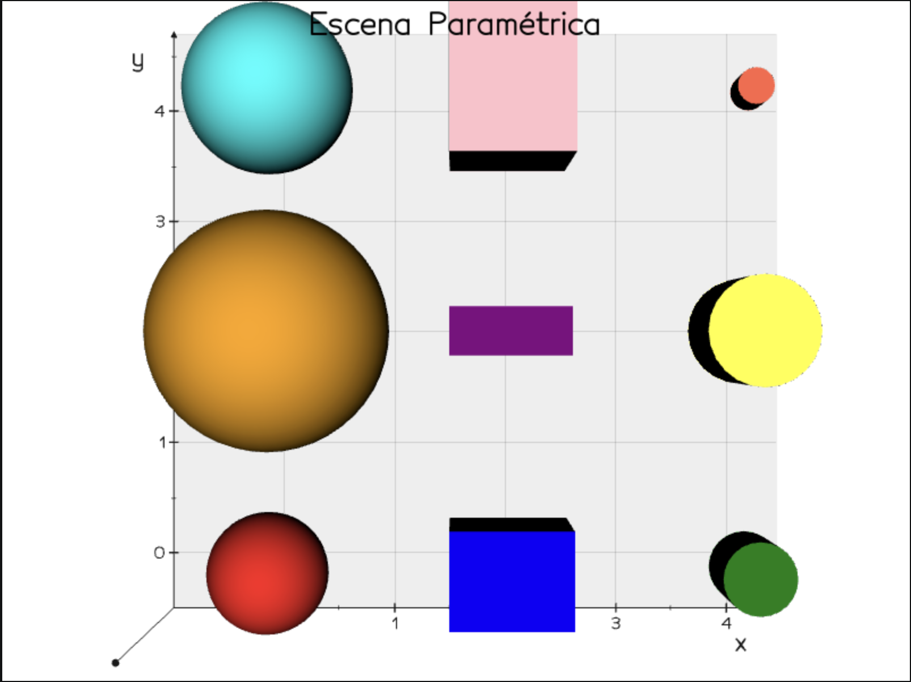
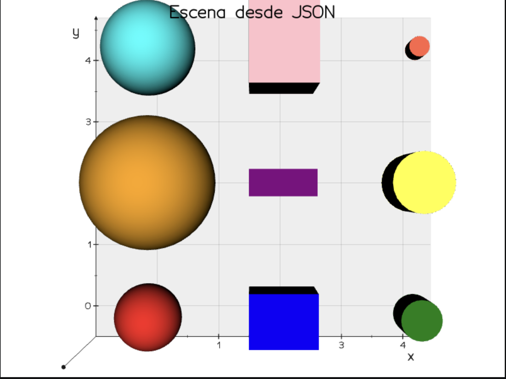
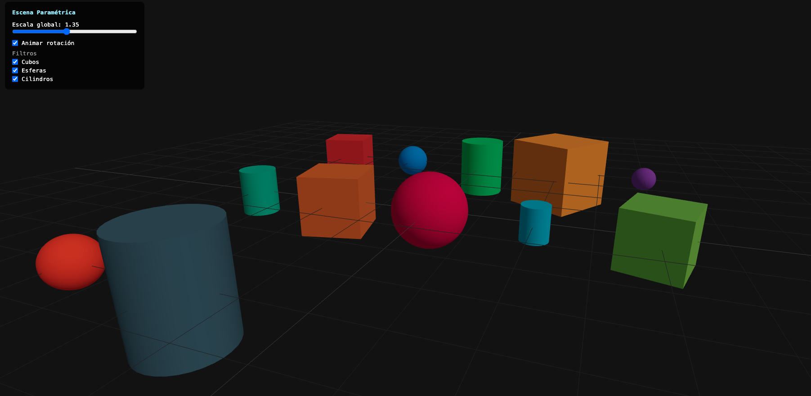
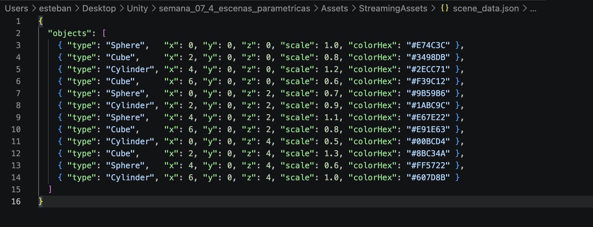

# Taller — Escenas Paramétricas: Creación de Objetos desde Datos

**Nombre del estudiante:**

- Esteban Barrera Sanabria
- Cristian Steven Motta Ojeda
- Juan Esteban Santacruz Corredor
- Sebastian Andrade Cedano
- Nicolas Quezada Mora
- Jeronimo Bermudez Hernandez

**Fecha de entrega:** 25 de abril de 2026

---

## Descripción

El objetivo del taller es generar objetos 3D de manera programada a partir de listas de coordenadas y datos estructurados, entendiendo cómo crear geometría en tiempo real de forma flexible mediante código.

Para lo anterior se implementaron tres entornos distintos: Python con trimesh para generación y exportación de meshes, Three.js con React Three Fiber para una escena web interactiva con controles en tiempo real, y Unity con C# para instanciación de primitivas desde un archivo JSON con botón de regeneración paramétrica.

**Entornos utilizados:**

- Python (Jupyter Notebook) — `trimesh`, `numpy`, `matplotlib`, `json`
- Three.js con React Three Fiber — `@react-three/fiber`, `@react-three/drei`
- Unity 2022.3 LTS

---

## Implementaciones

### Python

Se definió una lista de 9 objetos con parámetros de tipo, posición, escala y color en RGB. Una función `make_mesh()` itera sobre esa lista y genera meshes con `trimesh.creation` según el tipo de primitiva: `icosphere` para esferas, `box` para cubos y `cylinder` para cilindros. Cada mesh se traslada a su posición con `apply_translation()` sin necesidad de modificar la geometría base.

La visualización se realizó con `matplotlib` usando `Poly3DCollection` para renderizar las caras de cada mesh con su color correspondiente, evitando el uso de vedo que causaba inestabilidad del kernel en VSCode. Cada mesh se exportó individualmente como `.obj` usando `mesh.export()` de trimesh. Como bonus, los datos de la escena se serializaron a JSON con el módulo estándar de Python y se recargaron para regenerar la escena completa desde el archivo, demostrando el flujo de datos estructurados → geometría.

### Three.js con React Three Fiber

Se creó una escena con 12 objetos definidos en un archivo de datos `sceneData.js`, cada uno con tipo, posición, escala, color y rotación como parámetros independientes. El componente `ParametricScene` recibe props de control y filtra el array con `.filter()` según el tipo activo antes de mapearlo con `.map()` a componentes `ParametricObject`.

Cada `ParametricObject` elige su geometría condicionalmente según el campo `type` del dato: `boxGeometry`, `sphereGeometry` o `cylinderGeometry`. La rotación de cada objeto se convierte de grados a radianes al momento del render. La animación de rotación continua se implementó con `useFrame` y un `useRef` sobre el mesh, activándose solo cuando el prop `animate` es verdadero.

Los controles se implementaron como HTML nativo sobre el canvas usando estado de React (`useState`) sin dependencias externas, reemplazando `leva` que resultó incompatible con React 18 por usar la API de `ReactDOM.render` descontinuada. El panel incluye un slider de escala global, un toggle de animación y tres checkboxes de filtro por tipo de geometría.

### Unity

Se definieron dos clases serializables en C#: `ObjectData` con los campos de cada objeto y `SceneData` como contenedor de la lista. El script `ParametricScene.cs` lee el archivo `scene_data.json` desde `Application.streamingAssetsPath` usando `File.ReadAllText()` y lo deserializa con `JsonUtility.FromJson<SceneData>()`.

Por cada entrada del JSON, `SpawnObject()` crea una primitiva con `GameObject.CreatePrimitive()` seleccionada mediante un `switch` sobre el campo `type`. La escala se aplica multiplicando el valor del JSON por `globalScale`, parámetro configurable desde el Inspector. El color se parsea del hexadecimal usando `ColorUtility.TryParseHtmlString()` y se aplica clonando el material existente del renderer para mantener compatibilidad con URP. Cada objeto generado queda como hijo del transform del objeto `ParametricScene` para organización jerárquica.

El botón de regeneración llama a `OnRegenerateButton()`, que asigna una escala global aleatoria con `Random.Range(0.5f, 2f)` antes de limpiar y regenerar la escena, haciendo visible el efecto paramétrico en cada click. `ClearScene()` destruye todos los GameObjects del ciclo anterior antes de instanciar los nuevos.

---

## Resultados Visuales

### Python — Escena generada con matplotlib



### Python — Escena regenerada desde JSON



### Python — Archivos OBJ exportados


### Three.js — Snapshot general de la escena



### Three.js — Escena interactiva


### Unity — Grilla de objetos generados desde JSON



### Unity — Escena interactiva


---

## Código Relevante

**Python: Función de generación paramétrica:**

```python
def make_mesh(obj):
    x, y, z = obj["pos"]
    s       = obj["scale"]

    if obj["type"] == "sphere":
        m = trimesh.creation.icosphere(subdivisions=3, radius=s * 0.5)
    elif obj["type"] == "cube":
        m = trimesh.creation.box(extents=[s, s, s])
    elif obj["type"] == "cylinder":
        m = trimesh.creation.cylinder(radius=s * 0.4, height=s)

    m.apply_translation([x, y, z])
    return m
```

**Three.js: Mapeo condicional de geometría por tipo:**

```jsx
{data.type === "box"      && <boxGeometry args={[1, 1, 1]} />}
{data.type === "sphere"   && <sphereGeometry args={[0.5, 32, 32]} />}
{data.type === "cylinder" && <cylinderGeometry args={[0.4, 0.4, 1, 32]} />}
```

**Unity: Instanciación desde JSON con color hex:**

```csharp
void SpawnObject(ObjectData obj)
{
    PrimitiveType primitiveType;
    switch (obj.type)
    {
        case "Sphere":   primitiveType = PrimitiveType.Sphere;   break;
        case "Cylinder": primitiveType = PrimitiveType.Cylinder; break;
        default:         primitiveType = PrimitiveType.Cube;     break;
    }

    GameObject go = GameObject.CreatePrimitive(primitiveType);
    go.transform.position   = new Vector3(obj.x, obj.y + (obj.scale * 0.5f), obj.z);
    go.transform.localScale = Vector3.one * obj.scale * globalScale;
    go.transform.SetParent(transform);

    if (ColorUtility.TryParseHtmlString(obj.colorHex, out Color color))
    {
        Renderer rend = go.GetComponent<Renderer>();
        rend.material = new Material(rend.material);
        rend.material.color = color;
    }
}
```

---

## Prompts Utilizados

Durante el desarrollo se usaron herramientas de IA generativa para:

1. Diagnosticar el error `TypeError: 'numpy.ndarray' object is not callable` en vedo — la causa era que `.points` y `.cells` son propiedades en versiones recientes, no métodos. Y posteriormente el `ValueError` de faces inhomogéneas al pasar a trimesh, resuelto triangulando el mesh con `.triangulate()` antes de exportar.
2. Reemplazar vedo por `matplotlib` con `Poly3DCollection` para evitar que el plotter externo matara el kernel de Jupyter en VSCode.
3. Diagnosticar la incompatibilidad de `leva@0.9.35` con React 18 — el error `ReactDOM.render is not a function` indicaba que leva usaba la API de React 17. La solución fue eliminar leva y reimplementar los controles con `useState` y HTML nativo.

---

## Aprendizajes y Dificultades

### Aprendizajes

- `trimesh.creation` ofrece primitivas geométricas listas para usar (`icosphere`, `box`, `cylinder`) que se pueden posicionar con `apply_translation()` sin modificar la geometría base — esto es más confiable que construir meshes desde vértices y caras manualmente.
- En Three.js, `leva` es una dependencia con historial de incompatibilidades entre versiones de React. Para proyectos con React 18, los controles HTML nativos con `useState` son una alternativa sin fricción que cumple exactamente el mismo propósito pedagógico.
- `JsonUtility` de Unity requiere que las clases sean marcadas con `[Serializable]` y que la raíz del JSON sea un objeto, no un array directo — un array en la raíz no puede deserializarse con `JsonUtility.FromJson<T>()`.
- En URP, todo material creado con `new Material(Shader.Find("Standard"))` resulta en el shader magenta porque el shader Built-in no existe en URP. La forma correcta es clonar el material del renderer existente, que ya tiene el shader correcto del pipeline activo.

### Dificultades

- El mayor obstáculo en Python fue la inestabilidad del kernel al usar el plotter nativo de vedo en VSCode. Vedo intenta abrir una ventana gráfica con VTK que no es compatible con todos los entornos de Jupyter y termina el proceso. Migrar la visualización a matplotlib resolvió el problema completamente sin perder funcionalidad relevante para el taller.
- En Three.js, el error de `leva` fue difícil de diagnosticar porque el mensaje `ReactDOM.render is not a function` no menciona a leva directamente. Solo al rastrear el stack trace hasta `leva.js:5370` quedó claro que la librería era la fuente del problema.
- En Unity, la diferencia entre Built-in Render Pipeline y URP no es obvia para quien viene de tutoriales genéricos. Muchos ejemplos en línea usan `Shader.Find("Standard")` que funciona en Built-in pero produce objetos rosados en URP sin ningún mensaje de error explicativo en consola.
