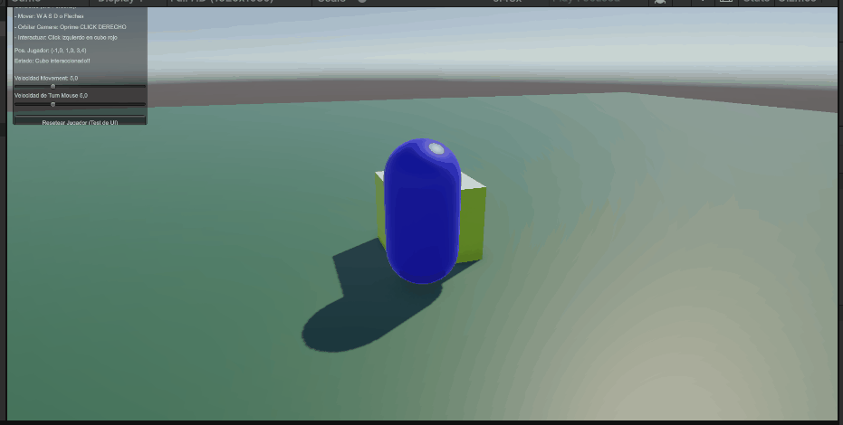
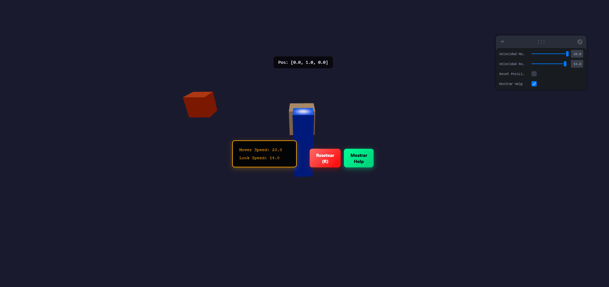

# Taller 7.6: Input & UI - Captura de Entrada y Interfaz Gráfica

## Nombre de los estudiantes

- [Completa con los nombres de tu grupo]

## Fecha de entrega

`26 de abril de 2026`

---

## Descripción breve

El objetivo de este taller fue aprender a capturar y procesar entradas del usuario (mouse, teclado, touch) e implementar interfaces visuales (UI) en entornos 3D. Se desarrollaron dos implementaciones paralelas:

1. **Unity:** Script C# autogenerado que crea escena 3D con movimiento WASD, cámara orbital con click derecho, y UI con OnGUI
2. **Three.js + React:** Aplicación web con React Three Fiber usando `useFrame` para input, `useEffect` para event listeners, y overlays HTML para UI

Ambas implementaciones demuestran cómo el input del usuario se integra con lógica 3D y paneles interactivos.

---

## Implementaciones

### Unity (C#)

- **Autogeneración de Escena:** Crea piso, cubo interactivo y jugador automáticamente en `Start()`
- **Input Directo:** Usa `Input.GetKey(KeyCode.W)` para evitar problemas con Input Manager
- **Cámara Orbital:** Implementa `Transform.RotateAround()` cuando se mantiene click derecho
- **Raycast Detection:** Click izquierdo dispara raycast para interactuar con objetos
- **UI Legacy:** Implementa panel de información con `OnGUI()` (garantizado funcionar)
- **Sliders Dinámicos:** Controla velocidad de movimiento y rotación en tiempo real

### Three.js + React Three Fiber (JavaScript)

- **Gestión de Input:** `useEffect` con `window.addEventListener` para WASD e historial de teclas
- **useFrame Hook:** Detecta entrada cada frame sin bloquear el render
- **OrbitControls:** Cámara que orbita alrededor del jugador automáticamente
- **Click Detection:** `onClick` en meshes de Three.js para interacción 3D
- **HTML Overlay:** `@react-three/drei/Html` superpone UI React sobre canvas
- **Sliders Leva:** Panel de control interactivo para parámetros en tiempo real
- **State Management:** React hooks para manejar posición, colores y estado de juego

---

## Características Principales

### Unity - Input y Movimiento
```csharp
private void HandleMovement()
{
    float h = 0f;
    float v = 0f;

    if (Input.GetKey(KeyCode.W) || Input.GetKey(KeyCode.UpArrow)) v += 1f;
    if (Input.GetKey(KeyCode.S) || Input.GetKey(KeyCode.DownArrow)) v -= 1f;
    if (Input.GetKey(KeyCode.D) || Input.GetKey(KeyCode.RightArrow)) h += 1f;
    if (Input.GetKey(KeyCode.A) || Input.GetKey(KeyCode.LeftArrow)) h -= 1f;
    
    Vector3 move = (player.right * h + player.forward * v).normalized;
    player.position += move * moveSpeed * Time.deltaTime;
}
```

### Unity - Cámara Orbital
```csharp
void LateUpdate() 
{
    if(Input.GetMouseButton(1))
    {
        float deltaX = Input.GetAxis("Mouse X") * turnSpeed;
        float deltaY = Input.GetAxis("Mouse Y") * turnSpeed;
        
        cameraTransform.RotateAround(player.position, Vector3.up, deltaX);
        cameraTransform.RotateAround(player.position, cameraTransform.right, -deltaY);
        cameraTransform.LookAt(player.position);
    }
}
```

### Three.js - Detector de Teclado
```javascript
useEffect(() => {
  const handleKeyDown = (e) => {
    keysPressed.current[e.key.toLowerCase()] = true
  }
  const handleKeyUp = (e) => {
    keysPressed.current[e.key.toLowerCase()] = false
  }
  
  window.addEventListener('keydown', handleKeyDown)
  window.addEventListener('keyup', handleKeyUp)
  
  return () => {
    window.removeEventListener('keydown', handleKeyDown)
    window.removeEventListener('keyup', handleKeyUp)
  }
}, [])
```

### Three.js - Movimiento en useFrame
```javascript
useFrame((state) => {
  let moveX = 0
  let moveZ = 0

  if (keysPressed.current['w']) moveZ -= 1
  if (keysPressed.current['s']) moveZ += 1
  if (keysPressed.current['d']) moveX += 1
  if (keysPressed.current['a']) moveX -= 1

  if (moveX !== 0 || moveZ !== 0) {
    const speed = moveSpeed * state.clock.getDelta()
    setPlayerPos((prev) => [
      prev[0] + moveX * speed,
      prev[1],
      prev[2] + moveZ * speed,
    ])
  }
})
```

### Three.js - UI HTML Overlay
```javascript
<Html fullScreen>
  <div className="ui-container">
    <div className="help-panel">
      <h2>TALLER 6.1: Input & UI</h2>
      <p>Controles: WASD para mover, Mouse para orbitar</p>
      <button onClick={onReset}>Resetear (R)</button>
    </div>
  </div>
</Html>
```

---

## Resultados Visuales

### Unity - Escena 3D con Input (Demo)


Demostración de la implementación en Unity mostrando:
- Movimiento del jugador (cápsula azul) con WASD
- Rotación de cámara orbital manteniendo click derecho
- UI con OnGUI mostrando posición, estado y sliders
- Click izquierdo para interactuar con el cubo rojo (cambio de color)

### Unity - Reseteo de Posición (Demo)


Demostración del botón de reseteo en la interfaz. Cuando se clickea el botón o se presiona R:
- El jugador vuelve a la posición inicial (0, 1, 0)
- La cámara se reposiciona automáticamente
- Se actualiza el mensaje de estado en el panel

### Three.js + React - Escena Interactiva (Demo)


Demostración de la implementación en Three.js + React mostrando:
- Movimiento fluido con WASD/Flechas
- Órbita de cámara automática con mouse drag
- Panel de información flotante con posición del jugador
- UI HTML overlay con controles de velocidad
- Click en cubo rojo para cambiar color aleatoriamente
- Sliders dinámicos para ajustar parámetros en tiempo real

### Estructura de Carpetas

```
semana_07_6_input_ui_unity_threejs/
├── README.md                          # Este archivo
├── unity/
│   └── My project (2)/
│       └── Assets/Scripts/
│           └── MainScript.cs         # Script autogenerado
└── threejs/
    ├── package.json                   # Dependencias
    ├── vite.config.js                 # Configuración Vite
    ├── index.html                     # Entrada HTML
    └── src/
        ├── main.jsx                   # Punto de entrada React
        ├── App.jsx                    # Canvas y Suspense
        ├── Scene.jsx                  # Lógica principal
        ├── Landscape.jsx              # Objetos 3D
        ├── ControlsUI.jsx             # UI Panels
        ├── ControlsUI.css             # Estilos
        └── App.css                    # Estilos globales
```

---

## Controles Comunes

| Input | Acción |
|-------|--------|
| **W / ↑** | Avanzar |
| **A / ←** | Izquierda |
| **S / ↓** | Retroceder |
| **D / →** | Derecha |
| **Click Derecho (Unity)** | Mantener para rotar cámara |
| **Mouse Drag (Three.js)** | Orbitar cámara |
| **Rueda Mouse** | Zoom in/out |
| **Click Izquierdo** | Interactuar con cubo (cambiar color) |
| **R** | Resetear posición |

---

## Prompts Utilizados

- "Crea un script de Unity que autogenere una escena 3D con input de teclado y mouse usando Input.GetKey()"
- "Implementa RotateAround() para camera orbital al mantener click derecho"
- "Crea una aplicación React Three Fiber con WASD para movimiento y OrbitControls"
- "Implementa UI HTML overlay usando @react-three/drei/Html y event listeners"
- "Añade raycast detection para interactuar con objetos 3D"

---

## Instrucciones de Uso

### Unity

1. Abre el proyecto en Unity 6000+ (o compatible)
2. Adjunta `MainScript.cs` a un GameObject vacío
3. Dale Play
4. Mueve con WASD, orbita con click derecho mantenido
5. Clickea el cubo rojo para interactuar

### Three.js + React

```bash
cd threejs
npm install
npm run dev
```

Abre `http://localhost:3000` en tu navegador.

---

## Comparación: Unity vs Three.js

| Aspecto | Unity | Three.js + React |
|--------|-------|------------------|
| **Lenguaje** | C# | JavaScript/JSX |
| **Input** | `Input.GetKey()` | `addEventListener('keydown')` |
| **Física** | Physics engine (opcional) | Manual |
| **Cámara** | `RotateAround()` | `OrbitControls` |
| **UI** | Canvas/OnGUI | HTML DOM |
| **Estado** | MonoBehaviour | React hooks |
| **Curva Aprendizaje** | Intermedia | Media-Alta |
| **Desempeño** | Excelente | Muy Bueno |
| **Deploy** | Ejecutable nativo | Página web |

---

## Aprendizajes y Dificultades

### Aprendizajes

- **Input directo vs Abstract:** Usar `Input.GetKey()` es más robusto que depender de Input Manager con ejes
- **Separación de concerns:** Mantener input, lógica 3D y UI separados hace código más mantenible
- **Event-driven vs Polling:** Los event listeners (addEventListener) capturan eventos puntuales; polling (GetKey) verifica estado continuamente
- **Cámara Orbital:** `RotateAround()` es más simple que rotar manualmente con quaterniones
- **React Hooks:** `useFrame` es ideal para lógica que depende de tiempo/frames
- **HTML Overlay:** Superponer HTML sobre WebGL es más flexible que sistemas de UI 3D

### Dificultades

- **Input Manager Conflictivo:** Las configuraciones de Input Axes pueden estar corruptas; usar input directo es más seguro
- **Sincronización Mouse-Cámara:** Decidir si rotar siempre o solo con click requiere lógica cuidadosa
- **OrbitControls Automático:** OrbitControls de drei orbita automáticamente; requiere desactivar autoRotate
- **Raycast vs OnGUI:** Raycast 3D es más preciso que interfaces GUI legacy pero más complejo
- **Performance:** Muchos listeners de teclado pueden afectar rendimiento si no se limpian correctamente
- **Diferencias de versión:** Unity Input System vs Legacy Input Manager; bibliotecas React Three Fiber son frecuentemente actualizadas

---

## Notas sobre Debugging

### Unity
- Usa `Debug.Log()` en `OnGUI()` para ver valores en tiempo real
- Verifica Project Settings > Input Manager para ver ejes configurados
- Si input no funciona, checkea que el GameObject con script esté activo

### Three.js
- Abre DevTools (F12) para ver errores de JavaScript
- Usa `console.log()` para debugging de estado React
- Verifica que node_modules esté instalado correctamente

---

## Referencias

- [Unity Input Documentation](https://docs.unity3d.com/ScriptReference/Input.html)
- [Transform.RotateAround](https://docs.unity3d.com/ScriptReference/Transform.RotateAround.html)
- [React Three Fiber useFrame](https://docs.pmnd.rs/react-three-fiber/api/hooks#useframe)
- [Three.js Raycaster](https://threejs.org/docs/#api/en/core/Raycaster)
- [@react-three/drei Documentation](https://drei.pmnd.rs/)

---

## Conceptos Clave

**BCI y Control Visual:** Aunque este taller no implementa BCI real, los conceptos de captura de input y respuesta visual son fundamentales para interfaces de control:
- Input → Procesamiento → Output Visual
- La retroalimentación visual es crítica en sistemas interactivos
- Los interfaces deben ser responsivos (bajo latency)

**Para próximos pasos:** Se podrían integrar algoritmos de ML para reconocer patrones de input más complejos (gestos, voces) o conectar con dispositivos BCI reales.
