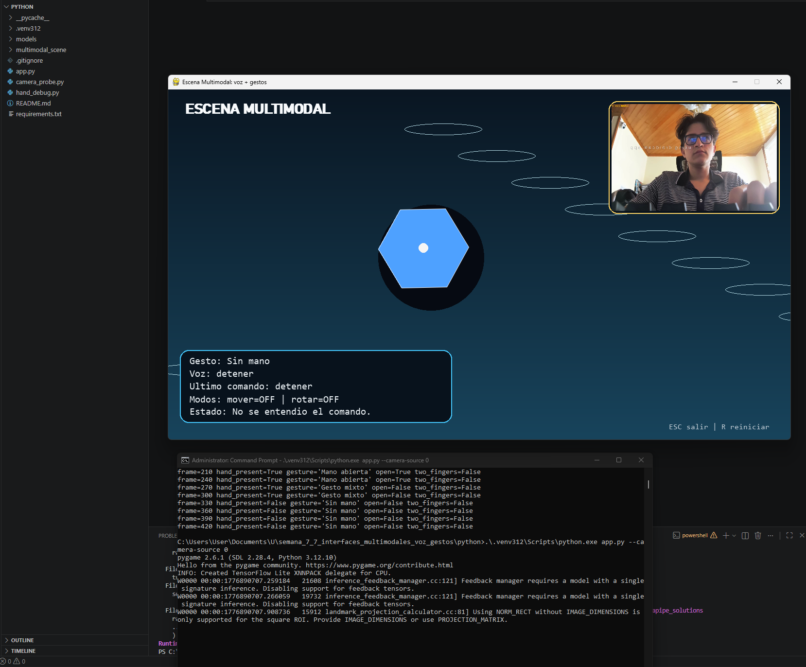
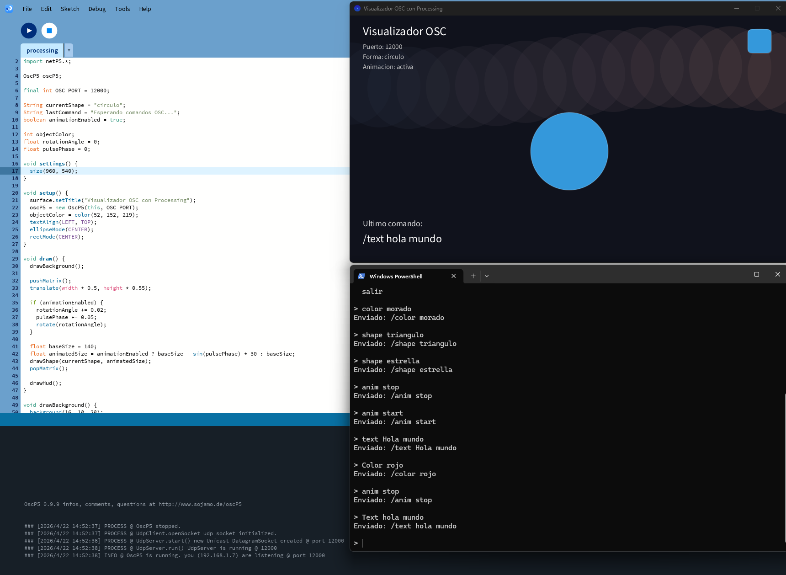

# Taller Semana 7: Interfaces Multimodales con Voz y Gestos

## Nombre del estudiante

Esteban Barrera  
Cristian Motta  
Nicolas Quezada Mora  
Juan Esteban Santacruz  
Jeronimo Bermudez  
Sebastian Andrade

## Fecha de entrega

`2026-04-22`

---

## Descripcion breve

Este taller se enfoco en explorar una interfaz multimodal en la que una escena visual responde a dos tipos de entrada: la voz del usuario y los gestos detectados con la mano. La idea principal fue comprobar como estas formas de interaccion pueden combinarse para controlar objetos y estados de una aplicacion de forma mas natural que usando solo teclado o mouse.

En la carpeta actual se desarrollaron dos partes principales. La primera esta en Python y permite controlar una escena con comandos de voz y gestos capturados por camara. La segunda esta en Processing y funciona como un visualizador que recibe mensajes por OSC para cambiar colores, formas, texto y animacion. En conjunto, el proyecto muestra una aproximacion practica a la interaccion multimodal aplicada a experiencias visuales en tiempo real.

---

## Implementaciones

### Python

En Python se construyo la parte principal del proyecto. La aplicacion usa `OpenCV` para capturar video, `MediaPipe` para reconocer la mano, `SpeechRecognition` y `PyAudio` para escuchar comandos de voz, y `Pygame` para dibujar la escena interactiva. A partir de esto, el usuario puede cambiar el color del objeto, activarle rotacion, moverlo con el gesto de dos dedos, ocultarlo o volver a mostrarlo.

La escena tambien mantiene mensajes de estado en pantalla para indicar que gesto fue detectado, que frase de voz se reconocio y cual fue el ultimo comando aplicado. Ademas, el proyecto deja preparada la posibilidad de enviar estados por OSC hacia otra visualizacion externa.

### Unity

No se desarrollo una implementacion en Unity dentro de esta carpeta del proyecto.

### Three.js / React Three Fiber

No se desarrollo una implementacion en Three.js o React Three Fiber dentro de esta carpeta del proyecto.

### Processing

En Processing se desarrollo un visualizador grafico que recibe mensajes OSC desde Python. Este sketch permite cambiar la forma principal entre circulo, cuadrado, triangulo y estrella, modificar el color, activar o detener la animacion y mostrar en pantalla el ultimo comando recibido.

Esta parte fue util para probar una comunicacion simple entre sistemas y para ver de manera visual como los mensajes enviados desde Python pueden transformar el comportamiento de otra escena en tiempo real.

---

## Resultados visuales

### Python - Implementacion


Este GIF muestra la escena multimodal en funcionamiento, con la vista previa de camara, la deteccion de la mano y la respuesta visual del objeto segun los gestos y comandos de voz.



Esta captura muestra el estado general de la interfaz en Python, incluyendo el objeto central, el panel de informacion y el seguimiento de la interaccion del usuario.

### Processing - Implementacion


Este GIF muestra como el visualizador en Processing cambia su forma, color y animacion segun los mensajes recibidos por OSC.



Esta imagen presenta la interfaz del sketch en Processing con el objeto principal, el fondo animado y el texto del ultimo comando recibido.

### Unity - Implementacion

No aplica en este proyecto.

### Three.js - Implementacion

No aplica en este proyecto.

---

## Codigo relevante

### Ejemplo de código Python:

```python
def _apply_command(self, keyword: str) -> None:
    self.state.last_command = keyword

    if keyword in COLOR_ORDER:
        if self._open_hand_is_active():
            self.state.color_name = keyword
            self.state.status_message = f"Color actualizado a {keyword}."
        else:
            self.state.status_message = f"Di '{keyword}' con mano abierta."
        return

    if keyword == "mover":
        if self._two_fingers_are_active():
            self.state.move_mode = not self.state.move_mode
            mode = "activado" if self.state.move_mode else "desactivado"
            self.state.status_message = f"Modo mover {mode}."
```

Este fragmento resume como la escena en Python decide que hacer con los comandos de voz segun el gesto que este activo en ese momento.

### Ejemplo de código Unity (C#):

```csharp
// No aplica en este proyecto.
```

### Ejemplo de código Three.js:

```javascript
// No aplica en este proyecto.
```

### Ejemplo de código Processing:

```java
void oscEvent(OscMessage message) {
  String address = message.addrPattern();
  String rawValue = extractStringArgument(message);
  String normalizedValue = normalizeToken(rawValue);

  if (address.equals("/color")) {
    applyColor(normalizedValue);
    lastCommand = "/color " + rawValue;
    return;
  }

  if (address.equals("/shape")) {
    applyShape(normalizedValue);
    lastCommand = "/shape " + rawValue;
    return;
  }
}
```

Este fragmento muestra como Processing recibe mensajes OSC y los convierte en cambios visuales directos dentro del sketch.

---

## Prompts utilizados

### Ejemplos:

```
"Ayudame a detectar una mano abierta y un gesto de dos dedos con MediaPipe de forma simple"

"Explicame por que el microfono puede fallar en Python y como probarlo paso a paso"

"Dame un ejemplo corto para enviar mensajes OSC desde Python hacia Processing"

"Ayudame a corregir un error de camara en OpenCV sin cambiar toda la estructura del programa"

"Genera una base sencilla para una escena en Pygame que responda a voz y gestos"
```

Se utilizaron prompts de IA principalmente para resolver errores puntuales y para acelerar la generacion de fragmentos de codigo base.

---

## Aprendizajes y dificultades

### Aprendizajes

Este taller permitio reforzar la idea de que una interfaz puede sentirse mas natural cuando combina diferentes formas de interaccion. Fue util ver como la voz puede servir para dar ordenes claras mientras los gestos ayudan a confirmar o complementar esas acciones dentro de una misma experiencia.

Tambien se aprendio la importancia de probar poco a poco cada parte del sistema. Primero fue necesario comprobar que la camara funcionara, luego que la voz reconociera palabras simples y, finalmente, que todo respondiera de forma coordinada dentro de la escena.

### Dificultades

La parte mas retadora fue lograr que la interaccion se sintiera consistente, ya que a veces la camara, el microfono o el reconocimiento no respondian exactamente como se esperaba. Eso obligo a repetir pruebas, ajustar pequenos detalles y buscar una forma de que el uso resultara mas claro para la persona que interactua con el sistema.

Otra dificultad fue conectar varias herramientas en un mismo flujo sin perder claridad en el resultado final. Se resolvio separando mejor las tareas de cada parte del proyecto y haciendo pruebas cortas para entender en que momento fallaba cada componente.

### Mejoras futuras

Como mejora futura, seria util agregar mas comandos, dar instrucciones visuales mas claras dentro de la interfaz y hacer que la respuesta de voz y gestos sea todavia mas estable. Tambien seria interesante unificar mejor la escena de Python con la de Processing para que ambas se sientan como una sola experiencia.

---

## Contribuciones grupales (si aplica)

- Esta parte del taller de semana fue realizada por Nicolas Quezada Mora.

---

## Referencias

- Documentacion oficial de OpenCV: https://docs.opencv.org/
- Documentacion de MediaPipe Hand Landmarker: https://developers.google.com/mediapipe/solutions/vision/hand_landmarker
- Documentacion de Pygame: https://www.pygame.org/docs/
- Libreria SpeechRecognition en PyPI: https://pypi.org/project/SpeechRecognition/
- Libreria oscP5 para Processing: https://sojamo.de/libraries/oscP5/
