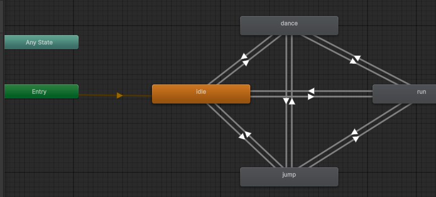

# Taller Motion Design Interactivo Eventos

## Nombre del estudiante

- Esteban Barrera
- Nicolas Quezada Mora
- Cristian Motta
- Esteban Santacruz
- Jeronimo Bermudez
- Sebastian Andrade

## Fecha de entrega

2026-04-18

---

## Descripción breve

En este taller se implementó un sistema de motion design interactivo en Unity utilizando un personaje humanoide de piloto descargado desde Mixamo. El objetivo fue conectar eventos de teclado del usuario con animaciones esqueléticas del personaje, controlando transiciones entre estados animados (idle, correr, saltar y bailar) a través de un Animator Controller y un script en C#.

---

## Implementación en Unity

### Configuración del modelo y animaciones

Se descargó un modelo de piloto desde Mixamo en formato `.FBX` junto con sus animaciones. En Unity se importó el modelo configurando el Rig y habilitando la opción de crear el avatar a partir del modelo. Las animaciones se importaron de forma independiente y se vincularon al mismo avatar.

### Animator Controller

Se creó un `Animator Controller` con cuatro estados animados:

- **Idle** (estado por defecto)
- **Run**
- **Jump**
- **Dance**

Las transiciones están configuradas de forma bidireccional entre todos los estados, controladas por dos variables `bool` (`isRunning`, `isDancing`) y un `trigger` (`jump`).



### Script de control (C#)

El script escucha eventos de teclado en cada frame y actualiza los parámetros del Animator en consecuencia:

- **W (presionar):** activa `isRunning = true` → entra a la animación de correr.
- **W (soltar):** activa `isRunning = false` → regresa a idle.
- **Space:** dispara el trigger `jump` → ejecuta la animación de salto.
- **D:** alterna `isDancing` entre `true` y `false` → entra o sale de la animación de baile.

```csharp
using UnityEngine;
using System.Collections;

public class sc : MonoBehaviour
{
    public Animator animator;

    // Update is called once per frame
    void Update()
    {
        if(Input.GetKeyDown(KeyCode.Space))
        {
            animator.SetTrigger("jump");
        }

        if(Input.GetKeyDown(KeyCode.W))
        {
            animator.SetBool("isRunning", true);
        }

        if(Input.GetKeyUp(KeyCode.W))
        {
            animator.SetBool("isRunning", false);
        }

        if(Input.GetKeyDown(KeyCode.D))
        {
            animator.SetBool("isDancing", !animator.GetBool("isDancing"));
        }
    }
}
```

---

## Resultados visuales

### Demo: correr, saltar y volver a idle


### Demo: bailar, saltar y volver a bailar


---

## Prompts utilizados

No se utilizaron herramientas de IA generativa en el desarrollo de este taller.

---

## Aprendizajes y dificultades

### Aprendizajes

Se comprendió el flujo completo de trabajo con animaciones en Unity: desde la importación de modelos y animaciones de Mixamo, la configuración del Rig en modo Humanoid, hasta la construcción de la máquina de estados en el Animator Controller. También se aprendió a manejar las transiciones entre estados mediante variables `bool` y `trigger` desde un script en C#, lo que permite un control preciso del comportamiento del personaje en respuesta a eventos del usuario.

### Dificultades

La principal dificultad fue la configuración del sistema de input de Unity. Para poder usar métodos como `Input.GetKeyDown()` y `Input.GetKeyUp()` fue necesario asegurarse de que el proyecto estuviera configurado para usar el **Input System clásico** (legacy), ya que la versión reciente de Unity por defecto utiliza el nuevo Input System, lo cual generaba conflictos al compilar.

---

## Estructura del proyecto

```
semana_7_8_motion_design_interactivo_eventos/
├── unity/
├── media/
│   ├── animator_controller.png
│   ├── demo_run_jump.gif
│   └── demo_dance_jump.gif
└── README.md
```