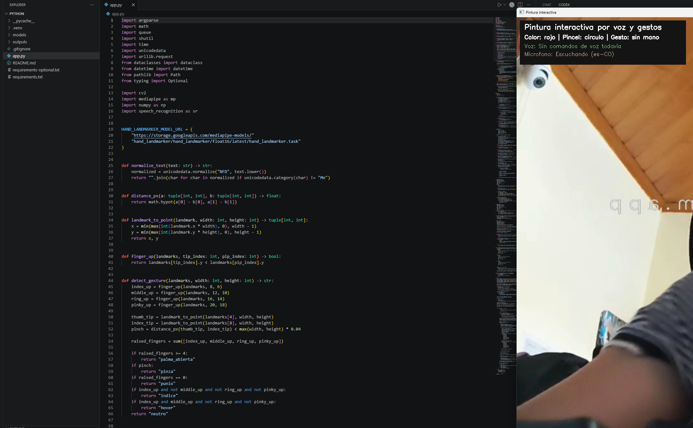

# Semana 7 - Pintura interactiva con voz y gestos

## Nombre del estudiante

Esteban Barrera  
Cristian Motta  
Nicolas Quezada Mora  
Juan Esteban Santacruz  
Jerónimo Bermúdez  
Sebastian Andrade

## Fecha de entrega

`2026-04-22`

---

## Descripción breve

Este taller consiste en una aplicación de pintura interactiva desarrollada en Python, donde la persona puede dibujar en pantalla usando movimientos de la mano y también controlar algunas acciones por medio de comandos de voz. La idea principal fue unir cámara, seguimiento de mano y reconocimiento de voz en una experiencia sencilla e intuitiva.

Durante el desarrollo se implementó un sistema que reconoce gestos básicos para dibujar, borrar o cambiar el tipo de pincel. Además, se añadieron comandos de voz para cambiar colores, limpiar el lienzo y guardar el resultado final. Todo esto se muestra en tiempo real sobre la imagen capturada por la cámara.

El resultado fue una herramienta funcional de pintura interactiva que permite experimentar con una forma distinta de crear imágenes, combinando gestos y voz en una misma interfaz.

---

## Implementaciones


### Python

En Python se desarrolló la implementación principal del proyecto. Se usaron `OpenCV` para manejar la cámara y la visualización, `MediaPipe` para detectar la mano y reconocer gestos, `SpeechRecognition` para procesar comandos de voz y `NumPy` para trabajar con el lienzo digital.

La aplicación permite dibujar con el dedo índice, borrar con el gesto de puño, cambiar el tipo de pincel con ciertos gestos y modificar colores mediante la voz. También incluye opciones para limpiar el lienzo, guardar la obra creada y mostrar información visual en pantalla para que la interacción sea más clara.

### Unity

No aplica en este proyecto.

### Three.js / React Three Fiber

No aplica en este proyecto.

### Processing

No aplica en este proyecto.

---

## Resultados visuales

### Python - Implementación


En este GIF se observa el funcionamiento general del sistema de pintura interactiva, donde el usuario puede dibujar sobre la imagen de la cámara usando gestos con la mano.



En esta captura se ve la interfaz del proyecto con el lienzo activo, la información visual en pantalla y el resultado del dibujo generado durante la interacción.

### Unity - Implementación

No aplica en este proyecto.

### Three.js - Implementación

No aplica en este proyecto.

---

## Código relevante


### Ejemplo de código Python:

```python
def detect_gesture(landmarks, width: int, height: int) -> str:
    index_up = finger_up(landmarks, 8, 6)
    middle_up = finger_up(landmarks, 12, 10)
    ring_up = finger_up(landmarks, 16, 14)
    pinky_up = finger_up(landmarks, 20, 18)

    thumb_tip = landmark_to_point(landmarks[4], width, height)
    index_tip = landmark_to_point(landmarks[8], width, height)
    pinch = distance_px(thumb_tip, index_tip) < max(width, height) * 0.04

    raised_fingers = sum([index_up, middle_up, ring_up, pinky_up])

    if raised_fingers >= 4:
        return "palma_abierta"
    if pinch:
        return "pinza"
    if raised_fingers == 0:
        return "punio"
    if index_up and not middle_up and not ring_up and not pinky_up:
        return "indice"
    if index_up and middle_up and not ring_up and not pinky_up:
        return "hover"
    return "neutro"
```

Este fragmento corresponde a la detección de gestos de la mano, que es una de las bases del proyecto porque permite decidir cuándo dibujar, borrar o cambiar de herramienta.

### Ejemplo de código Unity (C#):

```csharp
// No aplica en este proyecto.
```

### Ejemplo de código Three.js:

```javascript
// No aplica en este proyecto.
```

---

## Prompts utilizados

### Ejemplos:

```
"¿Cómo hago para detectar una mano en tiempo real con Python y la cámara?"

"Ayúdame a corregir un error al usar MediaPipe para seguimiento de mano"

"Genera un ejemplo simple para dibujar en pantalla con OpenCV usando la posición del dedo índice"

"¿Cómo puedo agregar comandos de voz básicos como rojo, verde, limpiar y guardar?"

"Explícame una forma sencilla de borrar el dibujo con un gesto de la mano"
```

Se utilizaron prompts de apoyo para resolver errores puntuales y para generar fragmentos base de código que luego fueron ajustados al proyecto.

---

## Aprendizajes y dificultades

### Aprendizajes

Con este taller se reforzó la idea de que una interacción digital puede sentirse mucho más natural cuando no depende solo del mouse o el teclado. También se aprendió a conectar varias partes de un mismo proyecto para que trabajaran juntas de forma coherente, como la cámara, la detección de gestos y la voz.

Además, quedó más claro cómo convertir una idea creativa en una experiencia funcional. Fue útil ver que pequeños cambios en la lógica de interacción pueden hacer que el programa se sienta más cómodo, más claro y más divertido para quien lo usa.

### Dificultades

Una de las principales dificultades fue lograr que los gestos se interpretaran de manera suficientemente estable para que dibujar no se sintiera confuso. A veces los movimientos de la mano podían generar acciones que no eran las esperadas, así que fue necesario probar varias veces y ajustar el comportamiento.

También hubo retos al integrar la voz con la pintura en tiempo real, porque no siempre era fácil mantener todo funcionando de manera fluida. La solución fue simplificar comandos, organizar mejor las acciones y hacer pruebas cortas hasta encontrar una interacción más confiable.

### Mejoras futuras

Como mejora futura, sería interesante agregar más colores, más tipos de pincel y una interfaz visual más atractiva. También sería útil incluir comandos de voz más variados y permitir guardar varias creaciones dentro de una galería.

Otra mejora posible sería hacer que el sistema reconozca mejor distintos estilos de movimiento de la mano, para que la experiencia sea más cómoda para diferentes personas y en distintos espacios de iluminación.

---

## Contribuciones grupales (si aplica)

Esta parte del taller de semana 7 fue realizada por Nicolas Quezada Mora.

---

## Referencias

Lista las fuentes, tutoriales, documentación o papers consultados durante el desarrollo:

- Documentación oficial de OpenCV: https://docs.opencv.org/
- Documentación oficial de MediaPipe: https://ai.google.dev/edge/mediapipe/solutions/vision/hand_landmarker
- Documentación de SpeechRecognition: https://pypi.org/project/SpeechRecognition/
- Repositorio oficial de NumPy: https://numpy.org/
