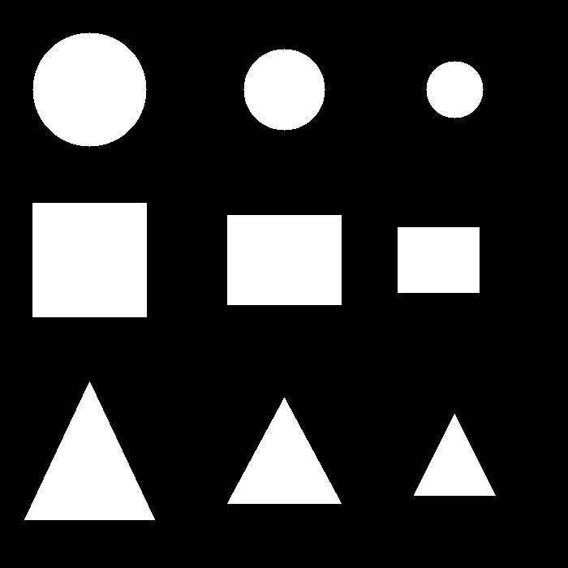
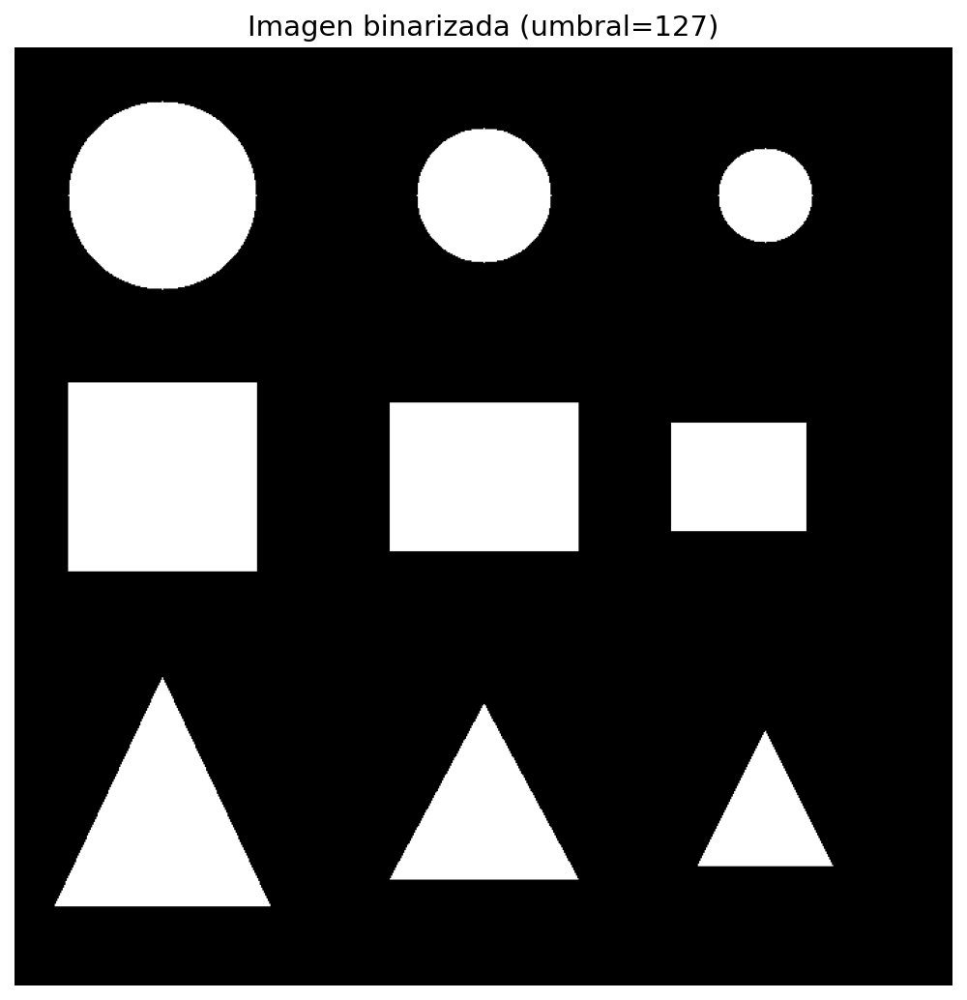
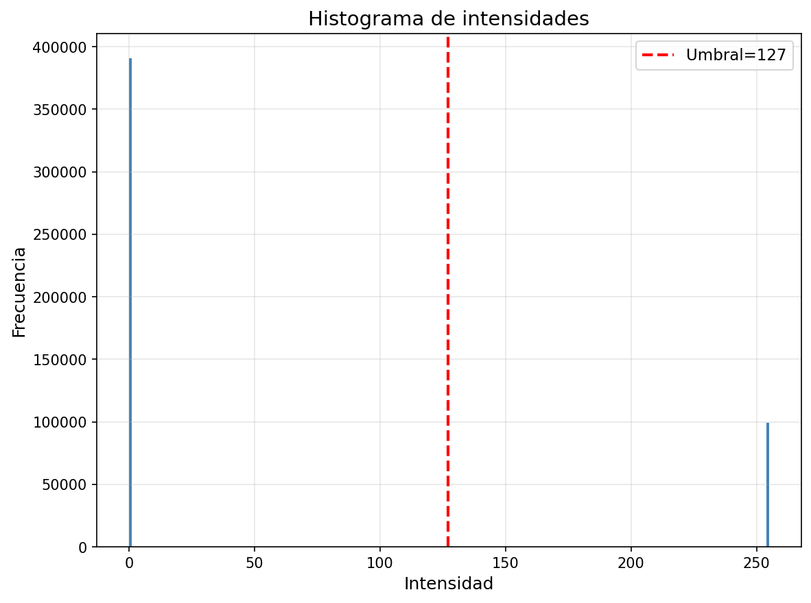
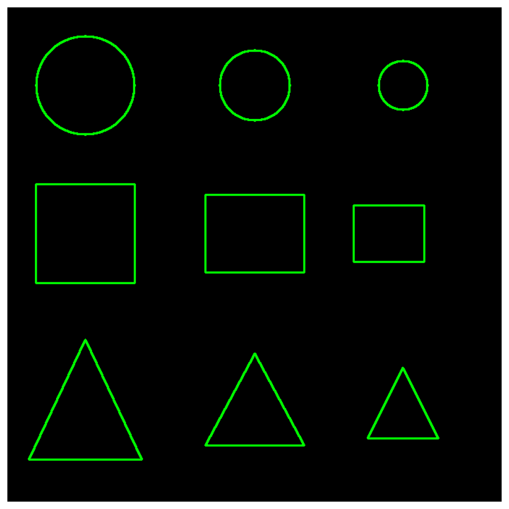
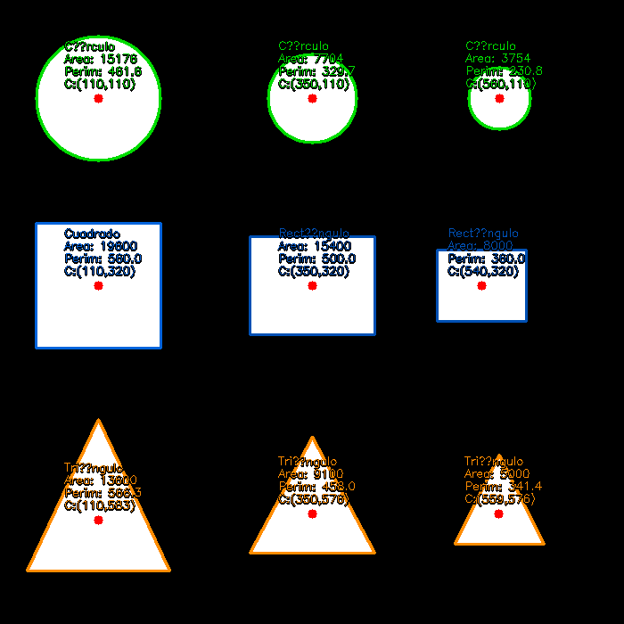

# Taller Detección de Formas y Métricas Geométricas con OpenCV

**Nombre del estudiante:** Esteban Barrera Sanabria

**Fecha de entrega:** 11 de mayo de 2026

---

## Descripción

El objetivo del taller es detectar formas simples (círculos, cuadrados, triángulos) en imágenes binarizadas y calcular propiedades geométricas como área, perímetro y centroide.

Se implementó un pipeline completo en Python usando OpenCV que va desde la generación de una imagen sintética con 9 figuras hasta la clasificación automática por número de vértices, pasando por binarización, detección de contornos, cálculo de métricas y visualización etiquetada.

**Entorno utilizado:**

- Python (Jupyter Notebook)
- `opencv-python`
- `numpy`
- `matplotlib`

---

## Implementaciones

### Binarización con cv2.threshold()

La imagen se convierte a escala de grises con `cv2.cvtColor(img, cv2.COLOR_BGR2GRAY)` y se binariza con `cv2.threshold(img_gray, 127, 255, cv2.THRESH_BINARY)`.

### Detección de contornos con cv2.findContours()

Se usó `cv2.RETR_EXTERNAL` para recuperar únicamente los contornos externos, ignorando posibles contornos anidados, y `cv2.CHAIN_APPROX_SIMPLE` para comprimir segmentos horizontales, verticales y diagonales almacenando solo sus puntos extremos.
Los 9 contornos detectados se dibujaron sobre fondo negro en verde para visualizar la detección aislada del contenido.

### Cálculo de propiedades geométricas

Para cada contorno se calcularon cinco propiedades:

1. El área con `cv2.contourArea()` devuelve el número de píxeles contenidos.

2. El perímetro con `cv2.arcLength(c, True)` calcula la longitud total del contorno cerrado.

3. El centroide se obtiene desde los momentos geométricos `cv2.moments(c)` como `cx = M10/M00` y `cy = M01/M00`, con guarda de división por cero.

4. La circularidad se calcula como `4π × área / perímetro²`, donde el valor 1.0 corresponde a un círculo perfecto.

### Visualización con métricas etiquetadas

Sobre una copia de la imagen original se dibujó cada contorno con `cv2.drawContours()` coloreado por tipo: verde para círculos, naranja para cuadrados/rectángulos y azul para triángulos.

El centroide se marcó como punto rojo sólido.

Cada figura se etiquetó con cuatro líneas de texto: nombre de la figura, área, perímetro y coordenadas del centroide.

### Clasificación automática con cv2.approxPolyDP()

`cv2.approxPolyDP()` aproxima cada contorno a un polígono con el algoritmo Ramer-Douglas-Peucker usando epsilon igual al 2% del perímetro. Contando los vértices del polígono resultante: 3 vértices → triángulo, 4 vértices → cuadrado (aspect ratio 0.85–1.15) o rectángulo, 8 o más vértices o circularidad mayor a 0.80 → círculo. La clasificación adicional por circularidad sirve de respaldo para círculos cuya aproximación poligonal devuelve entre 5 y 7 vértices según la resolución del contorno.

---

## Resultados Visuales

### Imagen original: 9 figuras generadas sintéticamente



### Binarización con histograma de intensidades






### Contornos detectados sobre fondo negro



### Resultado final de Clasificación y metricas etiquetadas



---

## Código Relevante

**Detección de contornos con filtro de área mínima:**

```python
contours, hierarchy = cv2.findContours(
    img_bin,
    cv2.RETR_EXTERNAL,
    cv2.CHAIN_APPROX_SIMPLE
)
contours = [c for c in contours if cv2.contourArea(c) > MIN_AREA]
```

**Cálculo de área, perímetro y centroide:**

```python
area      = cv2.contourArea(c)
perimetro = cv2.arcLength(c, True)
M         = cv2.moments(c)
cx = int(M['m10'] / M['m00'])
cy = int(M['m01'] / M['m00'])
circularidad = (4 * np.pi * area) / (perimetro ** 2)
```

**Clasificación automática con approxPolyDP:**

```python
epsilon = 0.02 * cv2.arcLength(contour, True)
approx  = cv2.approxPolyDP(contour, epsilon, True)
n_verts = len(approx)

if n_verts == 3:
    return 'Triángulo'
elif n_verts == 4:
    return 'Cuadrado' if 0.85 <= aspect_ratio <= 1.15 else 'Rectángulo'
elif n_verts >= 8 or circularidad > 0.80:
    return 'Círculo'
```

**Etiquetado con sombra sobre imagen:**

```python
for j, text in enumerate(labels):
    y_pos = offset_y + j * 14
    cv2.putText(img_resultado, text, (cx - 38, y_pos + 1),
                font, font_scale, (0, 0, 0), thickness + 1)   # sombra
    cv2.putText(img_resultado, text, (cx - 38, y_pos),
                font, font_scale, color, thickness)             # texto
```

---

## Prompts Utilizados

Durante el desarrollo se usaron herramientas de IA generativa para:

1. Diseñar la distribución de las 9 figuras sintéticas con tamaños variados dentro de cada categoría, para que las métricas calculadas mostraran diferencias significativas y no fueran redundantes.

2. Orientación sobre la diferencia entre `cv2.RETR_EXTERNAL` y `cv2.RETR_TREE` — el primero recupera solo los contornos más externos sin jerarquía, que es lo correcto cuando las figuras no tienen huecos ni figuras anidadas dentro.

---

## Aprendizajes y Dificultades

### Aprendizajes

- `cv2.moments()` calcula el centroide de forma más robusta que un bounding box porque tiene en cuenta la distribución real de píxeles dentro del contorno, no solo su caja envolvente. Para formas asimétricas como triángulos escalenos, la diferencia entre el centroide de momentos y el centro del bounding box puede ser significativa.
- `cv2.approxPolyDP()` es sensible al valor de epsilon: valores muy pequeños (<1% del perímetro) generan demasiados vértices y dificultan la clasificación; valores muy grandes (>5%) colapsan triángulos y rectángulos a menos vértices de los reales. El 2% del perímetro funciona bien para formas geométricas simples.
- La circularidad `4π × área / perímetro²` es un descriptor invariante a escala: una figura el doble de grande tiene el mismo valor de circularidad si su forma es idéntica. Esto lo hace útil para clasificar por forma independientemente del tamaño.
- `cv2.CHAIN_APPROX_SIMPLE` reduce dramáticamente el número de puntos del contorno en formas con lados rectos: un rectángulo de 140×110 px queda con 4 puntos en lugar de los 500 que devolvería `cv2.CHAIN_APPROX_NONE`, sin perder información relevante para el cálculo de métricas.

### Dificultades

- El cálculo de circularidad puede dar valores ligeramente superiores a 1.0 en figuras perfectamente generadas sintéticamente por efectos de discretización del contorno en la cuadrícula de píxeles. Para formas rasterizadas, un umbral de 0.80 en lugar de 1.0 es más robusto para identificar círculos.
- Las etiquetas de texto en `cv2.putText()` no hacen word wrap ni ajuste automático de posición, por lo que figuras pequeñas o ubicadas cerca del borde del canvas hacen que las etiquetas queden fuera de la imagen o se superpongan con otras. Se resolvió calculando el offset de texto relativo al centroide y limitando el tamaño de fuente a 0.42.
