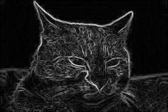
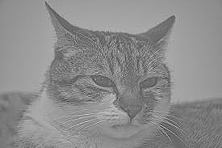

# Taller Filtro Visual: Convoluciones Personalizadas

## Nombre de los estudiantes
- Juan Esteban Santacruz Corredor
- Nicolas Quezada Mora
- Cristian Steven Motta Ojeda
- Sebastian Andrade Cedano
- Esteban Barrera Sanabria
- Jeronimo Bermudez Hernandez

## Fecha de entrega

`2026-05-10`

---

## Descripcion breve

En este taller se implemento un pipeline completo de filtrado por convolucion en una imagen en escala de grises. Partimos de una convolucion 2D manual con padding reflect, aplicamos kernels clasicos (suavizado, enfoque y Sobel), y contrastamos cada salida con los resultados de OpenCV. Finalmente, usamos derivadas cruzadas para construir un mapa de respuesta tipo Harris y visualizar esquinas relevantes en la escena.

---

## Implementaciones

### Python (Jupyter Notebook)

- Carga de imagen local en escala de grises y normalizacion a `float32` para operar con kernels.
- Implementacion de convolucion 2D manual (kernel invertido, padding reflect y barrido pixel a pixel).
- Aplicacion de tres kernels personalizados: suavizado (promedio), enfoque (realce de detalles) y Sobel (gradientes X/Y).
- Comparacion cualitativa con `cv2.filter2D()` y `cv2.Sobel()` para validar consistencia visual.
- Construccion de respuesta tipo Harris a partir de $I_{xx}$, $I_{yy}$ y $I_{xy}$, con umbral para resaltar esquinas.
- Exportacion de resultados a `media/` para documentacion.

---

## Resultados visuales

### Python - Implementacion


Resultado del filtro de suavizado aplicado manualmente. Se reduce el ruido de alta frecuencia y se suavizan bordes finos, manteniendo la estructura global.


Resultado del filtro de enfoque aplicado manualmente. Se incrementa el contraste local y se resaltan detalles en textura y contornos.



Deteccion de bordes con Sobel implementado manualmente. Las transiciones de intensidad se amplifican y aparecen lineas claras en bordes principales.


Filtro de suavizado con `cv2.filter2D()` para comparacion. Visualmente coincide con el blur manual, con diferencias minimas por manejo interno de bordes.



Filtro de enfoque con `cv2.filter2D()` para comparacion. El realce de detalles es equivalente al kernel manual.


Deteccion de bordes con `cv2.Sobel()` para comparacion. El mapa de gradientes replica la magnitud de bordes del Sobel manual.


Mapa de esquinas detectadas con derivadas cruzadas y filtro de suavizado. Se resaltan puntos de alta respuesta donde convergen gradientes en varias direcciones.

---

## Codigo relevante

### Convolucion 2D manual

```python
def convolve2d_gray(image, kernel, padding="reflect"):
    kernel = np.flipud(np.fliplr(kernel))
    kh, kw = kernel.shape
    pad_h = kh // 2
    pad_w = kw // 2

    if padding == "reflect":
        padded = np.pad(image, ((pad_h, pad_h), (pad_w, pad_w)), mode="reflect")
    elif padding == "zero":
        padded = np.pad(image, ((pad_h, pad_h), (pad_w, pad_w)), mode="constant")
    else:
        raise ValueError("padding debe ser 'reflect' o 'zero'")

    out = np.zeros_like(image, dtype=np.float32)
    h, w = image.shape

    for y in range(h):
        for x in range(w):
            region = padded[y : y + kh, x : x + kw]
            out[y, x] = np.sum(region * kernel)

    return out
```

### Deteccion de esquinas (Harris simplificado)

```python
Ixx = ix_manual * ix_manual
Iyy = iy_manual * iy_manual
Ixy = ix_manual * iy_manual

Sxx = convolve2d_gray(Ixx, kernel_blur)
Syy = convolve2d_gray(Iyy, kernel_blur)
Sxy = convolve2d_gray(Ixy, kernel_blur)

k = 0.04
det = (Sxx * Syy) - (Sxy * Sxy)
trace = Sxx + Syy
R = det - k * (trace * trace)
```

---

## Prompts utilizados

1. "Implementa una funcion de convolucion 2D manual en NumPy para imagenes en escala de grises."
2. "Aplica kernels de blur, sharpen y Sobel y compara con OpenCV."
3. "Implementa una deteccion de esquinas usando derivadas cruzadas y un filtro de suavizado."

---

## Aprendizajes y dificultades

### Aprendizajes

- Como implementar convoluciones 2D manuales y controlar padding.
- Diferencias visuales entre filtros personalizados y los de OpenCV.
- Uso de gradientes para detectar bordes y esquinas en imagenes.
- Importancia del suavizado para reducir ruido en la deteccion de esquinas.

### Dificultades

- Manejo de normalizacion para comparar resultados de filtros.
- Ajuste del umbral en el mapa de esquinas para resaltar solo puntos relevantes.
- Tiempo de ejecucion de la convolucion manual en imagenes grandes.

---

## Contribuciones grupales (si aplica)

| Integrante | Rol |
|---|---|
| Juan Esteban Santacruz Corredor | Implementacion de la convolucion manual y kernels base |
| Nicolas Quezada Mora | Comparacion con OpenCV y organizacion de resultados |
| Cristian Steven Motta Ojeda | Deteccion de esquinas y visualizacion |
| Sebastian Andrade Cedano | Preparacion de evidencias visuales en media |
| Esteban Barrera Sanabria | Validacion de salidas y pruebas locales |
| Jeronimo Bermudez Hernandez | Documentacion y redaccion del README |

---

## Estructura del proyecto

```
semana_09_2_convoluciones_personalizadas/
├── python/
│   └── notebook.ipynb           # Implementacion en Python
├── media/                       # Evidencias visuales (png, gif, video)
└── README.md                    # Este documento
```

---

## Referencias

- OpenCV: https://docs.opencv.org/4.x/
- NumPy: https://numpy.org/doc/
- Matplotlib: https://matplotlib.org/stable/
