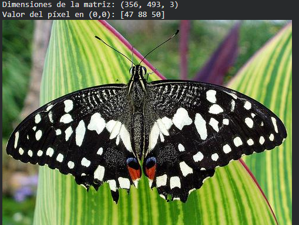
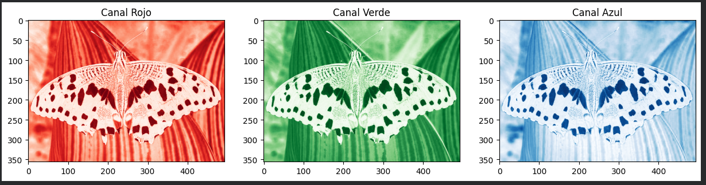
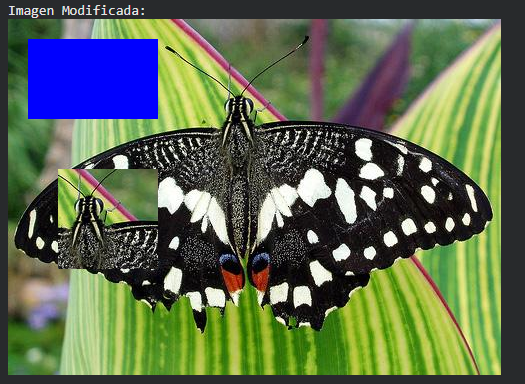
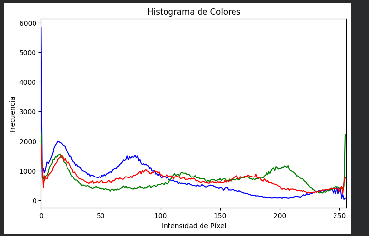
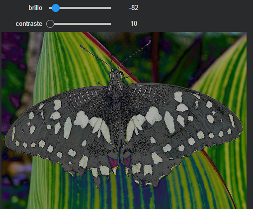
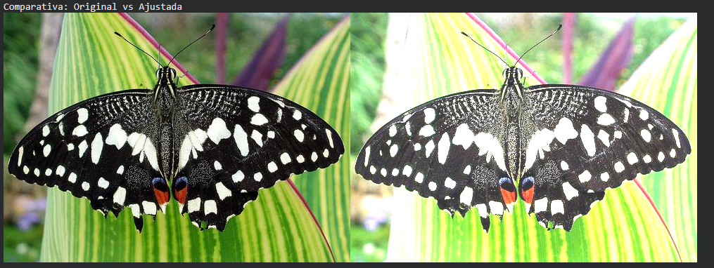

# Taller Imagen Matriz Pixeles

## Nombre de los estudiantes

- Juan Esteban Santacruz Corredor
- Nicolas Quezada Mora
- Cristian Steven Motta Ojeda
- Sebastian Andrade Cedano
- Esteban Barrera Sanabria
- Jeronimo Bermudez Hernandez

## Fecha de entrega

`11 de mayo de 2026`

---

## Descripción breve

Este taller explora la imagen digital como una matriz numérica manipulable con Python, OpenCV, NumPy y Matplotlib. A partir de una imagen de prueba, se trabajó directamente sobre sus píxeles para inspeccionar dimensiones, separar canales de color, modificar regiones específicas mediante slicing, calcular histogramas de intensidad y ajustar brillo y contraste tanto manualmente como con funciones de OpenCV.

Además, se incluyó una versión interactiva con sliders para variar brillo y contraste en tiempo real dentro del notebook.

---

## Implementaciones

### Python (OpenCV + NumPy + Matplotlib)

- Carga de imagen con `cv2.imread()` y exploración básica de la matriz.
- Separación de canales de color BGR y conversión al espacio HSV.
- Modificación de regiones usando slicing:
  cambio de color de un rectángulo y copia de una zona de la imagen sobre otra.
- Cálculo y visualización del histograma de intensidades por canal con `cv2.calcHist()`.
- Ajuste de brillo y contraste:
  un método manual con NumPy y otro con `cv2.convertScaleAbs()`.
- Bonus interactivo con `ipywidgets` para controlar brillo y contraste desde sliders.

---

## Resultados visuales

### Imagen original


### Canales de color


### Modificación por regiones


### Histograma de intensidades


### Ajuste de brillo y contraste


### Imagen ajustada final


Las evidencias muestran el flujo completo del taller: desde la inspección de la imagen original hasta la manipulación de canales, edición de regiones y mejora visual mediante ajustes de intensidad.

---

## Código relevante

### Carga e inspección de la imagen

```python
img = cv2.imread('imagen_test.jpg')
print(f"Dimensiones de la matriz: {img.shape}")
print(f"Valor del píxel en (0,0): {img[0, 0]}")
cv2_imshow(img)
```

### Separación de canales y conversión a HSV

```python
b, g, r = cv2.split(img)

hsv = cv2.cvtColor(img, cv2.COLOR_BGR2HSV)
h, s, v = cv2.split(hsv)
```

### Modificación de regiones con slicing

```python
img_mod = img.copy()
img_mod[20:100, 20:150] = [255, 0, 0]

region_interes = img[50:150, 200:300].copy()
img_mod[150:250, 50:150] = region_interes
```

### Histograma por canal

```python
for i, col in enumerate(('b', 'g', 'r')):
    hist = cv2.calcHist([img], [i], None, [256], [0, 256])
    plt.plot(hist, color=col)
```

### Ajuste de brillo y contraste

```python
alpha = 1.5
beta = 50

img_manual = np.clip(alpha * img + beta, 0, 255).astype(np.uint8)
img_cv2 = cv2.convertScaleAbs(img, alpha=alpha, beta=beta)
```

### Bonus interactivo

```python
def ajustar_interactivo(brillo, contraste):
    c = contraste / 10.0
    ajustada = cv2.convertScaleAbs(img, alpha=c, beta=brillo)
    cv2_imshow(ajustada)
```

El desarrollo completo se encuentra en:

- [python/semana_09_3_imagen_matriz_pixeles.ipynb](./python/semana_09_3_imagen_matriz_pixeles.ipynb)

---

## Estructura de carpetas

```text
semana_09_3_imagen_matriz_pixeles/
├── python/
│   ├── data/
│   │   └── imagen_test.jpg
│   └── semana_09_3_imagen_matriz_pixeles.ipynb
├── media/
│   ├── Ajustada.png
│   ├── Brillo_contraste.png
│   ├── Canales.png
│   ├── Histograma.png
│   ├── Modificada.png
│   └── Normal.png
└── README.md
```

---

## Prompts utilizados

Para apoyar la construcción y documentación del taller se usaron prompts orientados a:

- generar una guía base para manipular imágenes como matrices en OpenCV;
- separar y visualizar canales de color en BGR y HSV;
- aplicar slicing para modificar regiones específicas;
- comparar ajuste manual de brillo/contraste con `cv2.convertScaleAbs()`;
- redactar el README final a partir de los resultados obtenidos.

---

## Aprendizajes y dificultades

### Aprendizajes

- Una imagen digital puede tratarse directamente como una matriz tridimensional donde cada píxel almacena valores de color.
- El slicing de NumPy permite editar regiones completas de forma muy eficiente, sin recorrer píxel por píxel.
- OpenCV trabaja por defecto en BGR, por lo que es importante considerar el orden de canales al visualizar o modificar colores.
- El histograma ayuda a entender la distribución tonal de la imagen y a justificar ajustes de brillo y contraste.
- `cv2.convertScaleAbs()` simplifica operaciones que también pueden implementarse manualmente con ecuaciones y `np.clip`.

### Dificultades

- Recordar la diferencia entre BGR y RGB al momento de visualizar resultados.
- Elegir correctamente las coordenadas de slicing para que las regiones copiadas mantuvieran tamaño compatible.
- Ajustar brillo y contraste sin saturar demasiados píxeles en blancos o perder detalle en sombras.
- Integrar la visualización interactiva dependiendo del entorno de ejecución, especialmente si se alterna entre Colab y Jupyter.

---

## Conclusión

El taller permitió comprender de forma práctica cómo una imagen se representa como una matriz de datos y cómo esa representación facilita tareas de análisis y edición. Las operaciones realizadas muestran que, con herramientas básicas de visión por computador, es posible inspeccionar, transformar y mejorar imágenes de manera directa y controlada.
