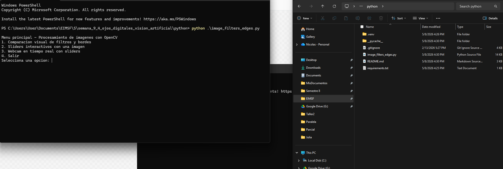

# Taller - Ojos Digitales: Introducción a la Visión Artificial

## Nombre de los estudiantes

Esteban Barrera  
Cristian Motta  
Nicolas Quezada Mora  
Juan Esteban Santacruz  
Jerónimo Bermúdez  
Sebastian Andrade

## Fecha de entrega

`2026-05-08`

---

## Descripción breve

En este taller se trabajó una introducción a la visión artificial usando Python y OpenCV. El objetivo principal fue entender cómo una imagen puede ser leída, transformada y analizada por medio de filtros básicos, cambios de color y detección de bordes.

El proyecto permite cargar una imagen propia o usar una imagen de demostración generada desde el programa. A partir de esa imagen se aplican procesos como conversión a escala de grises, filtro de desenfoque, realce de detalles, detección de bordes con Sobel y detección con Laplaciano. También se agregó un menú en consola para facilitar el uso del programa.

Además de la comparación visual de resultados, se implementaron sliders interactivos para cambiar el filtro y el tamaño del kernel en vivo. Como función adicional, el programa puede usar la webcam para aplicar los filtros en tiempo real.

---

## Implementaciones

El taller se desarrolló principalmente en Python. Las demás tecnologías de la plantilla se conservan para mantener la estructura solicitada.

### Python

La implementación principal se realizó en Python con OpenCV, NumPy y Matplotlib. El archivo principal es `python/image_filters_edges.py`, donde se organizan las funciones para cargar imágenes, crear una imagen de prueba, aplicar filtros y mostrar resultados.

El programa incluye un menú en consola con tres opciones principales: comparación visual de filtros y bordes, sliders interactivos con una imagen y procesamiento de webcam en tiempo real. Para la comparación se muestran varias versiones de la imagen: original, escala de grises, blur, sharpening, Sobel X, Sobel Y, Sobel combinado y Laplaciano.

También se incluyó un archivo `python/requirements.txt` con las librerías necesarias para ejecutar el proyecto.

### Unity

No aplica en este taller. La implementación desarrollada para esta entrega se concentró únicamente en Python y OpenCV.

### Three.js / React Three Fiber

No aplica en este taller. No se desarrolló una visualización web con Three.js o React Three Fiber.

### Processing

No aplica en este taller. No se desarrolló una versión en Processing.

---

## Resultados visuales

Los resultados visuales están guardados en la carpeta `media/` del proyecto.

### Python - Implementación



La imagen muestra la ejecución del programa desde PowerShell. Se observa el menú principal con las opciones para comparar filtros, usar sliders interactivos, activar la webcam o salir del programa.


El GIF muestra el proceso de ejecución del taller en consola y la interacción con el programa. Sirve como evidencia del flujo de uso y de las opciones implementadas para procesar imágenes.

### Unity - Implementación

No aplica en este taller.

### Three.js - Implementación

No aplica en este taller.

---

## Código relevante

El código completo se encuentra en `python/image_filters_edges.py`. A continuación se muestran algunos fragmentos importantes.

### Ejemplo de código Python:

```python
def to_gray(image_bgr: np.ndarray) -> np.ndarray:
    return cv2.cvtColor(image_bgr, cv2.COLOR_BGR2GRAY)
```

Este fragmento convierte una imagen cargada por OpenCV a escala de grises. Es uno de los primeros pasos para poder aplicar detectores de bordes.

```python
def blur_convolution(image_bgr: np.ndarray, kernel_size: int = 5) -> np.ndarray:
    kernel_size = ensure_odd(kernel_size)
    kernel = np.ones((kernel_size, kernel_size), dtype=np.float32)
    kernel /= float(kernel_size * kernel_size)
    return cv2.filter2D(image_bgr, ddepth=-1, kernel=kernel)
```

Este código aplica un filtro de desenfoque usando una convolución con un kernel promedio.

```python
def sobel_edges(gray: np.ndarray, kernel_size: int = 3) -> tuple[np.ndarray, np.ndarray, np.ndarray]:
    kernel_size = ensure_odd(kernel_size, minimum=1, maximum=7)
    sobel_x = cv2.Sobel(gray, cv2.CV_64F, 1, 0, ksize=kernel_size)
    sobel_y = cv2.Sobel(gray, cv2.CV_64F, 0, 1, ksize=kernel_size)

    abs_x = cv2.convertScaleAbs(sobel_x)
    abs_y = cv2.convertScaleAbs(sobel_y)
    magnitude = cv2.addWeighted(abs_x, 0.5, abs_y, 0.5, 0)
    return abs_x, abs_y, magnitude
```

Este fragmento calcula bordes horizontales y verticales con Sobel, y luego combina ambos resultados en una sola imagen.

### Ejemplo de código Unity (C#):

No aplica en este taller.

### Ejemplo de código Three.js:

No aplica en este taller.

---

## Prompts utilizados

Durante el desarrollo se usaron prompts sencillos para resolver errores, ordenar el código y entender mejor algunas partes del procesamiento de imágenes.

### Prompts:

```
"Ayúdame a hacer un programa en Python con OpenCV para aplicar filtros a una imagen"

"Me sale un error al abrir una imagen con cv2"

"Ayúdame a agregar sliders de OpenCV para cambiar el filtro y el tamaño del kernel"

"Cómo puedo mostrar una imagen original, una en gris y una con bordes en Matplotlib"

"Explícame de forma sencilla cómo funciona Sobel y Laplaciano"
```

---

## Aprendizajes y dificultades

Reflexión personal sobre el proceso de desarrollo del taller.

### Aprendizajes

En este taller se aprendió que una imagen no es solamente algo visual, sino también una matriz de datos que puede ser modificada con operaciones matemáticas. Al cambiar colores, aplicar filtros o buscar bordes, se puede entender mejor cómo un computador empieza a reconocer detalles importantes dentro de una imagen.

También quedó más claro que pequeños cambios en los valores del filtro pueden cambiar mucho el resultado final. Usar sliders ayudó a ver esos cambios de manera más directa, sin tener que ejecutar el programa desde cero cada vez.

### Dificultades

Una dificultad fue organizar el programa para que no fuera solo una prueba suelta, sino una herramienta que se pudiera usar desde un menú. Al principio puede ser confuso conectar las opciones del menú con las funciones de imagen, pero se resolvió separando cada parte en funciones más pequeñas.

Otra dificultad fue entender por qué algunos filtros se ven mejor con ciertos tamaños de kernel y peor con otros. Para resolverlo se hicieron pruebas cambiando los valores y comparando los resultados visualmente.

### Mejoras futuras

Como mejora futura se podría agregar una opción para guardar automáticamente las imágenes procesadas. También sería útil permitir comparar dos imágenes reales distintas o agregar más filtros para experimentar con otros efectos.

Estos apartados del taller fueron realizados por Nicolas Quezada Mora.


---

## Referencias

Fuentes consultadas durante el desarrollo:

- Documentación oficial de OpenCV: https://docs.opencv.org/
- Documentación de NumPy: https://numpy.org/doc/
- Documentación de Matplotlib: https://matplotlib.org/stable/
- Guía de OpenCV sobre filtros de imagen: https://docs.opencv.org/4.x/d4/d13/tutorial_py_filtering.html
- Guía de OpenCV sobre gradientes y bordes: https://docs.opencv.org/4.x/d5/d0f/tutorial_py_gradients.html
