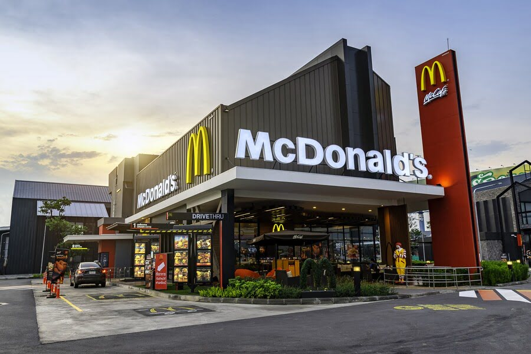
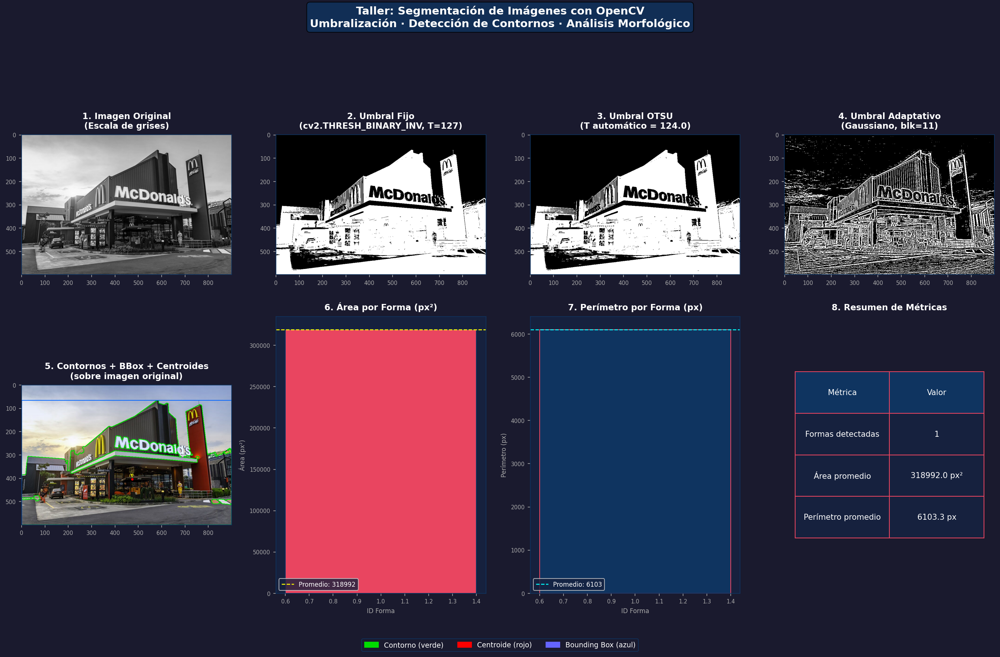
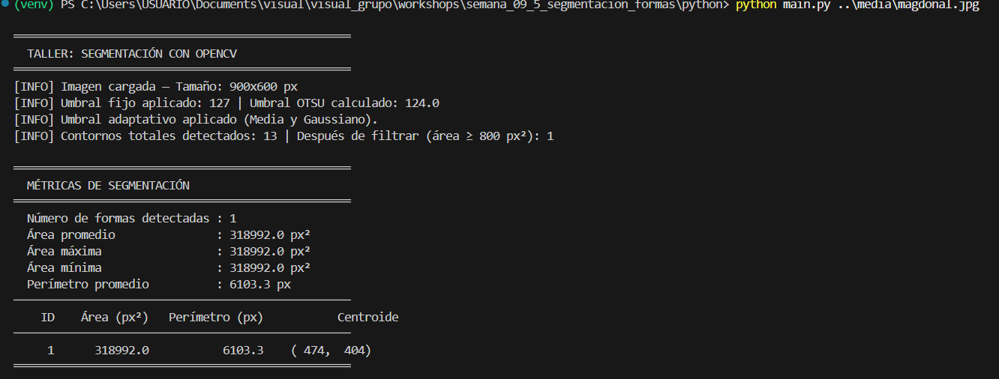

# Semana 9 - Segmentación de Imágenes con OpenCV

## Nombre del estudiante

- Esteban Barrera
- Nicolas Quezada Mora
- Cristian Motta
- Esteban Santacruz
- Jeronimo Bermudez
- Sebastian Andrade

## Fecha de entrega

`2026-05-08`

---

## Descripción breve

Este taller consiste en una aplicación de procesamiento de imágenes desarrollada en Python, donde se aplican técnicas básicas de segmentación mediante umbralización y detección de formas simples. La idea principal fue comprender cómo identificar regiones de interés en una imagen a través de procesos de binarización y análisis morfológico.

Durante el desarrollo se implementaron dos enfoques de segmentación: umbral fijo con valor manual y con el método OTSU, y umbral adaptativo con los modos media y gaussiano. A partir de la imagen binarizada más adecuada, se detectaron los contornos de cada forma presente, se calcularon sus centros de masa y se delimitaron con bounding boxes. Toda la información se muestra en una visualización de ocho paneles y se complementa con métricas numéricas en consola.

El resultado fue una herramienta funcional de análisis de imágenes que permite explorar cómo distintas técnicas de umbralización afectan la calidad de la segmentación y cómo extraer información geométrica básica de las formas detectadas.

---

## Implementaciones

### Python

En Python se desarrolló la implementación completa del proyecto. Se usaron `OpenCV` para la carga de la imagen, la binarización y la detección de contornos, `NumPy` para los cálculos sobre los momentos y las métricas, y `Matplotlib` para construir la visualización final con todos los resultados organizados en paneles.

La aplicación recibe una imagen en escala de grises, aplica los cuatro métodos de umbralización disponibles, limpia el resultado mediante operaciones morfológicas y detecta los contornos de las formas presentes. Para cada forma se calcula el centroide usando `cv2.moments()`, se dibuja el bounding box con `cv2.boundingRect()` y se registran el área y el perímetro. Al final se imprime un resumen de métricas en consola y se genera una figura con todos los resultados.


## Resultados visuales

### Python - Implementación



Esta es la imagen utilizada como entrada para el pipeline de segmentación. Fue procesada en escala de grises para aplicar los distintos métodos de umbralización.



En esta figura se observan los ocho paneles generados por el programa: la imagen original en escala de grises, los cuatro resultados de binarización, la imagen con los contornos dibujados junto con los centroides y bounding boxes, y los gráficos de área y perímetro por forma detectada, además de la tabla resumen de métricas.



En esta captura se ve la salida en consola del programa, donde se muestran el número de formas detectadas, el área promedio, el perímetro promedio y los datos individuales de cada forma identificada durante el análisis.
---

## Código relevante

### Ejemplo de código Python:

```python
def detectar_contornos(binaria, area_minima=500):
    contornos, jerarquia = cv2.findContours(
        binaria, cv2.RETR_EXTERNAL, cv2.CHAIN_APPROX_SIMPLE
    )
    contornos_filtrados = [c for c in contornos if cv2.contourArea(c) >= area_minima]
    return contornos_filtrados


def dibujar_resultados(imagen_color, contornos):
    resultado = imagen_color.copy()
    datos_formas = []

    for i, contorno in enumerate(contornos, start=1):
        cv2.drawContours(resultado, [contorno], -1, (0, 220, 0), 2)

        M = cv2.moments(contorno)
        if M["m00"] != 0:
            cx = int(M["m10"] / M["m00"])
            cy = int(M["m01"] / M["m00"])
        else:
            x, y, w, h = cv2.boundingRect(contorno)
            cx, cy = x + w // 2, y + h // 2

        cv2.circle(resultado, (cx, cy), 5, (0, 0, 255), -1)

        x, y, w, h = cv2.boundingRect(contorno)
        cv2.rectangle(resultado, (x, y), (x + w, y + h), (255, 100, 0), 2)

        area = cv2.contourArea(contorno)
        perimetro = cv2.arcLength(contorno, True)
        datos_formas.append({
            "id": i,
            "centroide": (cx, cy),
            "bounding_box": (x, y, w, h),
            "area": area,
            "perimetro": perimetro
        })

    return resultado, datos_formas
```

Este fragmento corresponde a las dos funciones centrales del proyecto. La primera detecta los contornos de la imagen binarizada y filtra los que son demasiado pequeños para ser considerados formas reales. La segunda recorre cada contorno, dibuja su silueta en verde, calcula el centroide usando los momentos geométricos, marca el centro con un punto rojo y dibuja el bounding box en azul. Ambas funciones son la base del análisis morfológico del taller.

---


## Aprendizajes y dificultades

### Aprendizajes

Con este taller quedó más claro cómo el proceso de binarización es el paso más crítico dentro de cualquier pipeline de segmentación, porque la calidad de los contornos detectados depende directamente de qué tan bien se separen las regiones de interés del fondo. También se aprendió que el umbral adaptativo puede ofrecer mejores resultados que el umbral fijo en imágenes con variaciones de iluminación, aunque su comportamiento depende del tamaño del bloque y del valor de corrección que se le configure.

Además, fue útil entender cómo los momentos geométricos permiten extraer información espacial de las formas sin necesidad de recorrer todos sus píxeles manualmente, lo que hace que el cálculo del centroide sea mucho más eficiente y preciso.

### Dificultades

Una de las principales dificultades fue encontrar los parámetros adecuados para el umbral adaptativo, porque valores poco ajustados generaban muchos contornos pequeños que no correspondían a formas reales. Fue necesario combinar el filtrado por área mínima con operaciones morfológicas para obtener un resultado limpio.

También hubo que prestar atención a los casos donde el denominador de los momentos era cero, lo que ocurre cuando un contorno tiene área muy pequeña. Sin manejar ese caso, el cálculo del centroide generaba errores en tiempo de ejecución.

### Mejoras futuras

Como mejora futura, sería interesante incorporar clasificación automática de formas según su circularidad o relación de aspecto, para distinguir entre círculos, rectángulos y formas irregulares sin necesidad de inspección manual. También sería útil agregar soporte para procesar múltiples imágenes en lote y exportar las métricas a un archivo CSV para análisis posterior.

Otra mejora posible sería integrar una interfaz gráfica sencilla que permita ajustar los parámetros de umbralización en tiempo real y ver cómo cambia el resultado de la segmentación de forma inmediata.

---
