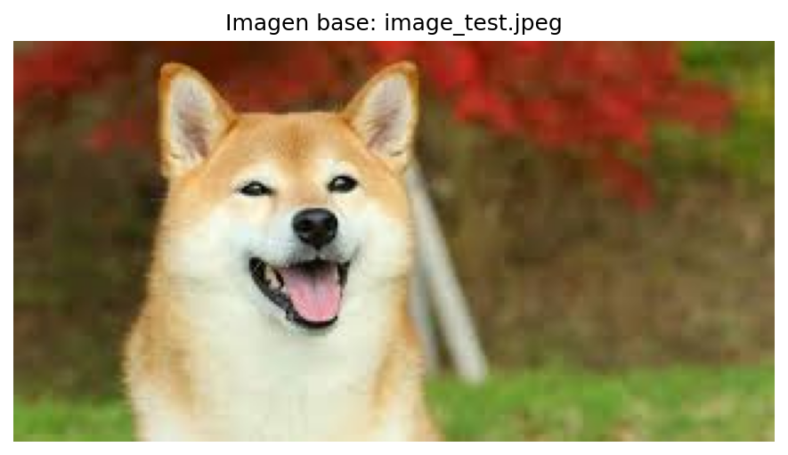
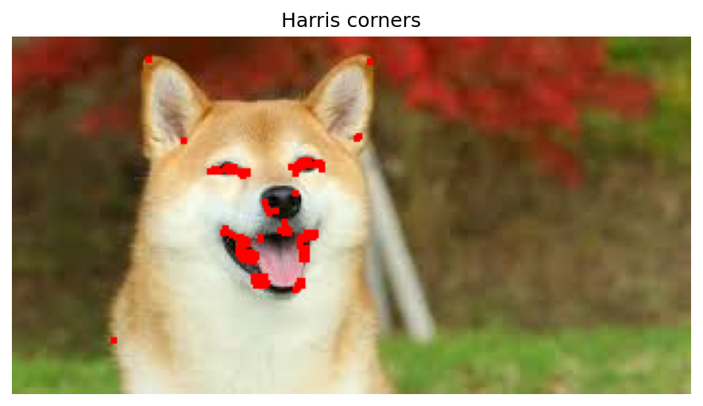
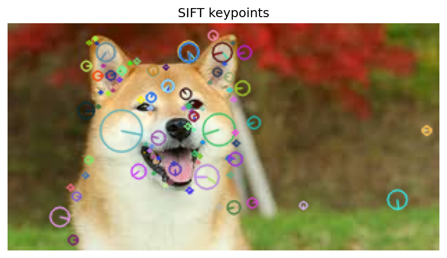
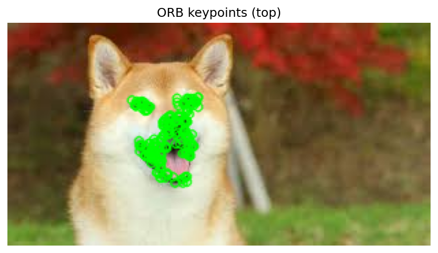
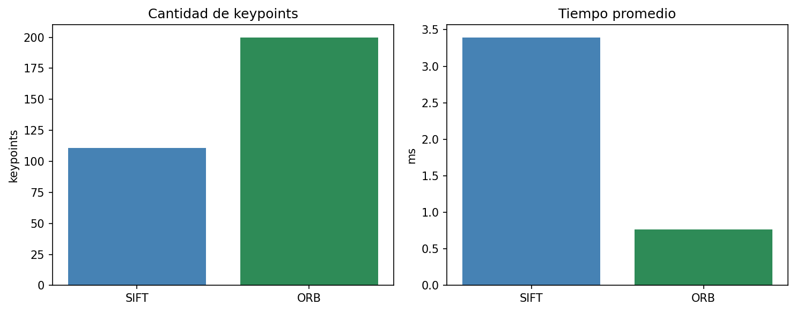
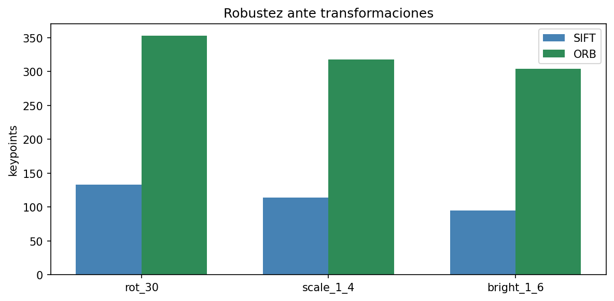
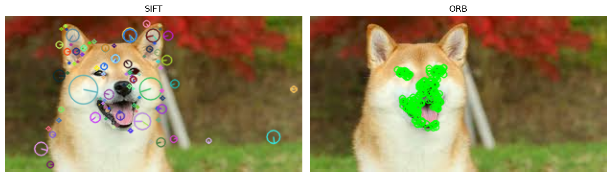

# Taller - Extraccion de Caracteristicas con SIFT y ORB

## Nombre de los estudiantes
- Juan Esteban Santacruz Corredor
- Nicolas Quezada Mora
- Cristian Steven Motta Ojeda
- Sebastian Andrade Cedano
- Esteban Barrera Sanabria
- Jeronimo Bermudez Hernandez

## Fecha de entrega

`2026-05-18`

---

## Descripcion breve

En este taller se implemento un flujo completo para detectar y comparar caracteristicas locales con Harris, SIFT y ORB. Se cargo una imagen de prueba, se extrajeron keypoints y descriptores, y se comparo el rendimiento y la robustez ante rotacion, escala e iluminacion. Todas las evidencias visuales se guardan en la carpeta media/.

---

## Implementaciones

### Python (Jupyter Notebook)

- Carga de imagen local y conversion a escala de grises para procesamiento.
- Deteccion de esquinas con Harris para resaltar puntos de alto contraste.
- Extraccion de keypoints y descriptores con SIFT.
- Extraccion de keypoints y descriptores con ORB.
- Comparacion de tiempo promedio y cantidad de keypoints detectados.
- Prueba de robustez con rotacion, escala e iluminacion.
- Exportacion de visualizaciones a media/.

---

## Resultados visuales

### Python - Implementacion



Imagen base usada para el analisis.



Esquinas detectadas con Harris sobre la imagen original.



Keypoints detectados con SIFT usando representacion rica.



Keypoints detectados con ORB (top por respuesta) para una visualizacion limpia.



Comparacion de cantidad de keypoints y tiempo promedio entre SIFT y ORB.



Cantidad de keypoints con rotacion, escala y cambio de iluminacion.



Comparacion visual lado a lado entre SIFT y ORB.

---

## Codigo relevante

### Benchmark de detectores

```python
def benchmark(detector, image_gray, runs=10):
    timings = []
    for _ in range(runs):
        start = time.perf_counter()
        detector.detectAndCompute(image_gray, None)
        timings.append(time.perf_counter() - start)
    return float(np.mean(timings)), float(np.std(timings))
```

### Transformaciones de robustez

```python
def rotate_image(img, angle_deg):
    h, w = img.shape[:2]
    matrix = cv2.getRotationMatrix2D((w / 2, h / 2), angle_deg, 1.0)
    return cv2.warpAffine(img, matrix, (w, h), flags=cv2.INTER_LINEAR, borderMode=cv2.BORDER_REFLECT)


def scale_image(img, scale):
    h, w = img.shape[:2]
    resized = cv2.resize(img, (int(w * scale), int(h * scale)), interpolation=cv2.INTER_LINEAR)
    out = np.full_like(img, 20)

    rh, rw = resized.shape[:2]
    if scale >= 1.0:
        y0 = (rh - h) // 2
        x0 = (rw - w) // 2
        out = resized[y0 : y0 + h, x0 : x0 + w]
    else:
        y0 = (h - rh) // 2
        x0 = (w - rw) // 2
        out[y0 : y0 + rh, x0 : x0 + rw] = resized

    return out


def adjust_brightness(img, gamma):
    inv = 1.0 / gamma
    table = np.array([(i / 255.0) ** inv * 255 for i in range(256)]).astype("uint8")
    return cv2.LUT(img, table)
```

---

## Prompts utilizados

1. "Configura un notebook para comparar Harris, SIFT y ORB en una imagen local."
2. "Genera visualizaciones de keypoints y guarda las salidas en la carpeta media/."
3. "Compara tiempo promedio y cantidad de keypoints entre SIFT y ORB."
4. "Evalua robustez con rotacion, escala e iluminacion y grafica resultados."

---

## Aprendizajes y dificultades

### Aprendizajes

- Diferencias de cantidad de keypoints y tiempo entre SIFT y ORB.
- Uso de Harris como detector de esquinas clasico.
- Importancia de normalizar la visualizacion para comparar resultados.
- Comportamiento ante cambios de iluminacion, rotacion y escala.

### Dificultades

- Ajuste de parametros para que las visualizaciones sean legibles.
- Balance entre cantidad de keypoints y claridad en la comparacion visual.
- Disponibilidad de SIFT y necesidad de opencv-contrib-python.

---

## Contribuciones grupales (si aplica)

| Integrante | Rol |
|---|---|
| Juan Esteban Santacruz Corredor | Configuracion del notebook y carga de imagen |
| Nicolas Quezada Mora | Implementacion de Harris y visualizaciones |
| Cristian Steven Motta Ojeda | Implementacion de SIFT y comparaciones |
| Sebastian Andrade Cedano | Implementacion de ORB y ajustes visuales |
| Esteban Barrera Sanabria | Pruebas de rendimiento y graficas |
| Jeronimo Bermudez Hernandez | Documentacion y redaccion del README |

---

## Estructura del proyecto

```
semana_10_1/
├── python/
│   └── semana_10_1_extraccion_caracteristicas_sift_orb.ipynb
├── media/
│   └── *.png
└── README.md
```

---

## Referencias

- OpenCV: https://docs.opencv.org/4.x/
- NumPy: https://numpy.org/doc/
- Matplotlib: https://matplotlib.org/stable/
