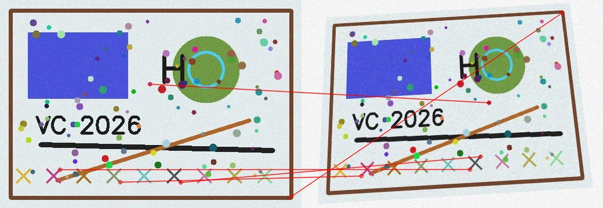

# Taller Coincidencia Patrones Homografias

## Nombre de los estudiantes

- Esteban Barrera
- Cristian Motta
- Nicolas Quezada Mora
- Juan Esteban Santacruz
- Jeronimo Bermudez
- Sebastian Andrade

## Fecha de entrega

`2026-05-12`

---

## Descripcion breve

El objetivo del taller fue trabajar con coincidencia de caracteristicas entre imagenes relacionadas, calcular homografias y usar esas transformaciones para tareas como deteccion de objetos y construccion de panoramas. La implementacion se realizo en Python usando OpenCV, NumPy y herramientas de visualizacion para revisar los resultados.

El proyecto permite cargar imagenes agregadas manualmente, detectar puntos importantes con SIFT u ORB, comparar el resultado de BFMatcher y FLANN, filtrar coincidencias con el ratio test de Lowe y calcular una matriz de homografia usando RANSAC. Tambien incluye una rutina para dibujar el objeto encontrado en una escena y otra para crear un panorama a partir de imagenes con solapamiento.

---

## Implementaciones

### Python

La implementacion esta en la carpeta `python/`. Se desarrollo una herramienta por consola que recibe rutas de imagenes y genera resultados de matching, homografia, deteccion de objetos y panorama.

El codigo incluye:

- Carga de imagenes con OpenCV.
- Deteccion de keypoints y descriptores con SIFT u ORB.
- Matching con BFMatcher.
- Matching con FLANN usando KDTREE para SIFT y LSH para ORB.
- Filtro de buenos matches con ratio test de Lowe.
- Calculo de homografia con `cv2.findHomography()` y RANSAC.
- Visualizacion de matches e inliers con `cv2.drawMatches()`.
- Deteccion de un objeto en una escena mediante bounding box.
- Construccion de panorama con `cv2.warpPerspective()`.
- Blending suave basico entre imagenes del panorama.
- Exportacion de metricas como numero de matches, porcentaje de inliers y tiempo de procesamiento.

---

## Resultados visuales

Los resultados visuales finales se encuentran en la carpeta `media/`. Estas evidencias resumen la ejecucion del taller con los detectores SIFT y ORB, mostrando coincidencias filtradas, transformaciones por homografia y el comportamiento general del proceso.

### Python - Demo general


El GIF muestra una demostracion general del flujo implementado en Python. En la secuencia se observa la deteccion de caracteristicas, la comparacion entre imagenes, el filtrado de coincidencias y el uso de homografia para relacionar las vistas.

### Python - SIFT


Esta imagen corresponde a una prueba con SIFT. Se observan puntos clave detectados en ambas imagenes y lineas que representan coincidencias entre caracteristicas. Aunque aparecen algunas coincidencias externas, RANSAC permite quedarse con los puntos que mejor soportan la homografia.

Metricas principales con SIFT:

- BFMatcher: 245 buenos matches, 210 inliers y 85.71% de inliers en 39.94 ms.
- FLANN: 245 buenos matches, 210 inliers y 85.71% de inliers en 47.92 ms.
- Deteccion de objeto: 264 buenos matches, 223 inliers y 84.47% de inliers en 74.26 ms.
- Panorama: 3 imagenes unidas en 150.24 ms; los pares tuvieron 86.41% y 84.82% de inliers.

### Python - ORB



Esta imagen corresponde a una prueba con ORB. El resultado visual es similar al de SIFT porque se usaron las mismas imagenes de entrada, pero ORB detecto una mayor cantidad de puntos clave y produjo mas coincidencias para estimar la homografia.

Metricas principales con ORB:

- BFMatcher: 715 buenos matches, 702 inliers y 98.18% de inliers en 124.19 ms.
- FLANN: 757 buenos matches, 735 inliers y 97.09% de inliers en 70.42 ms.
- Deteccion de objeto: 708 buenos matches, 672 inliers y 94.92% de inliers en 85.64 ms.
- Panorama: 3 imagenes unidas en 131.06 ms; los pares tuvieron 87.90% y 93.23% de inliers.

En esta prueba, ORB genero mas puntos y mas coincidencias que SIFT. SIFT produjo menos matches, pero mantuvo porcentajes de inliers estables en matching, deteccion de objeto y panorama.

---

## Codigo relevante

Archivo principal: `python/main.py`

Modulo con la logica del taller: `python/src/feature_lab.py`

Ejemplo de ejecucion:

```bash
python main.py --match-a data/matching_1.jpg --match-b data/matching_2.jpg --object-template data/template.jpg --object-scene data/scene.jpg --panorama-dir data/panorama --output-dir outputs
```

Fragmento central del calculo de homografia:

```python
src_points = np.float32([keypoints_a[m.queryIdx].pt for m in matches]).reshape(-1, 1, 2)
dst_points = np.float32([keypoints_b[m.trainIdx].pt for m in matches]).reshape(-1, 1, 2)
homography, mask = cv2.findHomography(src_points, dst_points, cv2.RANSAC, ransac_threshold)
```

Fragmento del filtro de Lowe:

```python
raw_matches = flann.knnMatch(descriptors_a, descriptors_b, k=2)
good_matches = []
for pair in raw_matches:
    if len(pair) == 2:
        m, n = pair
        if m.distance < ratio * n.distance:
            good_matches.append(m)
```

---

## Prompts utilizados

Se usaron prompts de IA para resolver errores y apoyar la generacion de codigo. Algunos prompts usados fueron:

```text
"Como hago feature matching con OpenCV en Python?"
"Me sale error con FLANN y ORB, que puede ser?"
"Como calculo una homografia con RANSAC?"
"Ayudame a organizar este codigo en funciones simples"
"Como dibujo el bounding box de un objeto detectado con homografia?"
"Como puedo hacer un panorama con dos imagenes en OpenCV?"
```

---

## Aprendizajes y dificultades

### Aprendizajes

Con este taller se entendio mejor como una imagen puede compararse con otra aunque cambie un poco el angulo, la escala o la posicion. Tambien quedo mas claro que no basta con encontrar muchos puntos parecidos, sino que hay que filtrar los que realmente ayudan a reconocer el mismo objeto o escena.

Otro aprendizaje importante fue ver que la homografia permite conectar dos vistas de una misma superficie o escena. Esto hizo mas facil entender por que se puede dibujar un objeto sobre una imagen diferente o unir varias imagenes para formar un panorama.

### Dificultades

Una dificultad fue organizar las imagenes de entrada, porque cada parte del taller necesita imagenes diferentes: unas para matching, otras para buscar objetos y otras con solapamiento para el panorama. Tambien fue necesario probar distintos parametros, ya que algunas imagenes pueden dar pocos matches o resultados poco claros.

Otra parte dificil fue entender por que algunos matches se veian bien a simple vista pero no servian para la homografia. Para solucionarlo se uso RANSAC, que ayuda a separar los puntos utiles de los errores.

### Mejoras futuras

Como mejora futura se podrian probar mas escenas reales, ajustar mejor el blending del panorama y generar comparaciones visuales mas completas entre SIFT y ORB. Tambien seria util guardar automaticamente reportes con varias pruebas para escoger los mejores parametros.


## Referencias

- Documentacion oficial de OpenCV: https://docs.opencv.org/
- Tutoriales de OpenCV sobre feature matching y homography.
- Documentacion de NumPy: https://numpy.org/doc/
