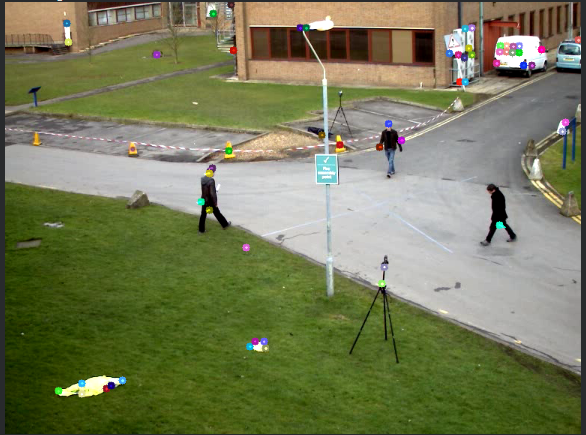
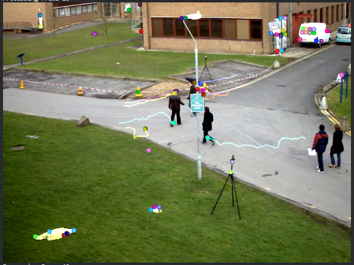
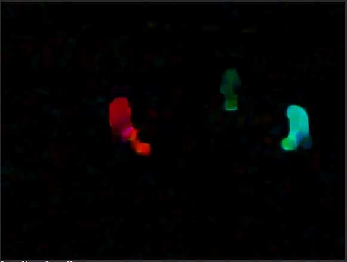
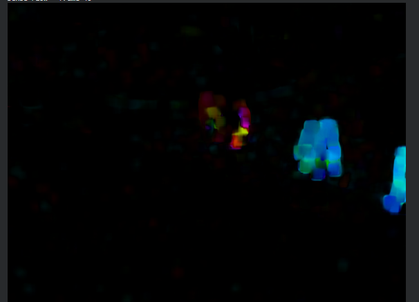
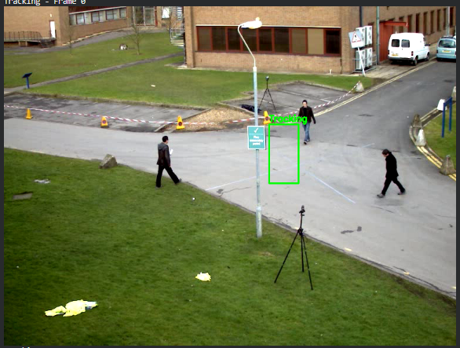
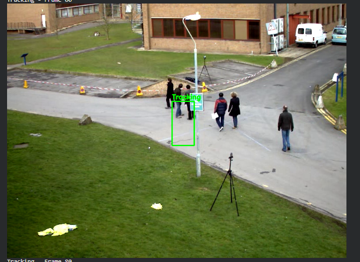
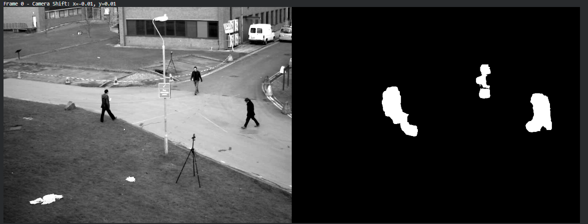
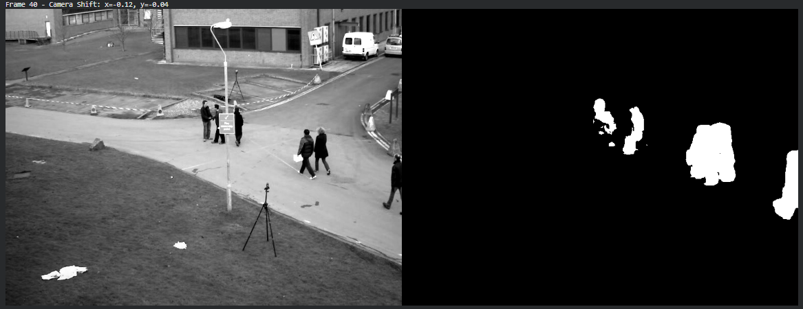

# Taller Flujo Optico Tracking

## Nombre de los estudiantes

- Juan Esteban Santacruz Corredor
- Nicolas Quezada Mora
- Cristian Steven Motta Ojeda
- Sebastian Andrade Cedano
- Esteban Barrera Sanabria
- Jeronimo Bermudez Hernandez

## Fecha de entrega

`18 de mayo de 2026`

---

## Descripción breve

Este taller tiene como objetivo explorar los conceptos fundamentales de visión artificial aplicados al análisis de secuencias de imágenes en movimiento. Utilizando Python y OpenCV, se implementaron diversas técnicas para calcular el movimiento relativo entre fotogramas consecutivos (Flujo Óptico) y realizar el seguimiento de objetos de interés a lo largo de un video (Tracking).

El desarrollo se enfoca en comprender tanto el movimiento escaso basado en características fuertes, como el movimiento denso que evalúa todos los píxeles, además de integrar algoritmos de segmentación de movimiento y seguimiento individual de entidades.

---

## Implementaciones

### Python (OpenCV + NumPy + Matplotlib)

- **Flujo Óptico Disperso (Lucas-Kanade):** Implementación utilizando `cv2.calcOpticalFlowPyrLK` para rastrear el movimiento temporal de puntos característicos locales extraídos previamente con `cv2.goodFeaturesToTrack` (Shi-Tomasi).
- **Flujo Óptico Denso (Farnebäck):** Algoritmo implementado con `cv2.calcOpticalFlowFarneback` para calcular vectores de movimiento de retroceso y avance en cada uno de los fotogramas, visualizado mapeando dirección a Matiz (Hue) y magnitud al Brillo (Value) en un espacio HSV.
- **Tracking de Objetos:** Seguimiento individualizado de un objetivo delimitado manualmente por una caja (Bounding Box). Se utilizó `cv2.TrackerMIL_create()` para adaptar el rastreo fotograma a fotograma comprobando la eficacia del seguidor mediante una ROI.
- **Estimación de Movimiento de Cámara y Detección:** Un análisis integral donde se extrae el vector promedio del flujo óptico denso para identificar la dirección y velocidad del movimiento global (como el "paneo" o desplazamiento de la cámara), seguido de la aplicación de umbrales sobre el mapa de magnitudes para separar figuras móviles del fondo (Background Subtraction).

---

## Resultados visuales

### 1. Flujo Óptico Disperso con Lucas-Kanade


*Rastreo de puntos característicos en los sujetos moviéndose a lo largo del tiempo.*

### 2. Flujo Óptico Denso con Farnebäck


*Representación HSV completa donde las direcciones y velocidades determinan el color y la saturación respectivamente.*

### 3. Tracking de Objetos


*Caja delimitadora verde adaptándose a la persona específica en la escena frame a frame.*

### 4. Detección y Estimación de Movimiento


*Uso del vector de flujo promedio y aplicación de umbralización binaria para delimitar por forma las siluetas móviles del video.*

---

## Código relevante

### Flujo Óptico Disperso (Lucas-Kanade)
```python
p1, st, err = cv2.calcOpticalFlowPyrLK(old_gray, frame_gray, p0, None, **lk_params)
good_new = p1[st == 1]
good_old = p0[st == 1]
# Dibujar el historial
for i, (new, old) in enumerate(zip(good_new, good_old)):
    a, b = new.ravel()
    c, d = old.ravel()
    mask = cv2.line(mask, (int(a), int(b)), (int(c), int(d)), color[i % 100].tolist(), 2)
```

### Flujo Óptico Denso (Farnebäck)
```python
flow = cv2.calcOpticalFlowFarneback(prvs, next_gray, None, 0.5, 3, 15, 3, 5, 1.2, 0)
mag, ang = cv2.cartToPolar(flow[..., 0], flow[..., 1])
# Asignación de Hue y Value basado en dirección y magnitud
hsv[..., 0] = ang * 180 / np.pi / 2
hsv[..., 2] = cv2.normalize(mag, None, 0, 255, cv2.NORM_MINMAX)
bgr = cv2.cvtColor(hsv, cv2.COLOR_HSV2BGR)
```

### Tracking de Objetos (MIL)
```python
# Inicialización y actualización de la trayectoria del individuo
tracker = cv2.TrackerMIL_create()
tracker.init(frame, bbox)

success, box = tracker.update(frame)
if success:
    (x, y, w, h) = [int(v) for v in box]
    cv2.rectangle(frame, (x, y), (x + w, y + h), (0, 255, 0), 2, 1)
```

### Estimación y Detección de movimiento
```python
# Promediado global y sustracción basada en límites de movimiento
avg_u = np.mean(flow[..., 0])
avg_v = np.mean(flow[..., 1])
motion_mask = np.uint8(cv2.normalize(mag, None, 0, 255, cv2.NORM_MINMAX))
_, thresh = cv2.threshold(motion_mask, 35, 255, cv2.THRESH_BINARY)
```

El desarrollo completo se encuentra en:

- [python/semana_10_3_flujo_optico_tracking.ipynb](./python/semana_10_3_flujo_optico_tracking.ipynb)

---

## Estructura de carpetas

```text
semana_10_3_flujo_optico_tracking/
├── python/
│   └── semana_10_3_flujo_optico_tracking.ipynb
├── media/
│   ├── Estimacion1.png
│   ├── Estimacion2.png
│   ├── farneback1.png
│   ├── farneback2.png
│   ├── kanade1.png
│   ├── kanade2.png
│   ├── kanade3.png
│   ├── tracking1.png
│   └── tracking2.png
└── README.md
```

---

## Prompts utilizados

Durante el desarrollo de esta actividad, se emplearon Modelos de Lenguaje (LLMs) orientados a:

- Explicar las matemáticas detrás de estimadores del flujo de píxeles, como Shi-Tomasi frente a Harris para detección de esquinas en Lucas-Kanade.
- Determinar de forma eficiente la mejor manera de proyectar `cv2.cartToPolar` sobre mapas de color HSV nativos en los ciclos continuos de OpenCV.
- Encontrar una recomendación técnica simple para configurar rastreadores estables de OpenCV (ej. MIL frente a CSRT) dada la limitación de la versión principal importada de opencv-python.
- Redactar un reporte de desempeño general a partir de las impresiones en consola y fotogramas clave.

---

## Aprendizajes y dificultades

### Aprendizajes

- El método de Lucas-Kanade resulta considerablemente rápido, pero es limitado por la necesidad estricta de actualizar o re-detectar características buenas (`goodFeaturesToTrack`) a medida que estas abandonan la vista, ya que el seguimiento falla gradualmente.
- Se entiende claramente la efectividad del método denso de Farnebäck, ofreciendo una interpretación sumamente visual y amplia del desplazamiento a costa de procesamiento adicional al analizar todos los puntos.
- Para estimar un paneo general o estabilizar el cuadro global de una cámara en desplazamiento dinámico (sin usar SLAM complejos), los promedios globales del vector geométrico provenientes del flujo denso son un enfoque ideal estadísticamente.
- Los trackers en sistemas computacionales como `TrackerMIL` encapsulan toda la matemática iterativa permitiendo focalizarse directamente en modelar regiones de interés y administrar los algoritmos en cascada.

### Dificultades

- Sincronizar y depurar con exactitud el comportamiento real al convertir direcciones de polar y grados al espectro de color en OpenCV debido a los rangos poco habituales para HSV ($180$, no $360$ para matiz).
- Mantener y visualizar buffers progresivos dibujando líneas a través del tiempo en algoritmos dispersos, sin alterar los fotogramas inmediatos con una máscara estática.

---

## Conclusión

El uso combinado de diferentes tipos de flujos ópticos (escasos y densos) así como los trackers preestablecidos en arquitecturas modernas permite generar potentes deducciones operativas mediante video en tiempo real. Este trabajo asienta bases sólidas permitiendo diferenciar el análisis global de cámara (Background motion) respecto del movimiento intra-escena, cimentando rutinas posteriores esenciales como mapeos locales, detección automática de anomalías y la navegación autónoma.
