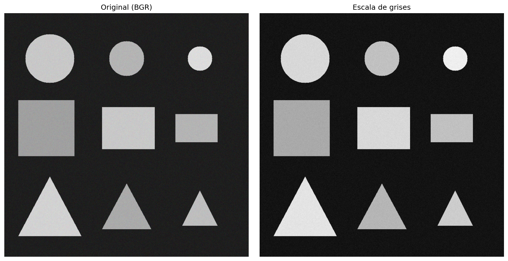
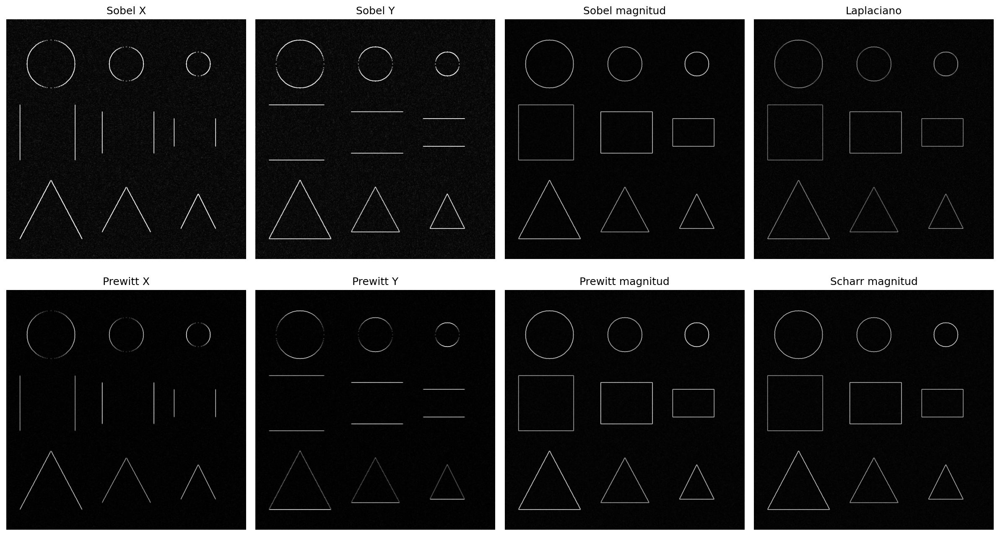
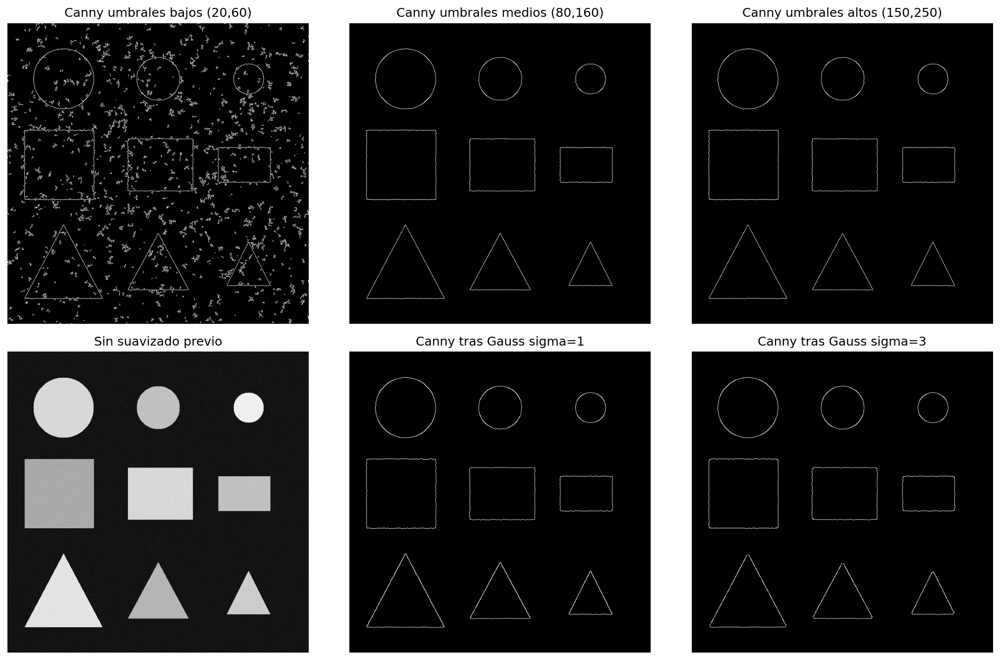
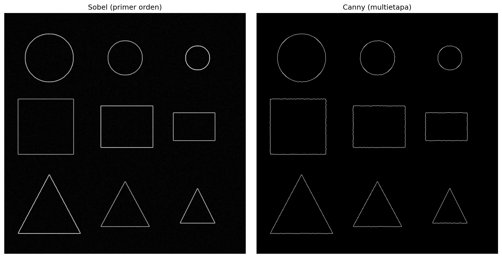
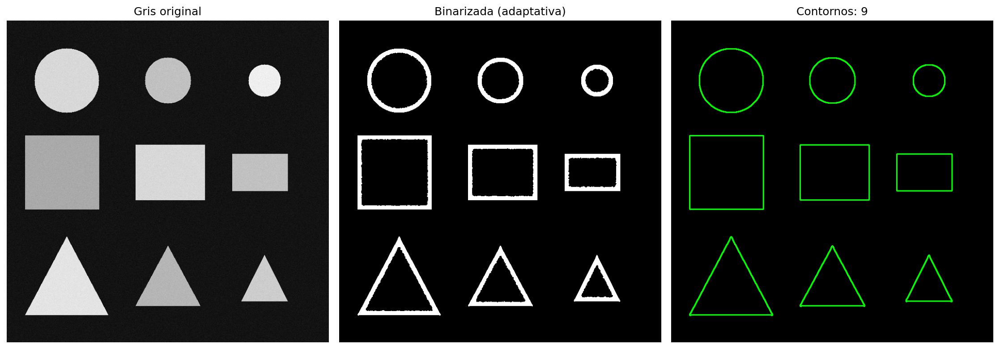
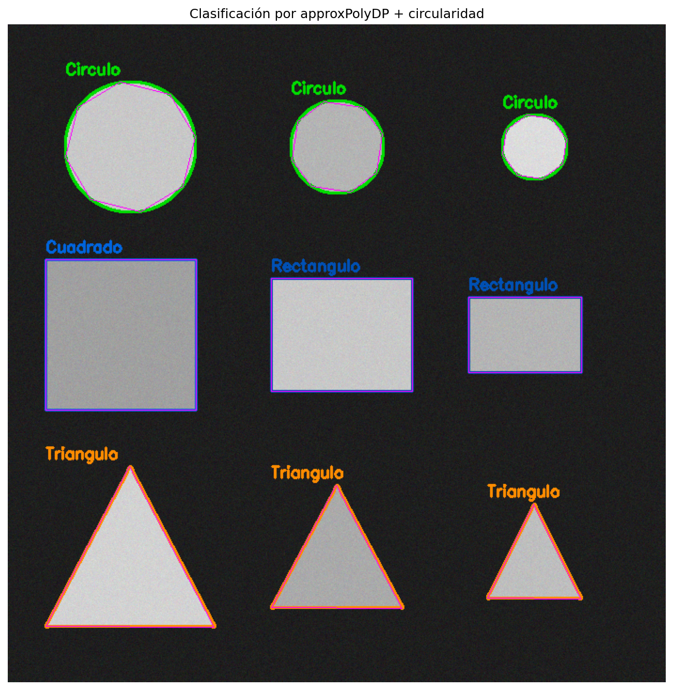
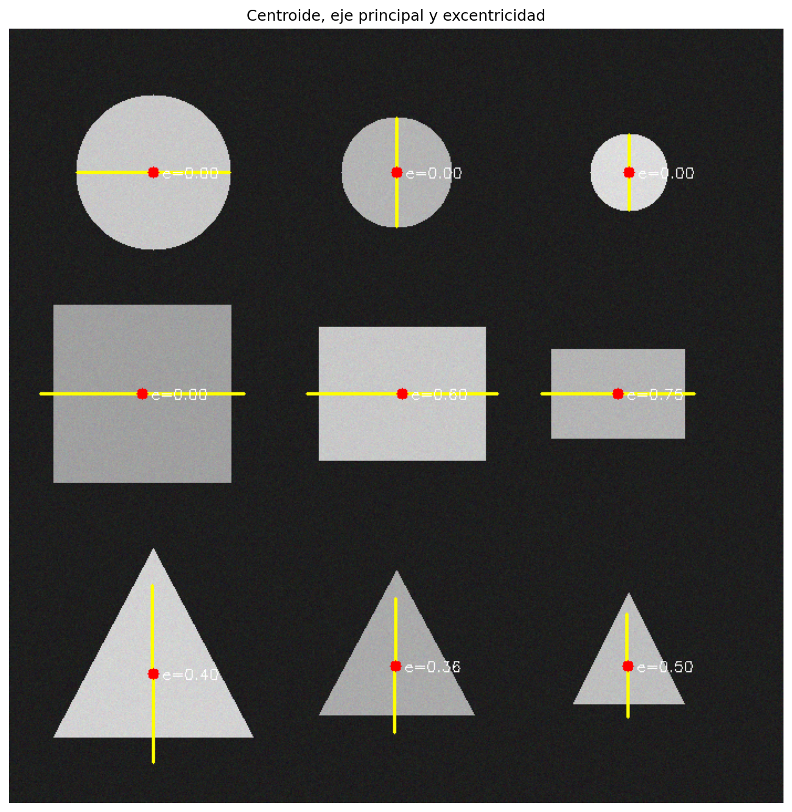
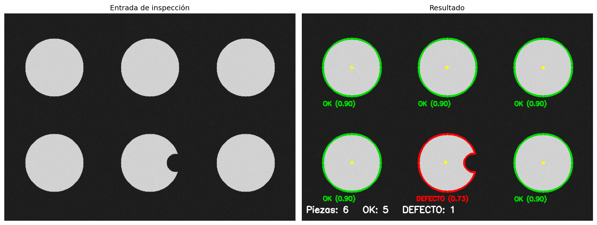
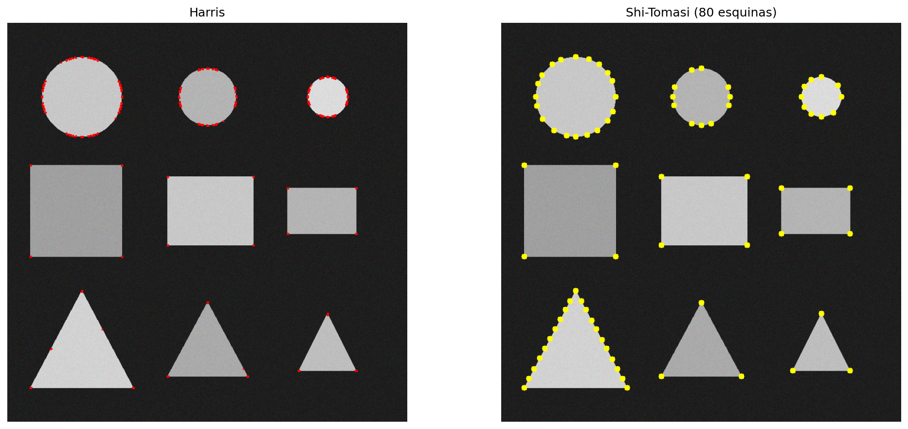

# Taller Detección de Bordes y Contornos

**Nombre de los estudiantes:**

- Juan Esteban Santacruz Corredor
- Nicolas Quezada Mora
- Cristian Steven Motta Ojeda
- Sebastian Andrade Cedano
- Esteban Barrera Sanabria
- Jeronimo Bermudez Hernandez

**Fecha de entrega:** 18 de mayo de 2026

## Descripción

El objetivo del taller es aplicar operadores de detección de bordes (Sobel, Prewitt, Laplaciano, Scharr y Canny) y comparar su comportamiento, para luego encadenar binarización adaptativa, detección de contornos, aproximación poligonal con `cv2.approxPolyDP`, análisis de momentos (centroide, orientación, excentricidad) y, finalmente, una aplicación de inspección visual que cuenta piezas y marca como defectuosa aquella cuya circularidad cae bajo un umbral.

Se implementó un pipeline completo en Python que parte de una imagen sintética con ruido gaussiano leve (para que los bordes sean transiciones reales y no perfectas) y termina con clasificación de formas, métricas geométricas y un sistema básico de control de calidad.

**Entorno utilizado:**

- Python (Jupyter Notebook)
- `opencv-python`
- `scikit-image`
- `numpy`
- `matplotlib`

## Implementaciones

### Operadores básicos: Sobel, Prewitt, Laplaciano, Scharr

Se calculan las derivadas en X y Y con `cv2.Sobel` y `cv2.Scharr` (con `ddepth=cv2.CV_64F` para evitar saturación), y la magnitud del gradiente como `cv2.magnitude(Gx, Gy)`. Para Prewitt se usa `skimage.filters.prewitt_v`, `prewitt_h` y `prewitt`, y el Laplaciano (segundo orden) se obtiene con `cv2.Laplacian`. Todos los resultados se normalizan a `[0, 255]` con `cv2.normalize` antes de visualizar.

### Detector de Canny y efecto del suavizado

`cv2.Canny` se evalúa con tres pares de umbrales (20/60, 80/160, 150/250) para ver el barrido del doble umbral por histéresis. Adicionalmente se aplica `cv2.GaussianBlur` previo con sigma 1 y sigma 3, evidenciando que un mayor sigma elimina detalles finos pero ensancha los bordes principales. Se incluye una comparación lado a lado entre Sobel (primer orden, gradiente continuo) y Canny (binario, una sola línea por borde).

### Detección de contornos con binarización adaptativa

La imagen se suaviza con Gauss y se binariza con `cv2.adaptiveThreshold` en modo `ADAPTIVE_THRESH_GAUSSIAN_C` (`blockSize=31`, `C=-5`), más robusto a cambios de iluminación que un umbral global. Los contornos se extraen con `cv2.findContours(..., cv2.RETR_EXTERNAL, cv2.CHAIN_APPROX_SIMPLE)` y se filtran descartando los de área menor a 800 px² para eliminar ruido residual.

### Aproximación poligonal y clasificación de formas

Cada contorno se aproxima con `cv2.approxPolyDP` usando `epsilon = 0.025 × perímetro` y se clasifica combinando número de vértices con circularidad y aspect-ratio del bounding box: 3 vértices → triángulo; 4 vértices → cuadrado (ratio 0.85–1.15) o rectángulo; ≥ 6 vértices con circularidad > 0.75 → círculo.

### Análisis de momentos: centroide, orientación y excentricidad

A partir de `cv2.moments` se calculan el centroide `(M10/M00, M01/M00)`, el ángulo del eje principal como `0.5 · atan2(2·μ11, μ20 − μ02)` y la excentricidad usando los autovalores de la matriz de covarianza de píxeles `λ1, λ2 = (μ20+μ02 ± √(4μ11² + (μ20−μ02)²))/2`. El eje mayor se dibuja como una línea amarilla desde el centroide.

### Aplicación de inspección de piezas

Se generan 6 piezas circulares idénticas en una segunda imagen, y a una se le inserta una mella oscura en el borde. El pipeline Canny → contornos → circularidad detecta que el contorno mellado cae por debajo de 0.85 y lo marca como **DEFECTO** en rojo, mientras que los demás se marcan en verde como **OK**, mostrando un resumen total `Piezas / OK / DEFECTO` en la parte inferior.

### Bonus: detección de esquinas (Harris y Shi-Tomasi)

Se aplica `cv2.cornerHarris` (con dilatación y umbral 1% del máximo para marcar esquinas en rojo) y `cv2.goodFeaturesToTrack` (Shi-Tomasi) con `qualityLevel=0.05` y `minDistance=15`, mostrando los puntos detectados en amarillo.

## Resultados Visuales

### Imagen original con ruido gaussiano



### Operadores de primer y segundo orden



### Canny con distintos umbrales y sigma



### Comparación Sobel vs Canny



### Binarización adaptativa y contornos externos



### Clasificación de formas con approxPolyDP



### Centroides, ejes principales y excentricidad



### Inspección de piezas (conteo y detección de defecto)



### Detección de esquinas (Harris y Shi-Tomasi)



## Código Relevante

**Sobel + magnitud del gradiente:**

```python
sobel_x = cv2.Sobel(img_gray, cv2.CV_64F, 1, 0, ksize=3)
sobel_y = cv2.Sobel(img_gray, cv2.CV_64F, 0, 1, ksize=3)
sobel_mag = cv2.magnitude(sobel_x, sobel_y)
sobel_mag = cv2.normalize(sobel_mag, None, 0, 255, cv2.NORM_MINMAX).astype(np.uint8)
```

**Canny con suavizado previo:**

```python
blur = cv2.GaussianBlur(img_gray, (5, 5), 1)
edges = cv2.Canny(blur, 80, 160)
```

**Binarización adaptativa + contornos:**

```python
img_bin = cv2.adaptiveThreshold(
    img_blur, 255,
    cv2.ADAPTIVE_THRESH_GAUSSIAN_C,
    cv2.THRESH_BINARY, blockSize=31, C=-5,
)
contornos, _ = cv2.findContours(img_bin, cv2.RETR_EXTERNAL, cv2.CHAIN_APPROX_SIMPLE)
contornos = [c for c in contornos if cv2.contourArea(c) > 800]
```

**Orientación y excentricidad desde momentos:**

```python
M = cv2.moments(c)
mu20 = M['mu20'] / M['m00']
mu02 = M['mu02'] / M['m00']
mu11 = M['mu11'] / M['m00']
angulo = 0.5 * np.arctan2(2 * mu11, mu20 - mu02)

comun = np.sqrt(4 * mu11**2 + (mu20 - mu02) ** 2)
lam1 = 0.5 * (mu20 + mu02 + comun)
lam2 = 0.5 * (mu20 + mu02 - comun)
excentricidad = np.sqrt(1 - lam2 / lam1)
```

**Decisión OK / DEFECTO en inspección:**

```python
area = cv2.contourArea(c)
per  = cv2.arcLength(c, True)
circ = (4 * np.pi * area) / (per ** 2)
estado = 'OK' if circ >= 0.85 else 'DEFECTO'
```

## Prompts Utilizados

Durante el desarrollo se usaron herramientas de IA generativa para:

1. Orientación sobre la diferencia entre el sigma del Gaussiano previo y los umbrales bajo/alto de Canny — el sigma controla qué escala de detalle se conserva, mientras que los umbrales controlan qué intensidad de gradiente se considera borde.
2. Ayuda para derivar la fórmula de excentricidad a partir de los momentos centrales normalizados `μ20`, `μ02`, `μ11`, evitando depender del `cv2.fitEllipse` que falla en formas con pocos puntos.

## Aprendizajes y Dificultades

### Aprendizajes

- Sobel y Scharr devuelven el gradiente continuo (intensidad proporcional a la fuerza del borde), mientras que Canny binariza el borde a una línea de un píxel tras supresión de no-máximos. Para visualización del **dónde** está el borde, Canny es más limpio; para análisis cuantitativo del **cuán fuerte** es el borde, Sobel/Scharr aportan más información.
- El sigma del Gaussiano previo a Canny actúa como un control de escala: sigma pequeño detecta bordes finos y ruido; sigma grande conserva solo los bordes principales pero los desplaza hacia el exterior del objeto.
- `cv2.adaptiveThreshold` con `blockSize` grande (~31) y `C` negativo destaca las regiones más claras dentro de cada vecindad, lo que evita perder figuras con intensidad media cuando se compara contra un umbral global.
- La excentricidad calculada por momentos (`sqrt(1 − λ2/λ1)`) es robusta incluso para formas con pocos puntos y no requiere ajustar una elipse explícitamente como `cv2.fitEllipse`, que falla con menos de 5 puntos.

### Dificultades

- El operador Prewitt de OpenCV no existe como función directa; se resolvió usando `skimage.filters.prewitt_v`, `prewitt_h` y `prewitt`. Los resultados de scikit-image vienen normalizados en `[0, 1]` y hay que escalarlos a `[0, 255]` antes de pasarlos a `cv2.convertScaleAbs` para visualización.
- El umbral de circularidad para distinguir piezas OK de piezas con defecto depende del tamaño absoluto del defecto en relación con la pieza. Un valor de 0.85 funcionó bien para una mella del orden del 10% del radio, pero defectos más pequeños requieren bajar el umbral o complementar con análisis de la convexidad (`cv2.isContourConvex` y comparación con `cv2.convexHull`).
- El cálculo del eje principal por momentos da un ángulo en `[-π/2, π/2]` que no distingue el sentido del eje; al dibujarlo se proyecta el segmento simétricamente desde el centroide para evitar ambigüedad visual.
