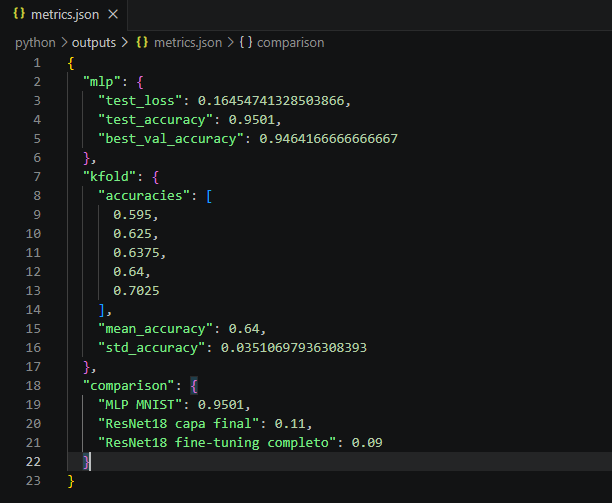

# Taller Entrenamiento Modelo Deep Learning Completo

## Nombre de los estudiantes

- Esteban Barrera
- Cristian Motta
- Nicolas Quezada Mora
- Juan Esteban Santacruz
- Jeronimo Bermudez
- Sebastian Andrade

## Fecha de entrega

`2026-05-12`

---

## Descripcion breve

En este taller se desarrollo un flujo completo de entrenamiento de un modelo de Deep Learning usando Python y PyTorch. El objetivo fue trabajar todo el proceso desde la carga del dataset hasta la evaluacion final, pasando por entrenamiento, validacion, metricas, fine-tuning y guardado del modelo.

Se uso el dataset MNIST porque permite probar el proceso de clasificacion de imagenes de una forma clara y rapida. Primero se entreno una red neuronal simple para reconocer digitos escritos a mano, y luego se agrego una comparacion con ResNet18 para observar la diferencia entre entrenar solo la capa final y hacer fine-tuning completo.

---

## Implementaciones

### Python

La implementacion esta en la carpeta [`python`](./python). Se creo un script principal llamado [`train_mnist.py`](./python/train_mnist.py) que realiza las siguientes actividades:

- descarga y carga del dataset MNIST;
- visualizacion de una muestra del dataset;
- separacion de datos en entrenamiento, validacion y prueba;
- entrenamiento de una red neuronal simple tipo MLP;
- validacion hold-out durante cada epoca;
- evaluacion con reporte de clasificacion y matriz de confusion;
- validacion cruzada K-Fold;
- fine-tuning con ResNet18 preentrenada;
- comparacion de resultados entre MLP, ResNet18 con capas congeladas y ResNet18 con fine-tuning completo;
- guardado y recarga del modelo final.

Las librerias usadas fueron `torch`, `torchvision`, `numpy`, `matplotlib`, `scikit-learn`, `seaborn` y `tqdm`.

Para ejecutar el proyecto:

```bash
cd python
pip install -r requirements.txt
python train_mnist.py
```

Tambien se puede ejecutar una version mas rapida:

```bash
python train_mnist.py --epochs 2 --kfold-epochs 1 --finetune-epochs 1 --finetune-samples 1000
```

---

## Resultados visuales

Los archivos visuales finales se encuentran en la carpeta [`media`](./media).

### Python - Entrenamiento y evaluacion


El GIF muestra la ejecucion del script principal, incluyendo el inicio del comando, el entrenamiento por epocas, la validacion, la evaluacion final y la generacion de metricas.



La imagen muestra una evidencia de los resultados finales guardados en `outputs/metrics.json`, incluyendo la accuracy del modelo MLP, los resultados de validacion K-Fold y la comparacion con ResNet18 como metricas complementarias.

---

## Codigo relevante

### Modelo base usado para MNIST

```python
def build_mlp() -> nn.Module:
    return nn.Sequential(
        nn.Flatten(),
        nn.Linear(28 * 28, 128),
        nn.ReLU(),
        nn.Dropout(0.2),
        nn.Linear(128, 64),
        nn.ReLU(),
        nn.Linear(64, 10),
    )
```

### Entrenamiento del modelo

```python
for images, labels in train_loader:
    images, labels = images.to(device), labels.to(device)
    optimizer.zero_grad()
    outputs = model(images)
    loss = criterion(outputs, labels)
    loss.backward()
    optimizer.step()
```

### Fine-tuning con ResNet18

```python
model = models.resnet18(weights=models.ResNet18_Weights.DEFAULT)

for param in model.parameters():
    param.requires_grad = False

num_features = model.fc.in_features
model.fc = nn.Linear(num_features, 10)
```

El script completo esta en [`python/train_mnist.py`](./python/train_mnist.py).

---

## Prompts utilizados

Durante el desarrollo se usaron prompts simples para resolver errores y generar partes del codigo:

```text
"Como puedo cargar MNIST con PyTorch y dividirlo en entrenamiento y validacion?"

"Ayudame a corregir un error al usar ResNet18 preentrenada con imagenes de MNIST."

"Como hago una matriz de confusion para un modelo de clasificacion en Python?"

"Como guardo y vuelvo a cargar un modelo entrenado en PyTorch?"

"Genera una estructura sencilla para entrenar, validar y probar un modelo con PyTorch."
```

---

## Aprendizajes y dificultades

### Aprendizajes

El taller ayudo a entender mejor el camino completo de un modelo: no basta con entrenarlo, tambien hay que separar bien los datos, revisar si aprende correctamente y mirar resultados con metricas claras. Tambien quedo mas claro por que es util guardar el modelo final para reutilizarlo despues sin entrenar todo otra vez.

Otro aprendizaje importante fue ver que un modelo preentrenado puede servir como punto de partida, pero no siempre significa que automaticamente sera mejor. Depende del dataset, del tiempo de entrenamiento y de que tanto se ajuste el modelo a la nueva tarea.

### Dificultades

Una dificultad fue organizar todas las partes del flujo sin mezclar entrenamiento, validacion y prueba. Al comienzo puede ser confuso saber que datos usar en cada momento, pero separarlo en funciones hizo que el proceso fuera mas facil de seguir.

Otra dificultad fue adaptar ResNet18 a MNIST, porque MNIST tiene imagenes pequenas y en escala de grises, mientras que ResNet18 espera imagenes mas grandes y con tres canales. Se resolvio transformando las imagenes para que fueran compatibles.

### Mejoras futuras

Como mejora futura se podrian probar mas epocas, ajustar hiperparametros y usar otros datasets como CIFAR-10. Tambien seria util guardar automaticamente las mejores graficas en la carpeta `media/` cuando ya se tengan las evidencias finales.


## Referencias

- PyTorch Documentation: https://pytorch.org/docs/stable/index.html
- Torchvision Datasets: https://pytorch.org/vision/stable/datasets.html
- Torchvision Models: https://pytorch.org/vision/stable/models.html
- Scikit-learn Metrics: https://scikit-learn.org/stable/modules/model_evaluation.html
