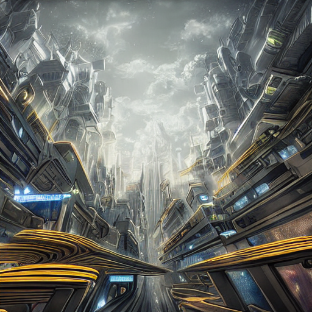
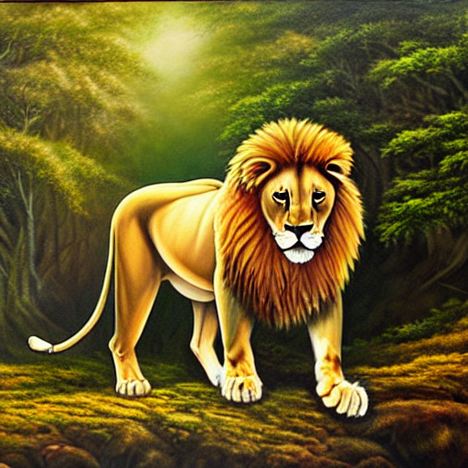
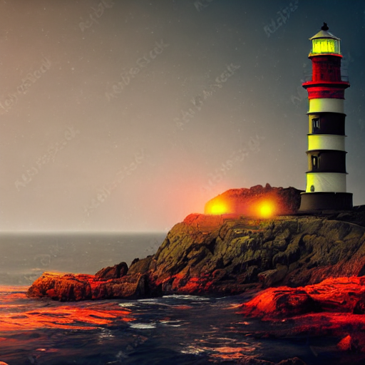
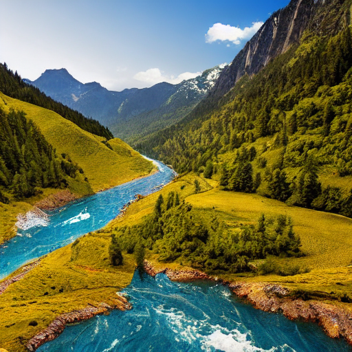

# Semana 12 - Generación de Imágenes con Stable Diffusion

## Nombre del estudiante

- Esteban Barrera
- Nicolas Quezada Mora
- Cristian Motta
- Esteban Santacruz
- Jeronimo Bermudez
- Sebastian Andrade

## Fecha de entrega

`2026-05-14`

---

## Descripción breve

Este taller consiste en la exploración práctica de la generación de imágenes mediante modelos de difusión, específicamente usando **Stable Diffusion v1.5** a través de la librería `diffusers` de Hugging Face, ejecutado en Google Colab con soporte GPU.

Durante el desarrollo se exploraron los parámetros clave del pipeline: `num_inference_steps` para controlar la calidad de la difusión, `guidance_scale` para regular la fidelidad al prompt, y `negative_prompt` para excluir elementos no deseados. Además se experimentó con distintos estilos artísticos directamente desde el texto del prompt.

El resultado fue una comprensión práctica de cómo cada parámetro afecta la imagen generada y cómo redactar prompts efectivos para distintos objetivos visuales.

---

## Implementaciones

### Python (Google Colab)

La implementación se realizó completamente en Python sobre Google Colab con GPU T4. Se utilizó `diffusers` para cargar el modelo y ejecutar el pipeline de generación, y `torch` para la gestión de tensores y el control de semillas con `torch.Generator`, garantizando reproducibilidad en cada experimento.

El pipeline `StableDiffusionPipeline` recibe un prompt de texto y produce una imagen PNG. Cada experimento fijó todas las variables excepto la que se estaba analizando, permitiendo aislar el efecto de cada parámetro de forma clara.

---

## Resultados visuales

### Experimento 1 — Pasos de inferencia (`num_inference_steps=50`)



Generación con 50 pasos de difusión sobre el prompt `"A surreal futuristic city in the clouds, digital art"`. Con este número de pasos el modelo tiene suficientes iteraciones para refinar los detalles y producir una imagen coherente y bien definida.

---

### Experimento 2 — Escala de guía (`guidance_scale=12.0`)



Generación con `guidance_scale=12.0` sobre el prompt `"A majestic lion in a fantasy forest, oil painting"`. Un valor alto de guidance fuerza al modelo a seguir el prompt con mayor fidelidad, produciendo resultados más literales y con mayor contraste estético.

---

### Experimento 3 — Estilo artístico en el prompt



Generación del prompt `"a lonely lighthouse on a rocky coast, cyberpunk style, neon colors, dark atmosphere"`. Incluir términos de estilo directamente en el prompt transforma radicalmente la paleta de colores, la iluminación y la atmósfera de la imagen resultante.

---

### Experimento 4 — Prompt negativo (`negative_prompt`)



Generación con prompt negativo: `"blurry, low quality, ugly, deformed, watermark, text, people, buildings"`. El prompt negativo actúa como una guía inversa que le indica al modelo qué elementos evitar, resultando en imágenes más limpias y alineadas con la intención del usuario.

---

## Código relevante

### Pipeline base

```python
from diffusers import StableDiffusionPipeline
import torch, os

os.makedirs("media", exist_ok=True)

pipe = StableDiffusionPipeline.from_pretrained(
    "runwayml/stable-diffusion-v1-5",
    torch_dtype=torch.float16
).to("cuda")
```

### Generación con seed fijo y parámetros explícitos

```python
generator = torch.Generator("cuda").manual_seed(42)

image = pipe(
    prompt,
    num_inference_steps=50,
    guidance_scale=7.5,
    generator=generator
).images[0]
image.save("media/inference_steps.png")
```

Fijar la semilla con `torch.Generator` garantiza que el resultado sea reproducible entre ejecuciones. El patrón se repite en todos los experimentos cambiando únicamente el parámetro de interés.

### Uso de prompt negativo

```python
image = pipe(
    positive_prompt,
    negative_prompt="blurry, low quality, ugly, deformed, watermark, text",
    num_inference_steps=35,
    guidance_scale=7.5,
    generator=torch.Generator("cuda").manual_seed(42)
).images[0]
image.save("media/negative_prompt.png")
```

---

## Aprendizajes y dificultades

### Aprendizajes

El taller dejó claro que la calidad de una imagen generada con Stable Diffusion depende de la interacción entre todos sus parámetros. `num_inference_steps` controla cuánto se refina la imagen durante la difusión inversa: valores bajos son rápidos pero ruidosos, mientras que valores altos producen imágenes más nítidas con mayor costo computacional.

El parámetro `guidance_scale` resultó ser uno de los más impactantes en términos de estilo: valores entre 7 y 9 ofrecen un buen equilibrio entre creatividad y fidelidad al prompt. Finalmente, la redacción del prompt es la habilidad más determinante, ya que incluir términos de estilo artístico, iluminación y nivel de detalle transforma radicalmente el resultado.

### Dificultades

Una dificultad inicial fue el error `Torch not compiled with CUDA enabled`, ocasionado por no tener la GPU habilitada en Colab. Una vez activada desde "Entorno de ejecución → Cambiar tipo de entorno de ejecución → GPU", el problema se resolvió.

### Mejoras futuras

Como mejora futura, sería interesante explorar modelos más recientes como Stable Diffusion XL o integrar una interfaz con `gradio` para ajustar los parámetros en tiempo real. También sería valioso incorporar técnicas de image-to-image para editar imágenes existentes en lugar de generar únicamente desde texto.

---
