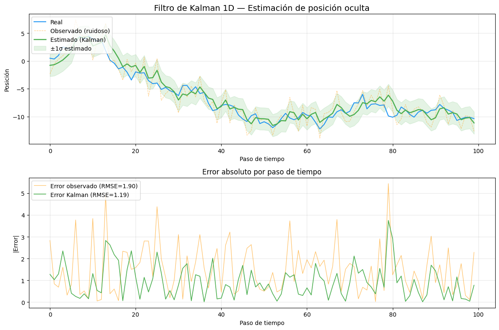

# Semana 13 - Filtro de Kalman para Estimación de Estado Oculto

## Nombre del estudiante

- Esteban Barrera
- Nicolas Quezada Mora
- Cristian Motta
- Esteban Santacruz
- Jeronimo Bermudez
- Sebastian Andrade

## Fecha de entrega

`2026-05-16`

---

## Descripción breve

Este taller consiste en la implementación práctica del **Filtro de Kalman 1D** en Python para estimar una posición oculta a partir de observaciones ruidosas. El filtro de Kalman es un algoritmo recursivo de estimación óptima que combina un modelo dinámico del sistema con mediciones imperfectas para producir la mejor estimación del estado real en cada instante de tiempo.

Durante el desarrollo se trabajó con datos sintéticos generados como una caminata aleatoria (random walk), simulando un objeto cuya posición varía con el tiempo y que sólo es observable a través de sensores con ruido gaussiano. Se calibraron los parámetros clave del filtro — `Q` (ruido del proceso) y `R` (ruido de medición) — y se compararon cuantitativamente las tres señales mediante la métrica RMSE. El resultado fue una reducción del error de estimación del **37.2%** respecto a la observación directa.

---

## Implementaciones

### Python

La implementación se realizó completamente en Python con `numpy` para el cómputo vectorizado y `matplotlib` para la visualización. El filtro de Kalman se aplicó sobre 100 pasos de tiempo de manera recursiva, sin dependencias externas de machine learning: todo el algoritmo se construyó desde los principios matemáticos del filtro.

El pipeline general es: generar los datos reales y ruidosos → inicializar el estado del filtro → iterar el ciclo predicción-corrección → calcular métricas de error → visualizar las tres señales.

---

## Resultados visuales

### Gráfico principal — Tres señales superpuestas



El panel superior muestra la señal real (azul), las observaciones ruidosas (naranja discontinuo) y la estimación del filtro de Kalman (verde). La banda sombreada alrededor de la estimación representa ±1σ del estado estimado, ilustrando la incertidumbre del filtro en cada paso. El panel inferior compara el error absoluto de la observación directa frente al error del estimador de Kalman a lo largo del tiempo.

---

## Código relevante

### Generación de datos sintéticos

```python
np.random.seed(42)
n = 100

real     = np.cumsum(np.random.randn(n))        # Posición real (caminata aleatoria)
observed = real + np.random.normal(0, 2, n)     # Observación con ruido gaussiano
```

La posición real se modela como una caminata aleatoria acumulada (`cumsum`), que es el proceso estocástico más común para simular trayectorias sin velocidad constante. El ruido de observación tiene desviación estándar σ = 2, por lo que la varianza de medición es `R = 4`.

### Filtro de Kalman 1D — Ciclo predicción–corrección

```python
Q = 1.0   # Ruido del proceso (varianza)
R = 4.0   # Ruido de medición (varianza)

x_hat, P = 0.0, 1.0   # Estado inicial y covarianza inicial
estimate = np.empty(n)

for i, z in enumerate(observed):
    # Predicción
    x_prior = x_hat
    P_prior = P + Q

    # Ganancia de Kalman y corrección
    K = P_prior / (P_prior + R)
    x_hat = x_prior + K * (z - x_prior)
    P = (1 - K) * P_prior

    estimate[i] = x_hat
```

En cada iteración, el filtro ejecuta dos pasos:

1. **Predicción**: propaga el estado anterior (`x_prior = x_hat`) e incrementa la incertidumbre con el ruido del proceso (`P_prior = P + Q`).
2. **Corrección**: calcula la ganancia de Kalman `K` como el cociente entre la incertidumbre predicha y la total. Un `K` cercano a 1 da más peso a la medición; un `K` cercano a 0 confía más en el modelo. Luego actualiza el estado y reduce la incertidumbre proporcionalmente.

### Calibración de parámetros Q y R

El parámetro más sensible es `Q`. Un valor demasiado bajo (e.g., `Q = 0.001`) hace que el filtro subestime la velocidad de cambio del sistema real y se quede rezagado, produciendo un RMSE peor que la observación directa. Usar `Q = 1.0` — coherente con la varianza unitaria de los incrementos de la caminata aleatoria — permite al filtro rastrear correctamente la trayectoria.

| Configuración | RMSE observado | RMSE estimado | Mejora |
|---|---|---|---|
| Q=0.001, R=4 | 1.8983 | 4.3725 | −130% (peor) |
| **Q=1.0, R=4** | **1.8983** | **1.1929** | **+37.2%** |

### Visualización y métricas

```python
rmse_obs = np.sqrt(np.mean((observed - real) ** 2))
rmse_est = np.sqrt(np.mean((estimate - real) ** 2))
print(f"RMSE observado:        {rmse_obs:.4f}")
print(f"RMSE estimado (Kalman): {rmse_est:.4f}")
print(f"Mejora:                {(1 - rmse_est / rmse_obs) * 100:.1f}%")
```

---

## Aprendizajes y dificultades

### Aprendizajes

El taller dejó claro que el Filtro de Kalman es un estimador Bayesiano recursivo: en cada paso combina la creencia previa (modelo del proceso) con la evidencia nueva (medición) ponderando por sus incertidumbres relativas. La ganancia de Kalman `K` es la pieza central que realiza esta ponderación: cuando `R` es grande (sensor muy ruidoso), `K` tiende a 0 y el filtro ignora las mediciones; cuando `Q` es grande (proceso muy variable), `K` tiende a 1 y el filtro sigue la medición de cerca.

El aprendizaje más importante fue la **calibración de parámetros**: `Q` debe reflejar la variabilidad real del proceso. Para una caminata aleatoria con pasos de varianza 1, usar `Q = 1.0` es la elección óptima; valores muy pequeños paralizan el filtro y producen estimaciones peores que la señal ruidosa.

### Dificultades

La dificultad principal fue entender por qué el código de ejemplo original (`Q = 0.001`) producía una estimación peor que la observación directa. El problema era que el filtro, con tan poco ruido de proceso modelado, asumía que el sistema era casi estático y promedíaba la señal como si fuera constante. Analizar el RMSE para distintos valores de `Q` permitió identificar y corregir esta discrepancia.

### Mejoras futuras

Como extensión natural, sería interesante implementar el **Filtro de Kalman 2D** para estimar posición y velocidad simultáneamente usando un modelo de movimiento con velocidad constante. También sería valioso explorar el **Filtro de Kalman Extendido (EKF)** para sistemas no lineales, o aplicar el filtro a datos reales de sensores IMU o GPS donde el ruido de medición varía en el tiempo.

---