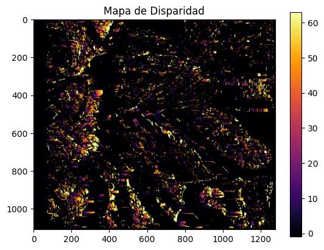
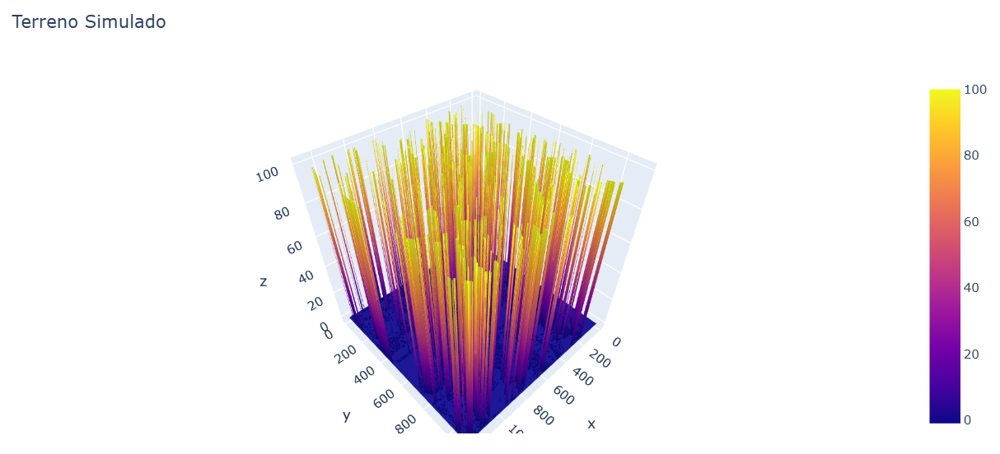

# Semana 13 - Reconstrucción 3D Estéreo Satelital con OpenCV

## Nombre del estudiante

- Esteban Barrera
- Nicolas Quezada Mora
- Cristian Motta
- Esteban Santacruz
- Jeronimo Bermudez
- Sebastian Andrade

## Fecha de entrega

`2026-05-16`

---

## Descripción breve

Este taller consiste en la implementación práctica de la **reconstrucción 3D a partir de visión estéreo** en Python, aplicada al contexto de imágenes satelitales o aéreas. El objetivo es obtener un **mapa de elevación digital (DEM simulado)** a partir de un par de imágenes capturadas desde ángulos ligeramente distintos, utilizando el algoritmo de disparidad de OpenCV (`StereoBM`) y visualizándolo como una malla 3D interactiva.

El pipeline completo comprende: cargar el par estéreo rectificado → calcular el mapa de disparidad → convertirlo a mapa de profundidad mediante inversión proporcional → visualizar el terreno como superficie 3D con Plotly. El resultado es una representación tridimensional del relieve de la escena a partir únicamente de las diferencias de perspectiva entre las dos imágenes.

---

## Implementaciones

### Python

La implementación se realizó en Python utilizando `opencv-python` para el cómputo de disparidad, `numpy` para las operaciones matriciales, `matplotlib` para la visualización del mapa de disparidad y `plotly` para la superficie 3D interactiva. El algoritmo `StereoBM` (Block Matching) compara bloques de píxeles entre la imagen izquierda y la derecha buscando correspondencias horizontales, produciendo un mapa donde cada valor representa cuántos píxeles se desplazó un punto entre las dos vistas — magnitud directamente proporcional a su cercanía a la cámara.

El pipeline general es: cargar el par estéreo en escala de grises → aplicar `StereoBM` → escalar la disparidad a valores reales → calcular la profundidad como inversa de la disparidad → construir la malla 3D.

---

## Resultados visuales

### Mapa de Disparidad



El mapa de disparidad muestra, en escala de color `inferno`, el desplazamiento horizontal (en píxeles) encontrado entre cada punto de la imagen izquierda y su correspondiente en la imagen derecha. Las zonas más brillantes indican mayor disparidad y, por tanto, menor profundidad (objetos más cercanos al sensor). Las zonas oscuras corresponden a regiones de mayor profundidad o donde el algoritmo no encontró correspondencia válida.

### Terreno Simulado — Superficie 3D



La superficie 3D representa el DEM simulado construido a partir del mapa de profundidad. Cada punto (x, y) del plano imagen se eleva en el eje Z según su valor de profundidad estimado, generando una malla que reconstruye el relieve de la escena. La paleta de color codifica la elevación relativa, permitiendo identificar visualmente las zonas altas y bajas del terreno reconstruido.

---

## Código relevante

### Carga del par estéreo y cálculo de disparidad

```python
import cv2

imgL = cv2.imread('left_image.png', cv2.IMREAD_GRAYSCALE)
imgR = cv2.imread('right_image.png', cv2.IMREAD_GRAYSCALE)

stereo = cv2.StereoBM_create(numDisparities=64, blockSize=15)
disparity = stereo.compute(imgL, imgR).astype("float32") / 16.0
```

Las imágenes se cargan en escala de grises, ya que `StereoBM` opera sobre un único canal de intensidad. El parámetro `numDisparities` define el rango de búsqueda horizontal (debe ser múltiplo de 16), y `blockSize` controla el tamaño del bloque de correlación (debe ser impar y mayor que 5). El resultado de `compute` viene escalado por 16 en formato entero, por lo que se divide para obtener valores reales en píxeles.

### Visualización del mapa de disparidad

```python
import matplotlib.pyplot as plt

plt.imshow(disparity, cmap='inferno')
plt.colorbar()
plt.title("Mapa de Disparidad")
```

La paleta `inferno` es adecuada para mapas de calor donde se quiere destacar la variación de magnitudes: los valores altos (mayor disparidad, menor profundidad) aparecen en tonos amarillos y blancos, mientras los valores bajos se representan en morado oscuro.

### Conversión a mapa de profundidad y visualización 3D

```python
import plotly.graph_objects as go
import numpy as np

depth_map = 1.0 / (disparity + 1e-6)  # Inversa proporcional
depth_map[depth_map > 100] = 100       # Recorte para visualización

x, y = np.meshgrid(range(depth_map.shape[1]), range(depth_map.shape[0]))
fig = go.Figure(data=[go.Surface(z=depth_map, x=x, y=y)])
fig.update_layout(title='Terreno Simulado', autosize=True)
fig.show()
```

La profundidad se calcula como la inversa de la disparidad: a mayor disparidad, menor profundidad. El término `1e-6` evita la división por cero en zonas donde `StereoBM` no encontró correspondencia (disparidad ≈ 0). El recorte en 100 elimina los outliers producidos por disparidades muy pequeñas que generarían picos irreales en la malla. Finalmente, `go.Surface` de Plotly construye la superficie 3D interactiva a partir de la grilla (x, y) y la elevación z.

---

## Aprendizajes y dificultades

### Aprendizajes

El taller evidenció que la visión estéreo es esencialmente un problema de **correspondencia de puntos entre dos perspectivas**: la disparidad horizontal entre imágenes rectificadas codifica directamente la información de profundidad sin necesidad de sensores activos como LiDAR. El algoritmo `StereoBM` implementa este principio comparando bloques de textura locales, lo que lo hace robusto en zonas con variación de intensidad pero propenso a errores en superficies uniformes o repetitivas.

El aprendizaje más importante fue la **relación inversa entre disparidad y profundidad**: zonas cercanas al sensor producen grandes desplazamientos entre las dos imágenes (alta disparidad), mientras que objetos lejanos generan desplazamientos mínimos. Esta relación, formalizada como `depth = (f × B) / disparity`, conecta directamente la geometría del sistema de captura con la reconstrucción métrica del espacio.

### Dificultades

La principal dificultad fue entender por qué la visualización 3D producía una superficie plana o con forma cúbica en lugar de un relieve real. El problema radicaba en dos causas combinadas: el uso de imágenes que no constituían un par estéreo rectificado válido (sin desplazamiento horizontal real entre ellas), y la ausencia de filtrado de disparidades inválidas que `StereoBM` marca con valores negativos. Ambas condiciones hacían que la mayor parte del mapa de disparidad fuera cero o negativo, y la operación `1/disparity` producía valores extremos uniformes que aplanaban la malla.

### Mejoras futuras

Como extensión natural, sería valioso incorporar la **calibración métrica del sistema de cámara** (longitud focal `f` y línea de base `B`) para obtener profundidades en metros reales en lugar de una escala relativa. También sería interesante explorar algoritmos más robustos como `StereoSGBM` (Semi-Global Block Matching), que produce mapas de disparidad más densos y suaves especialmente en zonas de baja textura, lo que es común en imágenes satelitales de terrenos homogéneos como desiertos o cuerpos de agua.

---