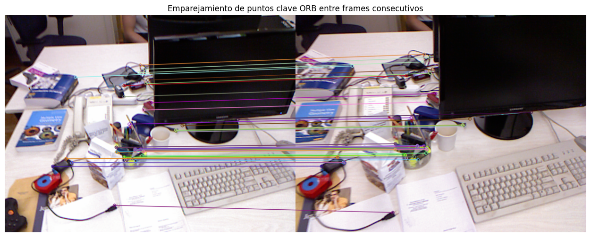
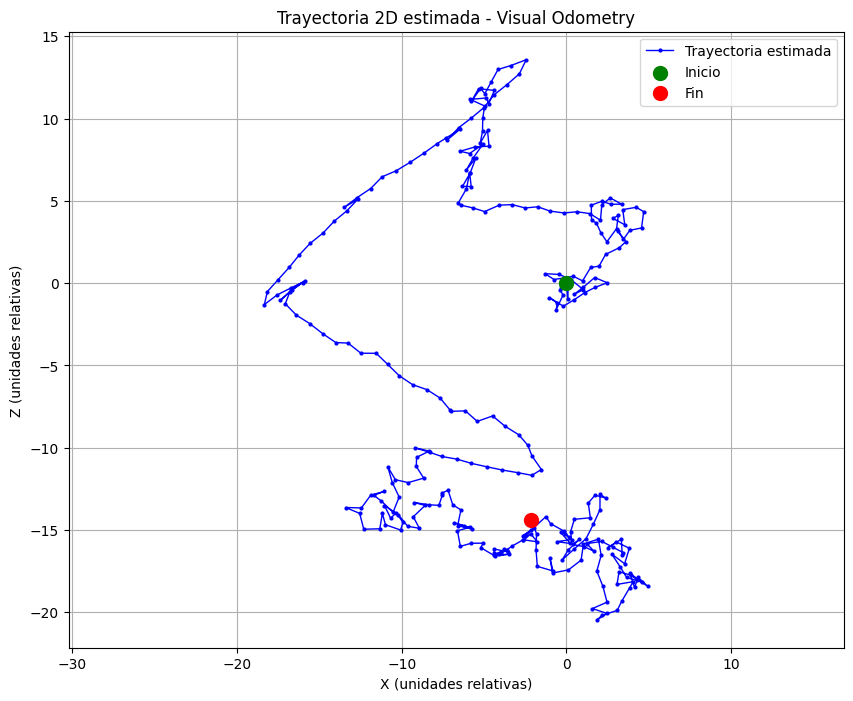

# Semana 13 - SLAM Visual Simulado: Seguimiento de Trayectoria con Cámara Virtual

## Nombre del estudiante

- Esteban Barrera
- Nicolas Quezada Mora
- Cristian Motta
- Esteban Santacruz
- Jeronimo Bermudez
- Sebastian Andrade


## Fecha de entrega

`2026-05-17`

---

## Descripción breve

Este taller consiste en la implementación práctica de los principios básicos del algoritmo **SLAM (Simultaneous Localization and Mapping)** en Python, usando una secuencia de imágenes del dataset TUM RGB-D. El objetivo es **detectar puntos clave entre frames consecutivos**, estimar el **movimiento relativo de la cámara** mediante la matriz esencial, y construir una **trayectoria 2D acumulada** a partir del análisis puramente visual (odometría visual).

El pipeline completo comprende: cargar los frames RGB del dataset → detectar y emparejar puntos clave con ORB → estimar la pose relativa entre frames con `findEssentialMat` y `recoverPose` → acumular las transformaciones de rotación y traslación → visualizar la trayectoria estimada en 2D. El resultado es una representación del recorrido de la cámara construida únicamente a partir de las diferencias visuales entre imágenes consecutivas, sin uso de sensores inerciales ni GPS.

---

## Implementaciones

### Python

La implementación se realizó en Python utilizando `opencv-python` para la detección de características y estimación de movimiento, `numpy` para las operaciones matriciales de acumulación de poses, y `matplotlib` para la visualización de la trayectoria y los emparejamientos. El detector **ORB (Oriented FAST and Rotated BRIEF)** extrae hasta 1000 puntos clave por frame y genera descriptores binarios compactos que se emparejan eficientemente con el matcher de fuerza bruta (`BFMatcher`) usando distancia Hamming.

La estimación de movimiento se basa en la **geometría epipolar**: dados los puntos emparejados entre dos frames, `findEssentialMat` con RANSAC estima la matriz esencial que codifica la rotación y traslación relativas entre las dos vistas. `recoverPose` descompone esa matriz en los componentes `R` (rotación) y `t` (traslación), que se acumulan iterativamente para reconstruir la trayectoria completa de la cámara.

---

## Resultados visuales

### Emparejamiento de puntos clave



El resultado muestra los 50 mejores emparejamientos ORB entre dos frames separados por 10 posiciones en la secuencia. Cada línea conecta un punto clave del frame izquierdo con su correspondiente en el frame derecho. La densidad y consistencia de las líneas refleja la calidad del emparejamiento: líneas aproximadamente paralelas y en la misma dirección indican un movimiento de cámara coherente, mientras que líneas cruzadas señalan falsos positivos filtrados posteriormente por RANSAC.

### Trayectoria 2D estimada



La trayectoria 2D muestra la posición acumulada de la cámara a lo largo de la secuencia, proyectada sobre el plano XZ (equivalente a la vista cenital del recorrido). El punto verde marca el origen (posición inicial) y el punto rojo el último frame procesado. La forma de la curva refleja los giros y desplazamientos reales de la cámara durante la captura del dataset, aunque a escala relativa dado que la traslación recuperada de `recoverPose` es unitaria y no métrica.

---

## Código relevante

### Carga de frames del dataset TUM

```python
def cargar_frames(rgb_folder, max_frames=200):
    imagenes = sorted([
        f for f in os.listdir(rgb_folder)
        if f.endswith('.png') or f.endswith('.jpg')
    ])
    frames = []
    for nombre in imagenes[:max_frames]:
        ruta = os.path.join(rgb_folder, nombre)
        img = cv2.imread(ruta)
        if img is not None:
            frames.append(img)
    return frames
```

Los frames se cargan en orden cronológico (orden lexicográfico de nombres, que en TUM corresponde a los timestamps). El límite `max_frames` permite controlar el costo computacional del pipeline completo sin procesar la secuencia entera.

### Detección ORB y emparejamiento

```python
def emparejar_frames(frame1, frame2):
    gray1 = cv2.cvtColor(frame1, cv2.COLOR_BGR2GRAY)
    gray2 = cv2.cvtColor(frame2, cv2.COLOR_BGR2GRAY)

    orb = cv2.ORB_create(nfeatures=1000)
    kp1, des1 = orb.detectAndCompute(gray1, None)
    kp2, des2 = orb.detectAndCompute(gray2, None)

    bf = cv2.BFMatcher(cv2.NORM_HAMMING, crossCheck=True)
    matches = sorted(bf.match(des1, des2), key=lambda x: x.distance)[:100]

    pts1 = np.float32([kp1[m.queryIdx].pt for m in matches])
    pts2 = np.float32([kp2[m.trainIdx].pt for m in matches])
    return pts1, pts2, kp1, matches
```

ORB opera en escala de grises. `crossCheck=True` en el matcher exige que el emparejamiento sea mutuamente consistente (A→B y B→A coinciden), lo que elimina una gran parte de los falsos positivos sin costo computacional adicional. Se retienen únicamente los 100 mejores matches por distancia Hamming.

### Estimación de pose y acumulación de trayectoria

```python
def estimar_trayectoria(frames, focal=525.0):
    h, w = frames[0].shape[:2]
    pp = (w / 2, h / 2)
    R_total = np.eye(3)
    t_total = np.zeros((3, 1))
    trayectoria = [(0.0, 0.0)]

    for i in range(1, len(frames)):
        pts1, pts2, _, _ = emparejar_frames(frames[i-1], frames[i])

        if pts1 is None or len(pts1) < 8:
            trayectoria.append(trayectoria[-1])
            continue

        E, mask = cv2.findEssentialMat(
            pts1, pts2, focal=focal, pp=pp,
            method=cv2.RANSAC, prob=0.999, threshold=1.0
        )
        _, R, t, mask = cv2.recoverPose(E, pts1, pts2, focal=focal, pp=pp)

        t_total = t_total + R_total @ t
        R_total = R @ R_total
        trayectoria.append((float(t_total[0]), float(t_total[2])))

    return trayectoria
```

El valor `focal=525.0` corresponde a la longitud focal estándar de la cámara Kinect usada en los datasets TUM RGB-D. La traslación de cada frame se rota al sistema de referencia global (`R_total @ t`) antes de acumularse, asegurando que la trayectoria se construya en coordenadas del mundo y no de la cámara local.

---

## Aprendizajes y dificultades

### Aprendizajes

El taller evidenció que la odometría visual es esencialmente un problema de **estimación de geometría relativa entre vistas consecutivas**: los puntos emparejados entre dos frames codifican la transformación rígida (rotación + traslación) que sufrió la cámara entre ambas capturas. ORB demostró ser un detector robusto y rápido para este propósito, produciendo emparejamientos consistentes incluso con movimientos moderados de cámara.

El aprendizaje más importante fue entender la **ambigüedad de escala inherente a la odometría monocular**: `recoverPose` recupera la traslación con norma unitaria, lo que significa que la trayectoria resultante es correcta en dirección y forma, pero no en escala métrica. Para obtener distancias reales sería necesario introducir información de profundidad (datos RGB-D) o referencias métricas externas.

### Dificultades

La principal dificultad fue el **drift acumulativo** de la trayectoria: los pequeños errores de estimación en cada par de frames se acumulan iterativamente, haciendo que la trayectoria se desvíe progresivamente de la real. Este efecto es intrínseco a la odometría visual sin corrección de cierre de loop (*loop closure*), que es precisamente el componente que distingue SLAM completo de odometría simple.

Otra dificultad fue determinar la ruta correcta dentro del dataset TUM una vez extraído el `.tgz`, ya que la estructura de carpetas varía ligeramente entre secuencias (fr1, fr2, fr3). Fue necesario explorar el árbol de directorios con `os.walk` para localizar la carpeta `rgb/` correcta antes de cargar los frames.

### Mejoras futuras

Como extensión natural, sería valioso incorporar un **mecanismo de loop closure** que detecte cuando la cámara regresa a una zona ya visitada y corrija el drift acumulado, completando así el pipeline SLAM completo. También sería interesante explorar el uso de los datos de profundidad incluidos en el dataset TUM (`depth/`) para recuperar la escala métrica real de la trayectoria mediante la triangulación directa de puntos 3D.

---