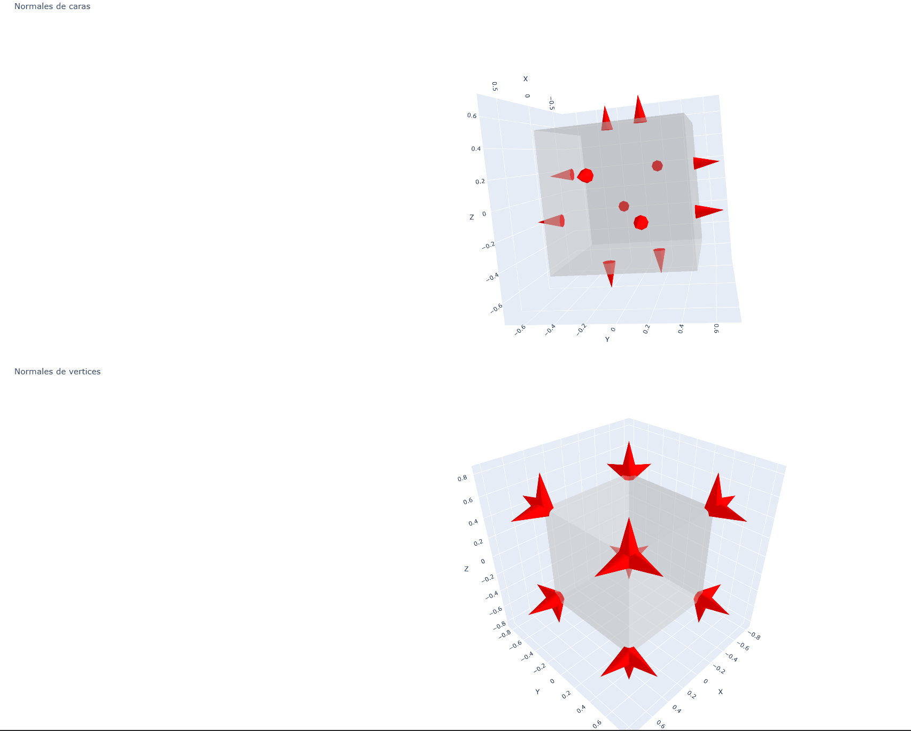
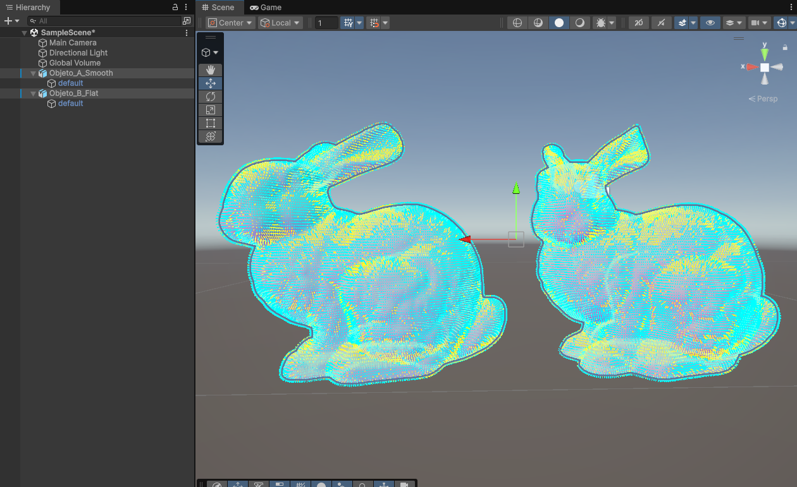
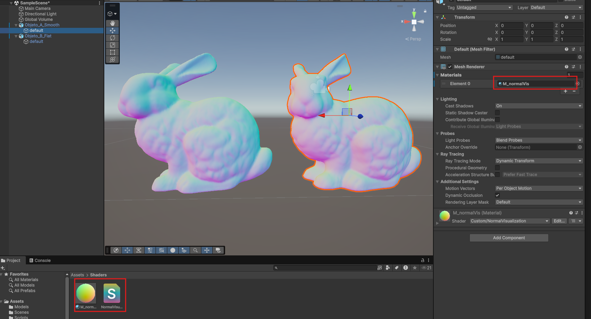

# Calculo y Visualizacion de Normales en Mallas 3D (Semana 3.3)

## Nombre del estudiante

Nicolas Quezada Mora

## Fecha de entrega

2026-03-01

---

## Descripcion breve

En este taller se desarrollaron proyectos para calcular, validar y visualizar normales en mallas 3D, trabajando en dos entornos: Unity (C#) y Python (trimesh + NumPy). El objetivo principal fue comparar el comportamiento visual y numerico entre flat shading y smooth shading, y verificar la consistencia de orientacion de normales.

En Unity se implemento un laboratorio de normales sobre modelos tipo bunny (version flat y smooth), con herramientas para leer normales importadas, recalcular normales con Unity, calcular normales manuales desde triangulos y dibujar vectores normales con Gizmos. Tambien se uso un shader de visualizacion RGB de normales para inspeccion visual directa.

En Python se construyo un notebook que carga modelos 3D, calcula normales de cara y de vertice manualmente, compara contra `trimesh`, valida magnitud unitaria, detecta posibles inversiones de orientacion y genera visualizaciones tanto de flechas de normales como de comparacion lado a lado entre flat y smooth shading.

---

## Implementaciones

### Python

Se implemento el notebook `python/calculo_normales_trimesh.ipynb` con `trimesh`, `numpy`, `matplotlib`, `plotly` y `vedo` (opcional). El notebook realiza:
- carga de modelo 3D (`.obj`, `.stl`, `.gltf`, `.glb`, `.ply`),
- calculo manual de normales de cara con producto cruz,
- orientacion de normales hacia afuera,
- calculo manual de normales de vertice por promedio ponderado por area,
- comparacion con `mesh.face_normals` y `mesh.vertex_normals`,
- visualizacion de normales como flechas,
- comparacion visual flat vs smooth shading,
- validacion de magnitud unitaria y consistencia de orientacion,
- correccion opcional con `fix_normals()`.

### Unity

Se implemento el script `unity/Normales/Assets/Scripts/NormalsLab.cs` y se uso el shader `unity/Normales/Assets/Shaders/NormalVisualization.shader`. La escena permite:
- leer `mesh.normals`,
- calcular normales manuales desde `mesh.triangles`,
- recalcular normales con `mesh.RecalculateNormals()`,
- aplicar normales manuales al mesh,
- visualizar normales importadas y manuales con `Gizmos.DrawLine`,
- comparar `bunny_flat.obj` vs `bunny_smooth.obj`,
- visualizar normales con material `M_normalVis.mat`.

### Three.js / React Three Fiber

No se realizo implementacion en Three.js / React Three Fiber para este taller.

### Processing

No se realizo implementacion en Processing para este taller.

---

## Resultados visuales

### Python - Implementacion


Visualizacion animada del flujo de analisis de normales y comparacion de sombreado en Python.



Captura de la visualizacion de malla y normales en el notebook.

### Unity - Implementacion


Visualizacion en Unity de normales y comparacion de modelos en escena.



Inspeccion visual de normales en la malla dentro del entorno Unity.



Comparacion adicional de apariencia y orientacion de normales.

### Three.js - Implementacion

No aplica en este taller.

---

## Codigo relevante

### Ejemplo de codigo Python:

```python
def compute_face_normals_manual(vertices, faces, eps=1e-12):
    tri = vertices[faces]
    v1 = tri[:, 1] - tri[:, 0]
    v2 = tri[:, 2] - tri[:, 0]
    normals = np.cross(v1, v2)
    lengths = np.linalg.norm(normals, axis=1, keepdims=True)

    valid = lengths[:, 0] > eps
    normals_unit = np.zeros_like(normals)
    normals_unit[valid] = normals[valid] / lengths[valid]
    return normals_unit, valid
```

### Ejemplo de codigo Unity (C#):

```csharp
public static Vector3[] CalculateManualNormals(Mesh mesh)
{
    Vector3[] vertices = mesh.vertices;
    int[] triangles = mesh.triangles;
    Vector3[] normals = new Vector3[vertices.Length];

    for (int i = 0; i < triangles.Length; i += 3)
    {
        int i0 = triangles[i];
        int i1 = triangles[i + 1];
        int i2 = triangles[i + 2];

        Vector3 e1 = vertices[i1] - vertices[i0];
        Vector3 e2 = vertices[i2] - vertices[i0];
        Vector3 faceNormal = Vector3.Cross(e1, e2);

        normals[i0] += faceNormal;
        normals[i1] += faceNormal;
        normals[i2] += faceNormal;
    }

    for (int i = 0; i < normals.Length; i++)
        normals[i] = normals[i].normalized;

    return normals;
}
```

### Ejemplo de codigo Three.js:

No aplica en este taller.

---

## Prompts utilizados

En este taller si se utilizo IA generativa para generar scripts base y para arreglo de errores durante el desarrollo.

### Prompts usados:

```text
"Genera un script C# para Unity que acceda a mesh.normals, calcule normales manualmente desde mesh.triangles y las dibuje con Gizmos.DrawLine()."

"Agrega ContextMenu para ejecutar mesh.RecalculateNormals() y otra opcion para aplicar normales manuales al mesh."

"Crea un shader de Unity para visualizacion de normales, mapeando componentes de [-1,1] a [0,1] en RGB."

"Escribe funciones en Python con trimesh y NumPy para calcular normales de caras y vertices, incluyendo normalizacion robusta."

"Compara normales manuales vs trimesh.vertex_normals y reporta error medio y maximo."

"Ayudame a detectar normales invertidas y corregir orientacion con fix_normals()."
```

---

## Aprendizajes y dificultades


### Aprendizajes

Se reforzo la diferencia entre normales por cara y normales por vertice, tanto en teoria como en resultado visual. Tambien quedo claro que la orientacion correcta de normales afecta directamente la iluminacion y la lectura de forma del modelo.


### Dificultades

La parte mas desafiante fue mantener consistencia de signo/orientacion al comparar normales manuales con las automaticas de librerias, porque la direccion puede invertirse globalmente sin cambiar la geometria. Tambien hubo ajustes para que la visualizacion de flechas no saturara la escena en modelos con muchos elementos.

Los errores mas frecuentes estuvieron relacionados con dimensiones de arreglos y casos degenerados (normales de longitud casi cero), y se resolvieron con validaciones (`eps`) y verificaciones intermedias.

### Mejoras futuras

Se propone ampliar la prueba con mallas mas complejas (no-manifold, huecos, self-intersections), automatizar un reporte de metricas y agregar comparaciones temporales de rendimiento entre distintos metodos de calculo de normales.

---

## Contribuciones grupales (si aplica)

Nicolas Quezada se encargo de realizar el apartado de Unity/python para esta tarea

---

## Referencias

- Documentacion oficial de Unity Mesh: https://docs.unity3d.com/ScriptReference/Mesh.html
- Unity `Mesh.RecalculateNormals()`: https://docs.unity3d.com/ScriptReference/Mesh.RecalculateNormals.html
- Documentacion oficial de trimesh: https://trimesh.org/
- NumPy `cross`: https://numpy.org/doc/stable/reference/generated/numpy.cross.html
- Matplotlib mplot3d: https://matplotlib.org/stable/gallery/mplot3d/index.html
- Vedo: https://vedo.embl.es/


